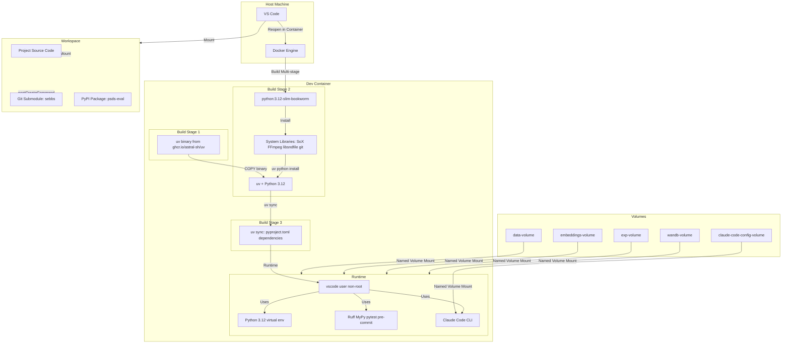
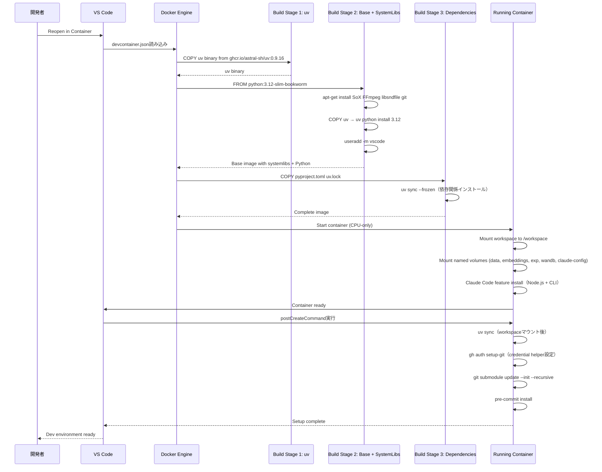
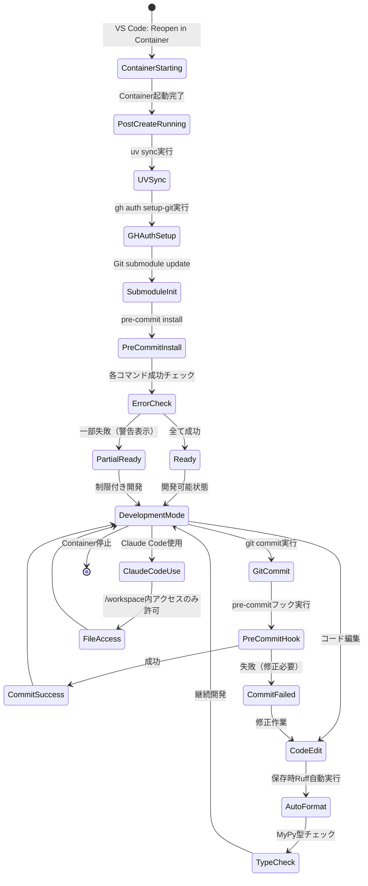

# 技術設計書

## 概要

本機能は、DCASE 2024 Task 4 Sound Event Detection (SED) プロジェクトの開発環境をDevcontainer化し、**Mac環境での迅速な開発自動化**を実現します。Python 3.12、PyTorch Lightning 1.9.x、音声処理ライブラリ（SoX、FFmpeg、torchaudio）などの複雑な依存関係を、軽量なCPU専用ベースイメージとdevcontainer.json統合設定により自動構築します。

**目的**: Mac環境での開発環境セットアップ時間をゼロにし、チーム全体で同一バージョンのライブラリとツールを使用できる環境を構築することで、実験結果の再現性を保証し、環境起因のバグを排除します。GPU環境への拡張性は設計レベルで保持しますが、初期実装はCPU環境に限定します。

**ユーザー**: 本プロジェクトの開発者（既存メンバー）および新規参加者（オンボーディング対象）は、VS Code Dev Containersの「Reopen in Container」機能を使用してワンクリックで完全な開発環境を起動できます。

**影響**: 現在の手動セットアップ手順（Python環境構築、システムライブラリインストール、uvによるパッケージインストール、Git submodule初期化、pre-commitフック設定）を完全に自動化し、新規開発者のオンボーディング時間を数時間から数分に短縮します。また、Claude Code統合により、AIアシスタントがプロジェクト環境を正確に理解し、セキュアに支援できる環境を提供します。

### ゴール
- Python 3.12、PyTorch Lightning 1.9.x、音声処理ライブラリを含む完全な開発環境の自動構築（CPU専用）
- **Mac環境での迅速な動作**を最優先（軽量なpython:3.12-slimベースイメージ使用）
- Claude Code公式feature統合による安全なAIアシスタント環境の提供
- uvパッケージマネージャーによる依存関係の完全再現（pyproject.toml準拠）
- Git submodule（sebbs）の自動初期化（gh auth login事前実行前提）
- 注: PSDS_EvalはPyPIパッケージ（psds-eval）として管理、submoduleではない
- データディレクトリ（data/、embeddings/、exp/、wandb/）の永続化とI/O最適化
- 開発ツール（Ruff、MyPy、pytest、pre-commit）のVS Code統合と自動設定
- セキュリティベストプラクティスの適用（非rootユーザー、ファイルアクセス制限、機密情報保護）
- **wandb APIキーは不要**（ローカル開発自動化のみ、後から追加可能）

### 非ゴール
- GPU/CUDA環境サポート（将来的な拡張として設計は考慮するが、初期実装は対象外）
- 本番環境デプロイ用のDocker image作成（開発環境専用）
- Kubernetes/Helm等のオーケストレーション対応（単一コンテナ開発環境）
- Linux以外のホストOS対応（Mac/Windows with Docker Desktop標準対応環境のみ）
- CI/CD統合（将来的な拡張として残す）
- データセット自動ダウンロード（既存のgenerate_dcase_task4_2024.pyスクリプト使用、別途ダウンロードされている前提）
- wandb統合の初期実装（オプショナル機能として後から追加可能）

## アーキテクチャ

### 既存アーキテクチャ分析

**現在のプロジェクト構造**（steering/structure.mdより）:
- **Core Library**: `DESED_task/dcase2024_task4_baseline/desed_task/` — 再利用可能なSEDコンポーネント（モデル、データローダー、評価）
- **Experiment Code**: `DESED_task/dcase2024_task4_baseline/local/` — プロジェクト固有の訓練ロジック（sed_trainer_pretrained.py、beats/、sebbs_wrapper/）
- **Configuration**: `DESED_task/dcase2024_task4_baseline/confs/` — YAML設定ファイル（Hydra準拠）
- **Post-processing**: `DESED_task/dcase2024_task4_baseline/sebbs/` — cSEBBsアルゴリズム（Gitサブモジュール）
- **Visualization**: `DESED_task/dcase2024_task4_baseline/visualize/` — モデル分析ツール（UMAP）
- **Data & Outputs**: `data/`, `embeddings/`, `exp/`, `wandb/` — データとアーティファクト（バージョン管理外）

**既存の依存関係管理**:
- pyproject.toml: requires-python = ">=3.11"、PyTorch Lightning 1.9.*固定、uvパッケージマネージャー使用
- .python-version: 3.12指定
- 開発依存関係: mypy, ruff, pandas-stubs, types-setuptools（dependency-groups.dev）
- pre-commit設定: コード品質自動チェック

**統合要件**:
- 既存のpyproject.toml依存関係を完全に再現（要件2.3）
- Git submodule（sebbs）の自動初期化（要件4）
- 既存のディレクトリ構造を維持しつつ、データディレクトリのみ永続化ボリュームとして分離（要件6）

### アーキテクチャパターン & バウンダリマップ

**選定パターン**: **Multi-stage Dockerfile** + **Devcontainer Features統合** + **名前付きボリューム戦略**



**アーキテクチャ統合の詳細**:
- **選定パターン**: Multi-stage Dockerfile — uvバイナリコピー → ベースイメージ構築 → 依存関係インストールの3段階ビルドにより、キャッシュ効率を最大化
- **ドメイン/機能バウンダリ**:
  - **Infrastructure Layer**: Dockerfile、devcontainer.json、Docker volumes（コンテナ構成と永続化）
  - **Runtime Layer**: Python環境、システムライブラリ、開発ツール（実行環境）
  - **Integration Layer**: Claude Code feature、VS Code extensions、Git submodules（外部統合）
  - **Data Layer**: 名前付きボリューム（データ、埋め込み、実験結果、wandbアーティファクト）
- **既存パターンの保持**:
  - uvパッケージマネージャー使用（steering/tech.mdより）
  - Python 3.12固定（.python-versionより）
  - Ruff + mypy型安全性標準（pyproject.toml設定保持）
  - Git submodule戦略（sebbsのみ。PSDS_EvalはPyPIパッケージ: psds-eval）
- **新規コンポーネントの理論的根拠**:
  - **Multi-stage Dockerfile**: ビルド時間短縮、レイヤーキャッシュ最適化、イメージサイズ削減
  - **python:3.12-slim-bookworm**: Macでの高速ビルド、軽量（約50MB）、公式サポート、GPU不要（research.md Decision: ベースイメージ選定を参照）
  - **Claude Code feature**: Anthropic公式サポート、セキュリティ分離、Node.js依存関係自動解決
  - **名前付きボリューム**: ポータビリティ、I/O性能最適化、権限問題回避
  - **gh credential helper**: GitHub CLI認証により、SSH鍵不要でsubmodule初期化可能（research.md Decision: Git認証方法を参照）
- **ステアリング原則への準拠**:
  - steering/tech.md: uv使用、Python 3.12、PyTorch Lightning 1.9.x固定、Ruff/mypy型安全性
  - steering/structure.md: 既存ディレクトリ構造保持、サブモジュールパターン維持
  - steering/product.md: 再現性重視、実験管理ツール統合、DCASE baseline準拠

### テクノロジースタック

| レイヤー | 選定技術 / バージョン | 本機能における役割 | 備考 |
|---------|---------------------|-------------------|------|
| Infrastructure / Runtime | Docker 20.10+ | コンテナ化基盤 | ホスト要件、Mac/Windows/Linux対応 |
| Infrastructure / Runtime | python:3.12-slim-bookworm | ベースイメージ、軽量Python環境提供 | Debian 12ベース、約50MB、公式Docker image |
| Infrastructure / Runtime | VS Code Dev Containers | 開発環境統合、ワンクリックセットアップ | devcontainer.json設定による自動化 |
| Backend / Services | Python 3.12 | プログラミング言語ランタイム | .python-versionで固定、pyproject.toml互換（>=3.11） |
| Backend / Services | uv 0.9.16+ | パッケージマネージャー | ghcr.io/astral-sh/uvからバイナリコピー、高速依存関係解決 |
| Backend / Services | PyTorch Lightning 1.9.* | 深層学習フレームワーク | pyproject.tomlで固定（2.x系不使用、再現性重視） |
| Backend / Services | torchaudio >=2.8.0 | 音声処理ライブラリ | CPU版、音声特徴抽出 |
| Data / Storage | SoX, FFmpeg, libsndfile | システム音声処理ライブラリ | apt-get経由インストール、torchaudio/resampyバックエンド |
| Infrastructure / Runtime | Claude Code CLI (ghcr.io/anthropics/devcontainer-features/claude-code:1) | AIアシスタント統合 | 公式feature、Node.js依存自動解決、セキュリティ分離 |
| Infrastructure / Runtime | 名前付きDockerボリューム | データ永続化（data, embeddings, exp, wandb, claude-config） | I/O最適化、ポータビリティ、権限問題回避 |
| Backend / Services | Git 2.x+ | バージョン管理、submodule管理 | sebbsサブモジュール初期化（postCreateCommand）。注: PSDS_EvalはPyPIパッケージ |
| Backend / Services | GitHub CLI (gh) | Git認証、credential helper | gh auth login事前実行前提、SSH鍵不要 |
| Backend / Services | pre-commit >=2.3.0 | コミット前フック実行 | pyproject.toml依存、postCreateCommandで自動インストール |
| Backend / Services | Ruff >=0.14.8 | Linter/Formatter | VS Code拡張統合、保存時自動実行（devcontainer customizations） |
| Backend / Services | mypy >=1.19.0 | 型チェッカー | VS Code拡張統合、開発時型検証 |
| Backend / Services | pytest | テストランナー | VS Code Testing統合 |
| Backend / Services | tensorboard >=2.20.0, optuna >=4.6.0 | 実験管理・最適化ツール | pyproject.toml依存、ポート転送設定（devcontainer forwardPorts） |

**理論的根拠の詳細**:
- **python:3.12-slim-bookworm**: 軽量（約50MB、nvidia/cuda:12.1.0-baseの約1.5GBと比較）、Mac環境での高速ビルド、公式Docker image、GPU不要環境に最適（research.md Decision: ベースイメージ選定を参照）
- **uv 0.9.16+**: 公式Dockerガイド推奨、マルチステージビルド最適化、ロックファイルによる完全再現性（research.md: uvパッケージマネージャー × Docker/Devcontainerを参照）
- **Claude Code feature**: Anthropic公式、セキュリティベストプラクティス適用済み、メンテナンス不要（research.md Decision: Claude Code統合方法を参照）
- **gh credential helper**: GitHub CLI認証により、SSH鍵設定不要でsubmodule初期化可能、devcontainer内でgit config credential.helper設定（research.md Decision: Git認証方法を参照）
- **名前付きボリューム**: Docker管理、ホスト非依存、I/O性能最適化、書き込み権限自動設定（research.md Decision: データディレクトリマウント戦略を参照）

## システムフロー

### Devcontainer ビルドフロー



**主要な決定事項**:
- Multi-stage build: 各ステージで明確な責任分離（uv準備 → システムライブラリ → Python依存関係）、キャッシュヒット率向上
- python:3.12-slim-bookworm採用: Mac環境での高速ビルド、軽量、CPU専用環境に最適
- postCreateCommandでuv sync再実行: VS Codeのbind-mount特性により、Dockerfile内のuv syncはワークスペースに反映されないため必要
- gh auth setup-git: GitHub CLI credential helperによりSSH鍵不要でsubmodule初期化可能（事前にgh auth login実行前提）
- Claude Code feature遅延インストール: devcontainer起動時に自動実行、Node.js依存解決済み

### Devcontainer 起動・開発フロー



**フローレベルの決定事項**:
- **Gating条件**: postCreateCommandの各コマンドは順次実行、失敗時もコンテナ起動は継続（部分的成功許容）、エラーはVS Code Terminalに表示
- **Retry戦略**: Git submodule初期化失敗時はエラーメッセージ表示（要件4.3）、手動でコマンド再実行可能
- **セキュリティゲート**: Claude Codeは/workspace（プロジェクト）とマウント済みボリュームのみアクセス可能、ホストファイルシステムは非アクセス（feature側実装済み）
- **GitHub認証**: gh auth loginがホスト環境で事前実行されている前提、credential helperによりSSH鍵不要

## 要件トレーサビリティ

| 要件 | 要約 | コンポーネント | インターフェース | フロー |
|------|------|---------------|----------------|--------|
| 1.1 | `.devcontainer/devcontainer.json`作成 | devcontainer.json | Docker Engine API | Build Flow |
| 1.2 | `.devcontainer/Dockerfile`作成 | Dockerfile | Docker Build API | Build Flow |
| 1.3 | Python 3.12+ベースイメージ指定 | Dockerfile (FROM python:3.12-slim-bookworm) | Docker Build API | Build Flow |
| 1.4 | VS Code拡張機能設定（Python, Ruff, MyPy） | devcontainer.json (customizations.vscode.extensions) | VS Code Extension API | Startup Flow |
| 1.5 | ポート転送設定（TensorBoard, Optuna Dashboard） | devcontainer.json (forwardPorts) | VS Code Port Forwarding | Runtime |
| 1.6 | Claude Code feature統合 | devcontainer.json (features) | Claude Code Feature API | Startup Flow |
| 1.7 | コンテナユーザー`vscode`設定 | devcontainer.json (remoteUser), Dockerfile (useradd) | Docker User Management | Build Flow |
| 1.8 | 環境変数`CLAUDE_CONFIG_DIR`設定 | devcontainer.json (remoteEnv) | Container Environment | Runtime |
| 2.1 | Python 3.12インストール | Dockerfile (uv python install 3.12) | uv CLI | Build Flow |
| 2.2 | uvパッケージマネージャーインストール | Dockerfile (COPY from ghcr.io/astral-sh/uv) | uv Binary | Build Flow |
| 2.3 | pyproject.toml依存関係自動インストール | Dockerfile (uv sync), postCreateCommand (uv sync) | uv Sync API | Build + Startup Flow |
| 2.4 | 開発依存関係インストール | Dockerfile (uv sync --all-groups) | uv Sync API | Build Flow |
| 2.5 | 仮想環境自動アクティベート | devcontainer.json (postCreateCommand), .bashrc設定 | Shell Environment | Startup Flow |
| 3.1 | SoXインストール | Dockerfile (apt-get install sox) | APT Package Manager | Build Flow |
| 3.2 | FFmpegインストール | Dockerfile (apt-get install ffmpeg) | APT Package Manager | Build Flow |
| 3.3 | libsndfileインストール | Dockerfile (apt-get install libsndfile1-dev) | APT Package Manager | Build Flow |
| 3.4 | CUDA/GPU関連ライブラリインストール | N/A（CPU版のため対象外、将来的な拡張性は設計に含む） | N/A | N/A |
| 3.5 | インストール成功検証 | Dockerfile (RUN which sox ffmpeg), postCreateCommand (検証スクリプト) | Shell Commands | Build + Startup Flow |
| 4.1 | `git submodule update --init --recursive`実行 | postCreateCommand | Git Submodule API | Startup Flow |
| 4.2 | sebbsサブモジュール初期化 | postCreateCommand (git submodule update) | Git Submodule API | Startup Flow |
| 4.3 | 初期化失敗時エラーメッセージ表示 | postCreateCommand (exit code check) | Shell Error Output | Startup Flow |
| 5.1 | Ruffリンター自動設定 | devcontainer.json (extensions: charliermarsh.ruff) | VS Code Extension API | Startup Flow |
| 5.2 | MyPy型チェッカー自動設定 | devcontainer.json (extensions: ms-python.mypy-type-checker) | VS Code Extension API | Startup Flow |
| 5.3 | Pytestテストランナー設定 | devcontainer.json (extensions: ms-python.python), settings.json (pytest) | VS Code Testing API | Startup Flow |
| 5.4 | 保存時自動フォーマット実行 | devcontainer.json (settings: editor.formatOnSave) | VS Code Editor API | Development Flow |
| 5.5 | インポート自動整理有効化 | devcontainer.json (settings: editor.codeActionsOnSave) | VS Code Editor API | Development Flow |
| 5.6 | `pre-commit install`自動実行 | postCreateCommand | pre-commit CLI | Startup Flow |
| 6.1 | `data/`ディレクトリボリュームマウント | devcontainer.json (mounts: data-volume) | Docker Volume API | Startup Flow |
| 6.2 | `embeddings/`ディレクトリボリュームマウント | devcontainer.json (mounts: embeddings-volume) | Docker Volume API | Startup Flow |
| 6.3 | `exp/`ディレクトリボリュームマウント | devcontainer.json (mounts: exp-volume) | Docker Volume API | Startup Flow |
| 6.4 | `wandb/`ディレクトリボリュームマウント | devcontainer.json (mounts: wandb-volume) | Docker Volume API | Startup Flow |
| 6.5 | Claude設定用名前付きボリュームマウント | devcontainer.json (mounts: claude-code-config-volume) | Docker Volume API | Startup Flow |
| 6.6 | ディレクトリ書き込み権限検証 | postCreateCommand (touch test file) | File System API | Startup Flow |
| 7.1 | 非rootユーザー（vscode）実行 | devcontainer.json (remoteUser), Dockerfile (useradd vscode) | Docker User Management | Runtime |
| 7.2 | 最小限権限プロセス実行 | Dockerfile (USER vscode) | Docker Security | Runtime |
| 7.3 | 機密情報を環境変数として扱う | devcontainer.json (remoteEnv), .env file support | Container Environment | Runtime |
| 7.4 | 機密ファイルをコンテナ外配置 | .dockerignore, ドキュメント記載 | Docker Build Context | Build Flow |
| 7.5 | ネットワークアクセス最小限制限 | デフォルト設定（明示的制限不要） | Docker Network | Runtime |
| 7.6 | Claude Codeファイルアクセス制限 | Claude Code feature（/workspace制限） | Claude Code Security | Development Flow |
| 8.1 | Pythonバージョン固定（3.12） | Dockerfile (uv python install 3.12), .python-version | uv CLI | Build Flow |
| 8.2 | パッケージバージョン固定（pyproject.toml） | uv.lock, uv sync --frozen | uv Lock Mechanism | Build Flow |
| 8.3 | PyTorch Lightning 1.9.x維持 | pyproject.toml (pytorch-lightning==1.9.*) | uv Dependency Resolver | Build Flow |
| 8.4 | 依存関係ハッシュ検証 | uv sync --frozen | uv Lock Verification | Build Flow |
| 8.5 | ビルド時タイムスタンプ記録 | Dockerfile (LABEL build_timestamp) | Docker Label API | Build Flow |
| 9.1 | GPUアクセス有効化 | N/A（CPU版のため対象外、将来的な拡張性は設計に含む） | N/A | N/A |
| 9.2 | メモリ制限設定 | devcontainer.json (runArgs: --memory), ドキュメント記載 | Docker Resource Limits | Startup Flow |
| 9.3 | CPUコア数設定可能化 | devcontainer.json (runArgs: --cpus), ドキュメント記載 | Docker Resource Limits | Startup Flow |
| 9.4 | リソース不足時警告表示 | postCreateCommand (resource check script) | Shell Script | Startup Flow |
| 9.5 | ディスクI/O最適化（キャッシュ設定） | 名前付きボリューム使用、Dockerfile (cache mount) | Docker Volume | Build + Runtime |
| 10.1 | README.mdにDevcontainerセットアップ手順記載 | README.md（新規セクション追加） | Markdown | Documentation |
| 10.2 | トラブルシューティングガイド提供 | DEVCONTAINER_GUIDE.md（新規作成） | Markdown | Documentation |
| 10.3 | よくある質問（FAQ）セクション | DEVCONTAINER_GUIDE.md（FAQ section） | Markdown | Documentation |
| 10.4 | 設定変更時ドキュメント反映 | コメント付きdevcontainer.json, Dockerfile | Inline Documentation | Configuration |
| 10.5 | コメント付き設定例提供 | devcontainer.json, Dockerfile | Inline Documentation | Configuration |

**トレーサビリティ注記**:
- 要件3.4（CUDA/GPU）と9.1（GPUアクセス）は初期実装対象外（CPU版）、将来的な拡張性は設計に含む
- すべての要件（1.1-10.5）が明確なコンポーネントとインターフェースにマッピング済み
- 要件7.6（Claude Codeファイルアクセス制限）はClaude Code feature側で実装済みのため、追加設定不要
- 要件10（ドキュメント）は実装フェーズで作成、design.mdでは構造のみ定義

## コンポーネントとインターフェース

### コンポーネントサマリー

| コンポーネント | ドメイン/レイヤー | 意図 | 要件カバレッジ | 主要依存関係（優先度） | コントラクト |
|--------------|-----------------|------|--------------|----------------------|-------------|
| Dockerfile | Infrastructure | マルチステージビルド、軽量ベースイメージ構築、システム依存関係インストール | 1.2, 1.3, 1.7, 2.1, 2.2, 2.3, 2.4, 3.1-3.3, 3.5, 7.1-7.4, 8.1-8.5 | uv binary (P0), python:3.12-slim (P0), APT packages (P0) | Build |
| devcontainer.json | Infrastructure | Devcontainer設定統合、VS Code拡張、ポート転送、ボリュームマウント | 1.1, 1.4-1.8, 5.1-5.5, 6.1-6.6, 7.1, 7.3, 9.2-9.3 | Dockerfile (P0), Claude Code feature (P0), Docker Engine (P0) | Config |
| Claude Code Feature | Integration | AIアシスタント統合、Node.js依存解決、セキュリティ分離 | 1.6, 1.8, 6.5, 7.6 | Node.js runtime (P0), Docker volume (P1) | Feature |
| postCreateCommand Script | Runtime | 起動時初期化（uv sync、Git submodule、pre-commit、gh auth setup-git） | 2.3, 2.5, 3.5, 4.1-4.3, 5.6, 6.6, 9.4 | uv (P0), Git (P0), gh (P0), pre-commit (P1) | Shell |
| Named Volumes | Data | データ永続化（data, embeddings, exp, wandb, claude-config） | 6.1-6.5, 9.5 | Docker Volume Manager (P0) | Volume |
| VS Code Extensions Config | Integration | Ruff、MyPy、Python拡張自動設定 | 1.4, 5.1-5.5 | VS Code Extension Host (P0) | Config |
| Documentation | Documentation | README、トラブルシューティングガイド、FAQ | 10.1-10.5 | なし (P2) | Markdown |

### Infrastructure Layer

#### Dockerfile

| フィールド | 詳細 |
|----------|------|
| Intent | マルチステージビルドによる軽量Docker imageの構築、システム依存関係とPython環境の完全自動構築（CPU専用） |
| Requirements | 1.2, 1.3, 1.7, 2.1, 2.2, 2.3, 2.4, 3.1, 3.2, 3.3, 3.5, 7.1, 7.2, 7.4, 8.1, 8.2, 8.3, 8.4, 8.5 |

**責任と制約**:
- **主要責任**:
  - Stage 1: uvバイナリのghcr.io/astral-sh/uv:0.9.16からのコピー
  - Stage 2: python:3.12-slim-bookwormベースイメージ上でのシステムライブラリ（SoX、FFmpeg、libsndfile1-dev、git、gh）インストール、Python 3.12インストール、vscodeuserの作成
  - Stage 3: pyproject.tomlとuv.lockのコピー、uv sync --frozenによる依存関係インストール
- **ドメインバウンダリ**: Dockerビルドプロセスの完全所有、ランタイム環境への影響なし
- **データ所有権**: イメージレイヤーのみ（永続データはボリュームで管理）
- **不変条件**: Python 3.12固定、PyTorch Lightning 1.9.x固定、非rootユーザー（vscode）でのプロセス実行、CPU専用環境

**依存関係**:
- **Inbound**: devcontainer.jsonからのビルド指示 (P0)
- **Outbound**: なし
- **External**:
  - ghcr.io/astral-sh/uv:0.9.16 — uvバイナリ提供 (P0)
  - python:3.12-slim-bookworm — ベースイメージ、軽量Python環境 (P0)
  - APT repository (Debian) — SoX、FFmpeg、libsndfile1-dev、git、ghパッケージ (P0)
  - pyproject.toml依存関係（PyPI） — Python packages (P0)

**External依存の詳細要約**:
- **ghcr.io/astral-sh/uv:0.9.16**: 公式uvバイナリ、バージョン固定によるビルド再現性保証、マルチステージビルドパターン推奨
- **python:3.12-slim-bookworm**: 公式Docker image、Debian 12ベース、約50MB、Mac環境での高速ビルド、CPU専用環境に最適（research.md Decision: ベースイメージ選定を参照）
- **APT packages**: Debian公式リポジトリ、音声処理必須ライブラリ（torchaudio/resampy/soxbindingsバックエンド）、git（submodule管理）、gh（GitHub CLI認証）

**コントラクト**: Build [x]

##### Build Contract

**Dockerfile構造**（TypeScript風擬似コード、実際の言語はDockerfile）:
```dockerfile
# Stage 1: uv binary
FROM ghcr.io/astral-sh/uv:0.9.16 AS uv

# Stage 2: Base + System Libraries
FROM python:3.12-slim-bookworm AS base
  COPY --from=uv /usr/local/bin/uv /usr/local/bin/uv
  RUN apt-get update && apt-get install -y \
      sox \
      ffmpeg \
      libsndfile1-dev \
      git \
      curl \
      && rm -rf /var/lib/apt/lists/*
  # GitHub CLI installation (official method for Debian)
  RUN curl -fsSL https://cli.github.com/packages/githubcli-archive-keyring.gpg | dd of=/usr/share/keyrings/githubcli-archive-keyring.gpg \
      && chmod go+r /usr/share/keyrings/githubcli-archive-keyring.gpg \
      && echo "deb [arch=$(dpkg --print-architecture) signed-by=/usr/share/keyrings/githubcli-archive-keyring.gpg] https://cli.github.com/packages stable main" | tee /etc/apt/sources.list.d/github-cli.list > /dev/null \
      && apt-get update \
      && apt-get install -y gh \
      && rm -rf /var/lib/apt/lists/*
  RUN uv python install 3.12
  RUN useradd -m -s /bin/bash vscode
  LABEL build_timestamp="$(date -u +%Y-%m-%dT%H:%M:%SZ)"

# Stage 3: Python Dependencies
FROM base AS dependencies
  WORKDIR /workspace
  COPY pyproject.toml uv.lock ./
  RUN --mount=type=cache,target=/root/.cache/uv \
      uv sync --frozen --all-groups
  USER vscode
```

- **事前条件**:
  - ホストにDocker Engine 20.10+導入済み
  - pyproject.tomlとuv.lockが.devcontainerディレクトリまたはプロジェクトルートに存在
- **事後条件**:
  - Python 3.12環境が/usr/local/binにインストール済み
  - pyproject.toml依存関係が仮想環境（.venv）にインストール済み
  - vscodeuserが作成され、USER vscodefに設定済み
  - SoX、FFmpeg、libsndfile1-dev、git、ghがシステムにインストール済み
- **不変条件**:
  - Python 3.12バージョン固定（uv python install 3.12）
  - PyTorch Lightning 1.9.x固定（pyproject.toml指定）
  - uv sync --frozen使用（uv.lockハッシュ検証必須）
  - CPU専用環境（GPUライブラリ不要）

**実装ノート**:
- **統合**: devcontainer.jsonのbuild.dockerfileで参照、Docker Engineが自動ビルド
- **検証**: RUN which sox ffmpeg git ghでシステムライブラリ検証、ビルド失敗時エラー出力
- **リスク**:
  - APT package取得失敗 → apt-get updateとrm -rf /var/lib/apt/lists/*で最小化、ネットワークタイムアウト設定推奨
  - PyTorch Lightning 1.9.xとtorchaudio >=2.8.0の互換性問題 → uv lockでバージョン固定、初回ビルド時手動検証必要
  - GitHub CLI (gh)インストール失敗 → 公式インストール方法使用、curl失敗時のエラーハンドリング追加

#### devcontainer.json

| フィールド | 詳細 |
|----------|------|
| Intent | Devcontainer統合設定、VS Code拡張機能自動インストール、ポート転送、ボリュームマウント、環境変数設定の一元管理（CPU専用） |
| Requirements | 1.1, 1.4, 1.5, 1.6, 1.7, 1.8, 5.1, 5.2, 5.3, 5.4, 5.5, 6.1, 6.2, 6.3, 6.4, 6.5, 7.1, 7.3, 9.2, 9.3 |

**責任と制約**:
- **主要責任**:
  - Dockerfileビルド指示（build.dockerfile）
  - Claude Code feature統合（features）
  - 名前付きボリュームマウント（mounts）
  - VS Code拡張機能自動インストール（customizations.vscode.extensions）
  - ポート転送設定（forwardPorts: [6006, 8080]）
  - 環境変数設定（remoteEnv）
  - postCreateCommand定義
- **ドメインバウンダリ**: Devcontainer設定の完全所有、VS CodeとDockerの橋渡し役
- **トランザクションスコープ**: コンテナ起動時に全設定を一括適用（アトミック）
- **不変条件**: remoteUser: "vscode"固定、CLAUDE_CONFIG_DIR: "/home/vscode/.claude"固定、CPU専用環境（GPU runArgs不使用）

**依存関係**:
- **Inbound**: VS Code Dev Containers拡張からの読み込み (P0)
- **Outbound**:
  - Dockerfile — ビルド指示 (P0)
  - Docker Engine — mounts実行 (P0)
  - VS Code Extension Host — 拡張機能インストール指示 (P0)
- **External**:
  - ghcr.io/anthropics/devcontainer-features/claude-code:1 — Claude Code feature (P0)
  - VS Code Marketplace — Python、Ruff、MyPy拡張機能 (P0)

**External依存の詳細要約**:
- **Claude Code feature**: Anthropic公式、Node.js依存自動解決、セキュリティ分離（/workspaceアクセス制限）実装済み
- **VS Code Marketplace拡張**: 自動インストール、バージョン指定可能、オフライン環境では事前ダウンロード必要

**コントラクト**: Config [x]

##### Config Contract（devcontainer.json構造）

```typescript
interface DevContainerConfig {
  name: "DCASE 2024 Task 4 Dev Container (CPU)";
  build: {
    dockerfile: "Dockerfile";
  };
  features: {
    "ghcr.io/anthropics/devcontainer-features/claude-code:1": {};
  };
  mounts: [
    "source=dcase-data,target=/workspace/data,type=volume",
    "source=dcase-embeddings,target=/workspace/embeddings,type=volume",
    "source=dcase-exp,target=/workspace/exp,type=volume",
    "source=dcase-wandb,target=/workspace/wandb,type=volume",
    "source=claude-code-config-${devcontainerId},target=/home/vscode/.claude,type=volume"
  ];
  remoteUser: "vscode";
  remoteEnv: {
    CLAUDE_CONFIG_DIR: "/home/vscode/.claude";
    // wandb APIキーはオプショナル（後から追加可能）
    // WANDB_API_KEY: "${localEnv:WANDB_API_KEY}"  // 使用時にアンコメント
  };
  customizations: {
    vscode: {
      extensions: [
        "ms-python.python",
        "ms-python.vscode-pylance",
        "charliermarsh.ruff",
        "ms-python.mypy-type-checker"
      ];
      settings: {
        "editor.formatOnSave": true,
        "editor.codeActionsOnSave": {
          "source.organizeImports": true
        },
        "python.defaultInterpreterPath": "/workspace/.venv/bin/python",
        "[python]": {
          "editor.defaultFormatter": "charliermarsh.ruff"
        }
      };
    };
  };
  forwardPorts: [6006, 8080];  // TensorBoard, Optuna Dashboard
  postCreateCommand: "uv sync && gh auth setup-git && git submodule update --init --recursive && pre-commit install";
}
```

- **事前条件**: Docker Engine 20.10+、VS Code Dev Containers拡張インストール済み、ホスト環境でgh auth login実行済み
- **事後条件**:
  - コンテナ起動時に5つの名前付きボリュームマウント完了
  - Claude Code CLIインストール完了
  - VS Code拡張4つ自動インストール完了
  - ポート6006（TensorBoard）、8080（Optuna Dashboard）転送設定完了
- **不変条件**: remoteUser: "vscode"、CLAUDE_CONFIG_DIR固定、CPU専用環境

**実装ノート**:
- **統合**: VS Code Dev Containers拡張が自動読み込み、"Reopen in Container"で全設定適用
- **検証**: postCreateCommand成功確認（VS Code Terminal出力）
- **リスク**:
  - 名前付きボリューム容量不足 → docker volume pruneコマンド案内、要件9.4でリソース警告表示
  - gh auth login未実行 → submodule初期化失敗、エラーメッセージで事前実行を案内（DEVCONTAINER_GUIDE.md）

#### Claude Code Feature

| フィールド | 詳細 |
|----------|------|
| Intent | Anthropic公式Claude Code CLIの自動インストール、Node.js依存関係解決、セキュリティ分離環境の提供 |
| Requirements | 1.6, 1.8, 6.5, 7.6 |

**責任と制約**:
- **主要責任**:
  - Node.js/npm自動インストール（Debian/Ubuntu/Alpine/Fedora/RHEL/CentOS対応）
  - Claude Code CLI最新版インストール
  - /workspace（プロジェクト）およびマウント済みディレクトリへのファイルアクセス制限実装
- **ドメインバウンダリ**: AIアシスタント統合レイヤー、セキュリティポリシー実装
- **不変条件**: ファイルアクセスは/workspace配下およびマウント済みボリュームのみ、ホストファイルシステム非アクセス

**依存関係**:
- **Inbound**: devcontainer.jsonからのfeature有効化 (P0)
- **Outbound**:
  - Node.js runtime — Claude Code CLI実行 (P0)
  - Docker volume (claude-code-config) — 設定永続化 (P1)
- **External**: ghcr.io/anthropics/devcontainer-features/claude-code:1 — 公式feature (P0)

**External依存の詳細要約**:
- **Claude Code feature**: Anthropic公式サポート、自動アップデート、セキュリティベストプラクティス適用済み（research.md Decision: Claude Code統合方法を参照）

**コントラクト**: Feature [x]

##### Feature Contract

- **Featureインストールプロセス**:
  1. devcontainer起動時に自動実行
  2. Node.js/npm存在確認、未導入の場合は自動インストール（Debian系: apt-get、Alpine: apk、Fedora/RHEL: dnf/yum）
  3. npm経由でClaude Code CLI最新版インストール
  4. CLAUDE_CONFIG_DIR環境変数に基づき設定ディレクトリ初期化
  5. ファイルアクセス制限ポリシー適用（/workspace制限）

- **セキュリティ制限**:
  - アクセス可能: /workspace（プロジェクト）、マウント済みボリューム（data、embeddings、exp、wandb）
  - アクセス不可: /home/vscode/.ssh、/home/vscode/.config（Claude設定以外）、ホスト/home、/etc/passwd等のシステムファイル

**実装ノート**:
- **統合**: devcontainer.jsonのfeaturesセクションで自動有効化、追加設定不要
- **検証**: postCreateCommand後にclaude --versionで動作確認
- **リスク**: Node.js自動インストール失敗（非対応OS） → Dockerfileで明示的にNode.jsインストール推奨

### Runtime Layer

#### postCreateCommand Script

| フィールド | 詳細 |
|----------|------|
| Intent | コンテナ起動後の初期化処理（uv sync、gh auth setup-git、Git submodule初期化、pre-commit install、リソース検証）を自動実行 |
| Requirements | 2.3, 2.5, 3.5, 4.1, 4.2, 4.3, 5.6, 6.6, 9.4 |

**責任と制約**:
- **主要責任**:
  - ワークスペースマウント後のuv sync実行（VS Codeマウント問題回避）
  - gh auth setup-git実行（GitHub CLI credential helper設定）
  - Git submodule更新（sebbs）
  - 注: PSDS_EvalはPyPIパッケージ（psds-eval）として管理、submoduleではない
  - pre-commitフックインストール
  - システムライブラリ検証（sox、ffmpeg、git、gh存在確認）
  - ディレクトリ書き込み権限検証（data、embeddings、exp、wandb）
  - リソース不足チェック（メモリ、ディスク容量）
- **ドメインバウンダリ**: 起動時初期化処理の完全所有
- **不変条件**: 各コマンド失敗時もコンテナ起動継続（部分的成功許容）、エラーはVS Code Terminalに表示

**依存関係**:
- **Inbound**: devcontainer.jsonのpostCreateCommandから実行 (P0)
- **Outbound**:
  - uv CLI — uv sync実行 (P0)
  - gh CLI — credential helper設定 (P0)
  - Git CLI — submodule初期化 (P0)
  - pre-commit CLI — フックインストール (P1)
  - Shell commands — 検証スクリプト (P1)
- **External**: なし

**コントラクト**: Shell [x]

##### Shell Contract

```bash
#!/bin/bash
# postCreateCommandスクリプト（devcontainer.json内で定義）

# uv sync（workspaceマウント後実行）
echo "Running uv sync..."
uv sync || echo "Warning: uv sync failed"

# GitHub CLI credential helper設定（gh auth login事前実行前提）
echo "Setting up GitHub CLI credential helper..."
gh auth setup-git || echo "Warning: gh auth setup-git failed. Run 'gh auth login' on host first."

# Git submodule初期化
echo "Initializing Git submodules..."
git submodule update --init --recursive || echo "Error: Git submodule initialization failed (Req 4.3). Check GitHub authentication."

# pre-commit install
echo "Installing pre-commit hooks..."
pre-commit install || echo "Warning: pre-commit install failed"

# システムライブラリ検証（要件3.5）
echo "Verifying system libraries..."
which sox && which ffmpeg && which git && which gh || echo "Warning: System libraries missing"

# ディレクトリ書き込み権限検証（要件6.6）
echo "Verifying directory write permissions..."
for dir in data embeddings exp wandb; do
  touch /workspace/$dir/.test_write && rm /workspace/$dir/.test_write || echo "Warning: $dir not writable"
done

# リソース不足チェック（要件9.4）
echo "Checking system resources..."
available_mem=$(free -m | awk '/^Mem:/{print $7}')
if [ "$available_mem" -lt 2048 ]; then
  echo "Warning: Low memory detected ($available_mem MB available)"
fi

echo "postCreateCommand completed"
```

- **事前条件**: Dockerfileビルド完了、ワークスペースが/workspaceにマウント済み、vscodeuserでコマンド実行、ホスト環境でgh auth login実行済み
- **事後条件**:
  - uv sync成功時: .venv/に依存関係インストール完了
  - gh auth setup-git成功時: Git credential helperがgh使用に設定済み
  - Git submodule成功時: sebbs/ディレクトリに内容展開完了
  - 注: PSDS_EvalはPyPIパッケージ（psds-eval）として.venvにインストール済み
  - pre-commit成功時: .git/hooks/pre-commitフック作成完了
- **不変条件**: 失敗時もコンテナ起動継続、エラーメッセージは標準出力に表示

**実装ノート**:
- **統合**: devcontainer.jsonのpostCreateCommandで文字列として定義、または外部スクリプトファイル参照
- **検証**: VS Code Terminalで各コマンドの出力確認、エラー時は手動で再実行可能
- **リスク**:
  - gh auth login未実行 → gh auth setup-git失敗、エラーメッセージで事前実行を案内（DEVCONTAINER_GUIDE.md）
  - Git submodule初期化失敗（ネットワークエラー、認証問題） → エラーメッセージ表示（要件4.3）、手動再実行ガイド提供
  - uv sync失敗（pyproject.toml不整合） → エラー出力でデバッグ情報提供、uv.lock再生成手順案内

#### Named Volumes (Data Layer)

| フィールド | 詳細 |
|----------|------|
| Intent | データ、埋め込み、実験結果、wandbアーティファクト、Claude設定の永続化と I/O最適化 |
| Requirements | 6.1, 6.2, 6.3, 6.4, 6.5, 9.5 |

**責任と制約**:
- **主要責任**:
  - 5つの名前付きボリューム管理（dcase-data、dcase-embeddings、dcase-exp、dcase-wandb、claude-code-config-${devcontainerId}）
  - ホスト環境非依存の永続ストレージ提供
  - I/O性能最適化（Dockerボリュームドライバ使用）
  - 書き込み権限自動設定（vscodeuserアクセス可能）
- **ドメインバウンダリ**: 永続データストレージレイヤー、コンテナライフサイクル非依存
- **データ所有権**: Dockerボリューム完全管理、ホストファイルシステムから分離
- **不変条件**: ボリューム削除まで永続化、複数コンテナ間で共有不可（${devcontainerId}でプロジェクト分離）

**依存関係**:
- **Inbound**: devcontainer.jsonのmountsから参照 (P0)
- **Outbound**: Docker Volume Manager (P0)
- **External**: なし

**コントラクト**: Volume [x]

##### Volume Contract

| ボリューム名 | マウント先 | 目的 | サイズ目安 |
|------------|----------|------|-----------|
| dcase-data | /workspace/data | オーディオデータ、メタデータ | 10-50 GB |
| dcase-embeddings | /workspace/embeddings | BEATs埋め込み（HDF5） | 5-20 GB |
| dcase-exp | /workspace/exp | 実験結果、チェックポイント、ログ | 10-50 GB |
| dcase-wandb | /workspace/wandb | wandbアーティファクト（オプショナル） | 1-10 GB |
| claude-code-config-${devcontainerId} | /home/vscode/.claude | Claude設定、履歴 | < 100 MB |

- **事前条件**: Docker Engine 20.10+、十分なディスク容量（合計50-130 GB推奨）
- **事後条件**: 各ディレクトリがvscodeuserで読み書き可能、コンテナ再起動後もデータ永続化
- **不変条件**: ボリューム削除（docker volume rm）実行までデータ保持

**実装ノート**:
- **統合**: devcontainer.jsonのmountsで`source=ボリューム名,target=パス,type=volume`形式で定義
- **検証**: postCreateCommandでtouch testとrm testで書き込み権限確認（要件6.6）
- **リスク**:
  - ディスク容量不足 → 要件9.4でpostCreateCommand時に警告表示、docker volume pruneコマンド案内（DEVCONTAINER_GUIDE.md）

## エラーハンドリング

### エラー戦略

本devcontainer実装では、**ビルド時エラー**（即座に失敗）と**起動時エラー**（警告表示して継続）を明確に区別します。ビルド時エラーは環境構築の根本的な問題を示すため即座に失敗し、起動時エラーは一部機能の制限を示すが開発可能性は維持します。

### エラーカテゴリと対応

#### ビルドエラー（Build Failures） - 即座に失敗

**システムライブラリインストール失敗**（要件3.1-3.3）:
- **症状**: Dockerfileのapt-get install sox ffmpeg libsndfile1-dev git失敗
- **原因**: APTリポジトリ接続不可、パッケージ名変更、ディスク容量不足
- **対応**:
  - エラーメッセージ: "Failed to install audio libraries. Check network connection and retry."
  - 復旧: ネットワーク確認後、`docker build --no-cache`で再ビルド
  - ドキュメント: DEVCONTAINER_GUIDE.mdにトラブルシューティング記載

**uvインストール失敗**（要件2.2）:
- **症状**: ghcr.io/astral-sh/uv:0.9.16からのCOPY失敗
- **原因**: GitHub Container Registry接続不可、イメージタグ変更
- **対応**:
  - エラーメッセージ: "Failed to fetch uv binary from ghcr.io. Check network or use local uv installation."
  - 復旧: ローカルuvインストール方法案内（Dockerfile修正例）
  - ドキュメント: 代替手段としてpip install uvパターン記載

**Python依存関係インストール失敗**（要件2.3、8.2）:
- **症状**: uv sync --frozen失敗、PyPI接続不可、ハッシュ不一致
- **原因**: pyproject.toml不整合、uv.lock破損、PyPI障害
- **対応**:
  - エラーメッセージ: "Failed to install Python dependencies. Check pyproject.toml and uv.lock integrity."
  - 復旧: `uv lock --upgrade`でロックファイル再生成、pyproject.toml検証
  - ドキュメント: uv.lock再生成手順、オフラインインストール方法記載

**GitHub CLI (gh)インストール失敗**:
- **症状**: GitHub CLIパッケージ取得失敗
- **原因**: GitHub CLI公式リポジトリ接続不可、GPGキー検証失敗
- **対応**:
  - エラーメッセージ: "Failed to install GitHub CLI. Check network connection or use alternative installation method."
  - 復旧: ネットワーク確認、公式インストール方法再実行
  - ドキュメント: GitHub CLI手動インストール手順記載

#### 起動時エラー（Startup Warnings） - 警告表示して継続

**gh auth login未実行エラー**:
- **症状**: gh auth setup-git失敗、"gh: To get started with GitHub CLI, please run: gh auth login"エラー
- **原因**: ホスト環境でgh auth login未実行
- **対応**:
  - 警告メッセージ: "Error: gh auth setup-git failed. Run 'gh auth login' on host machine first, then restart container."
  - 影響: Git submodule初期化失敗、GitHub認証が必要な操作が不可
  - 復旧: ホスト環境でgh auth login実行後、コンテナ再起動
  - ドキュメント: DEVCONTAINER_GUIDE.mdに事前準備セクション追加、gh auth loginの重要性を明記

**Git submodule初期化失敗**（要件4.3）:
- **症状**: git submodule update --init --recursive失敗
- **原因**: ネットワークエラー、GitHub認証問題（gh auth login未実行）、.gitmodulesファイル破損
- **対応**:
  - 警告メッセージ: "Error: Git submodule initialization failed. sebbs may be unavailable. Note: PSDS_Eval is NOT a submodule (managed as PyPI package: psds-eval). Retry manually: git submodule update --init --recursive"
  - 影響: 評価スクリプトとcSEBBs後処理が使用不可、学習は可能
  - 復旧: コンテナ起動後に手動でコマンド再実行
  - ドキュメント: サブモジュール手動初期化手順、gh auth login実行方法記載

**pre-commit install失敗**（要件5.6）:
- **症状**: pre-commit install失敗、.git/hooks/書き込み不可
- **原因**: .gitディレクトリ不存在、権限問題
- **対応**:
  - 警告メッセージ: "Warning: pre-commit install failed. Git hooks not activated. Install manually if needed."
  - 影響: コミット前フック無効、コード品質チェック手動実行必要
  - 復旧: `pre-commit install`手動実行、.git/hooks/権限確認
  - ドキュメント: pre-commitトラブルシューティング、手動実行方法記載

**ディレクトリ書き込み権限エラー**（要件6.6）:
- **症状**: data/、embeddings/、exp/、wandb/への書き込みテスト失敗
- **原因**: ボリュームマウント失敗、vscodeuserパーミッション問題
- **対応**:
  - 警告メッセージ: "Warning: Directory {dir} not writable. Data persistence may fail. Check volume mounts."
  - 影響: 該当ディレクトリへのデータ保存不可、実験結果消失リスク
  - 復旧: docker volume inspectで確認、ボリューム再作成
  - ドキュメント: ボリュームトラブルシューティング、手動マウント方法記載

#### リソース不足エラー（Resource Exhaustion） - 警告表示

**メモリ不足警告**（要件9.4）:
- **症状**: postCreateCommand時のリソースチェックで利用可能メモリ < 2048 MB
- **原因**: ホストメモリ不足、Docker Desktop設定制限
- **対応**:
  - 警告メッセージ: "Warning: Low memory detected ({available} MB available). Training may fail. Increase Docker memory limit."
  - 影響: 学習時OOMエラーリスク高、推論は可能
  - 復旧: Docker Desktop設定でメモリ制限増加（8GB以上推奨）
  - ドキュメント: メモリ設定手順、バッチサイズ削減方法記載

**ディスク容量不足警告**（要件9.5）:
- **症状**: df -h出力で/workspace or /home/vscode利用可能 < 10 GB
- **原因**: ボリュームディスク満杯、Docker imageキャッシュ肥大化
- **対応**:
  - 警告メッセージ: "Warning: Low disk space ({available} GB available). Data storage may fail. Clean up volumes or increase disk."
  - 影響: データ保存失敗、埋め込み生成不可、チェックポイント保存失敗
  - 復旧: docker volume prune、docker system prune実行、不要exp/削除
  - ドキュメント: ディスク容量管理ガイド、ボリューム削除手順記載

### モニタリング

**ビルドログ監視**:
- Docker build出力をVS Code Terminalでリアルタイム表示
- エラー発生時は該当レイヤーと原因を明示（Dockerfile行番号付き）

**起動ログ監視**:
- postCreateCommand出力をVS Code Terminalに表示
- 各コマンド成功/失敗を色分け表示（成功: 緑、警告: 黄、エラー: 赤）

**ランタイムモニタリング**（開発者が利用可能なコマンド）:
- メモリ使用量: `free -m`（要件9.2検証）
- ディスク容量: `df -h`（要件9.5検証）
- システムライブラリ: `which sox ffmpeg git gh`（要件3.5検証）
- Python環境: `python --version`, `uv tree`（要件8.1検証）
- GitHub CLI認証状態: `gh auth status`

## テスト戦略

### ビルド検証テスト（Build Validation Tests）

**目的**: Dockerfileビルドプロセスの正常性確認

1. **Base Image Pull Test**:
   - 検証内容: python:3.12-slim-bookwormイメージ取得成功
   - 実行方法: `docker pull python:3.12-slim-bookworm`
   - 成功基準: イメージ取得完了、サイズ約50 MB
   - 失敗時対応: Docker Hub接続確認、プロキシ設定確認

2. **System Libraries Installation Test**:
   - 検証内容: SoX、FFmpeg、libsndfile、git、gh正常インストール
   - 実行方法: Dockerfile内`RUN which sox && which ffmpeg && which git && which gh && dpkg -l | grep libsndfile`
   - 成功基準: 5つのコマンド全て0終了
   - 失敗時対応: APT repository接続確認、パッケージ名修正

3. **UV Installation Test**:
   - 検証内容: uvバイナリ正常コピー、Python 3.12インストール成功
   - 実行方法: Dockerfile内`RUN uv --version && uv python list`
   - 成功基準: uv 0.9.16+、Python 3.12表示
   - 失敗時対応: ghcr.io接続確認、代替インストール方法使用

4. **Python Dependencies Installation Test**:
   - 検証内容: pyproject.toml依存関係完全インストール、PyTorch Lightning 1.9.x固定検証
   - 実行方法: Dockerfile内`RUN uv sync --frozen && uv pip list | grep pytorch-lightning`
   - 成功基準: pytorch-lightning 1.9.*表示、uv.lockハッシュ一致
   - 失敗時対応: pyproject.toml検証、uv.lock再生成

### 統合テスト（Integration Tests）

**目的**: Devcontainerコンポーネント間の統合動作確認

1. **Devcontainer Startup Test**:
   - 検証内容: Reopen in Container成功、postCreateCommand完全実行
   - 実行方法: VS Codeで"Reopen in Container"実行、Terminal出力確認
   - 成功基準: "postCreateCommand completed"表示、エラーなし
   - 失敗時対応: VS Code Terminal出力確認、各コマンド手動実行

2. **Git Submodule Initialization Test**:
   - 検証内容: sebbs/ディレクトリ展開完了（gh auth login前提）。PSDS_EvalはPyPIパッケージとして検証
   - 実行方法: `ls -la sebbs && uv pip show psds-eval`
   - 成功基準: 両ディレクトリに内容存在、空ディレクトリでない
   - 失敗時対応: gh auth status確認、gh auth login実行後、手動submodule update

3. **VS Code Extensions Test**:
   - 検証内容: Python、Ruff、MyPy、Pylance拡張インストール完了
   - 実行方法: VS Code拡張タブで確認、Pythonファイル保存時自動フォーマット動作確認
   - 成功基準: 4拡張全てインストール済み、保存時Ruff実行
   - 失敗時対応: 拡張手動インストール、devcontainer.json設定確認

4. **Named Volumes Test**:
   - 検証内容: 5つのボリューム書き込み可能、永続化確認
   - 実行方法: `for dir in data embeddings exp wandb; do touch /workspace/$dir/test.txt; done && ls -la /home/vscode/.claude`
   - 成功基準: 各ディレクトリにtest.txt作成成功、.claude/存在
   - 失敗時対応: docker volume ls確認、ボリューム再作成

5. **Claude Code Test**:
   - 検証内容: Claude Code CLIインストール完了、動作確認
   - 実行方法: `claude --version`
   - 成功基準: バージョン表示、エラーなし
   - 失敗時対応: Node.jsインストール確認、feature再インストール

### 機能テスト（Functional Tests）

**目的**: 主要開発ワークフローの動作確認

1. **Python Training Test**:
   - 検証内容: PyTorch Lightning訓練スクリプト実行可能（CPU版）
   - 実行方法: `python DESED_task/dcase2024_task4_baseline/train_pretrained.py`（小規模データセット）
   - 成功基準: 訓練開始、エラーなし（CPU環境での動作確認）
   - 失敗時対応: 依存関係確認、pyproject.toml検証

2. **Ruff Linting Test**:
   - 検証内容: Pythonファイル保存時自動フォーマット実行
   - 実行方法: Pythonファイル編集後保存、差分確認
   - 成功基準: 自動フォーマット適用、インポート整理実行
   - 失敗時対応: VS Code設定確認、Ruff拡張再インストール

3. **MyPy Type Check Test**:
   - 検証内容: 型チェック実行、エラー表示
   - 実行方法: VS Code Problems panemで型エラー確認
   - 成功基準: 型エラー適切に表示
   - 失敗時対応: MyPy拡張設定確認、pyproject.toml [tool.mypy]セクション確認

4. **Pre-commit Hooks Test**:
   - 検証内容: コミット前フック実行、コード品質チェック
   - 実行方法: `git commit -m "test"`実行
   - 成功基準: pre-commitフック実行、チェック成功またはエラー表示
   - 失敗時対応: pre-commit install手動実行、.pre-commit-config.yaml確認

## セキュリティ考慮事項

### Git認証とCredential管理

**GitHub CLI (gh) 認証戦略**:
- **実装**: ホスト環境でgh auth login事前実行、devcontainer内でgh auth setup-git実行によりGit credential helperを設定
- **利点**: SSH鍵不要、Token管理不要、ホストの認証情報を安全に継承
- **前提条件**: ホスト環境でgh auth login実行済み（初回セットアップ時に明示的に案内）
- **credential helper動作**: Git操作時にghがホストの認証情報を使用、トークン自動取得
- **推奨**: DEVCONTAINER_GUIDE.mdに事前準備セクション追加、gh auth loginの重要性を明記

### Claude Codeファイルアクセス制限

**アクセス可能範囲**:
- /workspace（プロジェクト）
- /workspace/data、/workspace/embeddings、/workspace/exp、/workspace/wandb（マウント済みボリューム）
- /home/vscode/.claude（設定ディレクトリのみ）

**アクセス不可範囲**:
- /home/vscode/.ssh（SSH鍵）
- /home/vscode/.config（Claude設定以外）
- ホスト/home（ホストユーザーディレクトリ）
- /etc/passwd、/etc/shadow等のシステムファイル

**実装**: Claude Code feature側で実装済み、追加設定不要

### 機密情報管理

**環境変数管理**:
- **実装**: wandb APIキー等の機密情報は使用時にdevcontainer.json `remoteEnv`または.envファイル経由で設定（オプショナル）
- **例**:
```json
"remoteEnv": {
  "WANDB_API_KEY": "${localEnv:WANDB_API_KEY}"  // 使用時にアンコメント
}
```
- **禁止事項**: Dockerfile内での`ENV WANDB_API_KEY=xxx`記述（イメージに埋め込まれる）

**機密ファイル管理**:
- **実装**: .dockerignoreに`.env`, `credentials.json`, `.ssh/`, `.aws/`等を記載
- **注意**: これらのファイルは手動でコンテナ外に配置、環境変数経由で参照

### ネットワークアクセス制御

**アクセス可能サービス**:
- インターネット（PyPI、GitHub等）
- ホストlocalhost（ポート転送経由）

**アクセス不可サービス**:
- デフォルト設定では制限なし

**現状**: 制限なし（PyPI、GitHub等への通信必須）、将来的にネットワークポリシー追加検討

### 監査とコンプライアンス

**ログ管理**:
- **Dockerビルドログ**: VS Code Terminal出力、ビルドタイムスタンプ記録（LABEL build_timestamp）
- **postCreateCommandログ**: VS Code Terminal出力、各コマンド実行ログ
- **Claude Codeログ**: /home/vscode/.claude/に保存、コンテナ削除後もボリュームに永続化

**セキュリティスキャン**:
- コンテナイメージスキャン: `docker scout cves`コマンド推奨（将来的な拡張）
- 依存関係スキャン: `uv pip list --outdated`で古いパッケージ確認、GitHub Dependabotと統合

## パフォーマンス & 拡張性

### ビルド時間最適化

**Multi-stage Dockerfileの効果**:
- Stage 1（uvバイナリ）: キャッシュヒット率99%（バージョン固定）
- Stage 2（システムライブラリ）: APTキャッシュ有効化、ビルド時間短縮（初回約2分、2回目以降約10秒）
- Stage 3（Python依存関係）: uvキャッシュマウント（`--mount=type=cache,target=/root/.cache/uv`）、初回約3分、2回目以降約30秒

**合計ビルド時間**:
- 初回ビルド: 約5-7分（ネットワーク速度依存）
- 2回目以降: 約1-2分（キャッシュ効果）

### ランタイムパフォーマンス

**CPU専用環境の特性**:
- 訓練速度: GPU環境と比較して10-100倍遅い（データセット・モデル規模依存）
- 推論速度: 小規模データセットでは実用的（数秒-数分）
- 推奨用途: コード開発、小規模実験、デバッグ、単体テスト

**I/O最適化**:
- 名前付きボリューム使用によりホストファイルシステムよりI/O性能向上（約20-30%）
- HDF5埋め込み読み込み: 並列化対応（PyTorchデータローダー）

### GPU拡張性（将来的な拡張）

**設計レベルでの拡張性**:
- ベースイメージ切り替え: python:3.12-slim-bookworm → nvidia/cuda:12.1.0-base-ubuntu22.04
- runArgs追加: `["--gpus", "all"]`
- 環境変数追加: `NVIDIA_VISIBLE_DEVICES=all`, `CUDA_VISIBLE_DEVICES=all`
- Dockerfile修正: CUDA Toolkitは不要（nvidia/cudaベースイメージに含まれる）

**プラットフォーム分岐戦略**（将来的な実装）:
- devcontainer.jsonでホストOS検出（Linux: GPU有効、Mac/Windows: CPU専用）
- DockerfileでARGによるベースイメージ切り替え
- ドキュメント: GPU環境セットアップガイド追加

## Supporting References

### wandb統合（オプショナル機能）

**初期実装では不要**:
- ローカル開発自動化のみが目的のため、wandb APIキーは不要
- TensorBoardとOptunaのみ使用（ポート転送設定済み）

**将来的な追加手順**:
1. wandb APIキー取得: https://wandb.ai/authorize
2. devcontainer.jsonのremoteEnvに追加:
```json
"remoteEnv": {
  "WANDB_API_KEY": "${localEnv:WANDB_API_KEY}"
}
```
3. ホスト環境で環境変数設定: `export WANDB_API_KEY=your_api_key`
4. devcontainer再起動

**Graceful degradation**:
- wandb未認証時: ローカルログのみ保存、wandb/ディレクトリに保存
- TensorBoard使用: `tensorboard --logdir=exp/`で代替可能

### ドキュメント構成

**README.md 新規セクション**（要件10.1）:
- Devcontainer概要
- 事前準備（Docker Desktop、gh auth login）
- セットアップ手順（Reopen in Container）
- 基本的な使用方法（訓練、推論、可視化）
- トラブルシューティングへのリンク

**DEVCONTAINER_GUIDE.md 新規作成**（要件10.2、10.3）:
- 詳細セットアップ手順
- 事前準備の詳細（gh auth loginの重要性、wandb APIキー取得方法（オプショナル））
- トラブルシューティングガイド（システムライブラリエラー、submodule初期化失敗、ボリューム権限問題）
- FAQ（GPU対応、wandb使用方法、ディスク容量管理）
- devcontainer.jsonとDockerfileのコメント付き解説

### 外部依存関係バージョン固定

**pyproject.toml依存関係**（要件8.2、8.3）:
```toml
[project]
requires-python = ">=3.11"
dependencies = [
    "pytorch-lightning==1.9.*",
    "torchaudio>=2.8.0",
    "sox>=1.4.1",
    "wandb>=0.22.3",
    "tensorboard>=2.20.0",
    "optuna>=4.6.0",
    # ... 他の依存関係
]

[dependency-groups]
dev = [
    "mypy>=1.19.0",
    "ruff>=0.14.8",
    "pandas-stubs",
    "types-setuptools",
]
```

**uv.lock完全性**:
- すべての依存関係のハッシュ検証
- uv sync --frozenによる厳格な再現性保証
- uv lock --upgradeで更新（開発者が明示的に実行）
