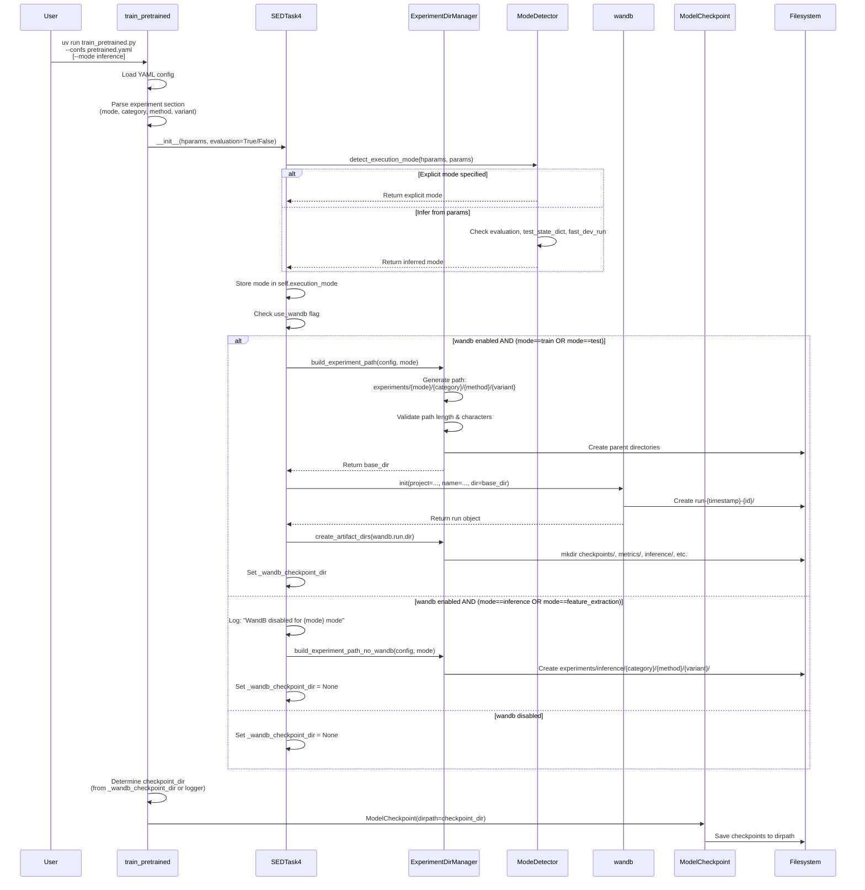
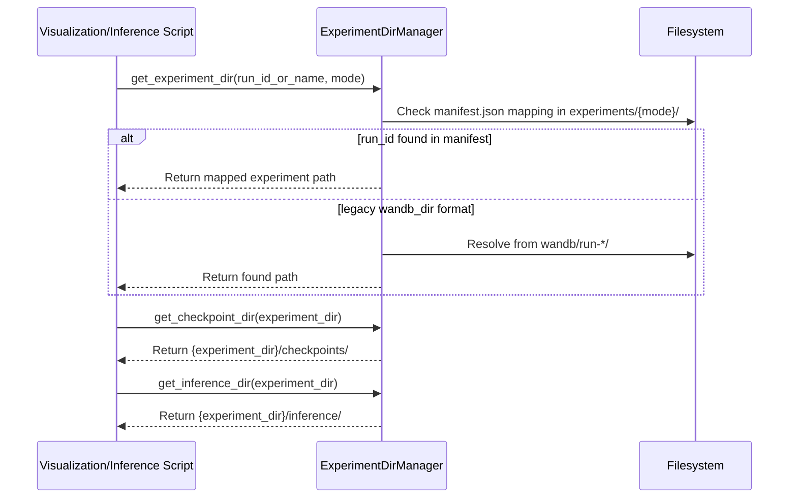
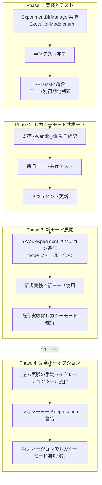

# Technical Design: 実験ディレクトリ構造リファクタリング

## Overview

本機能は、DCASE 2024 Task 4音響イベント検出システムの実験管理基盤を改善する。現在のwandbデフォルト形式（`run-{timestamp}-{id}`）から、研究者が理解しやすい階層的レイアウト（`experiments/{mode}/{category}/{method}/{variant}/`）への移行により、実験成果物の組織化と追跡性を大幅に向上させる。さらに、**実行モード別のwandBログ管理**により、training実行とtest-only実行、feature-extraction実行を明確に区別し、不要なログファイルの生成を防止する。

**Purpose**: 研究ワークフローにおける実験成果物の発見可能性と再現性を向上させ、実験目的に応じた適切なログ管理を実現する。

**Users**:
- **音響研究者**: 複数の実験手法（CMT、SEBBs、BEATs統合等）を比較・管理、training/test/inference実行を明確に識別
- **データサイエンティスト**: ハイパーパラメータチューニングと結果分析、不要なwandBログから解放
- **システム開発者**: チェックポイントと推論結果の保守、実行モード別のディレクトリ構造管理

**Impact**: 既存のwandB統合とPyTorch Lightning checkpointing機構を拡張し、ファイルシステム上の階層構造とwandBクラウドトラッキングの両方で実験を組織化する。実行モード管理により、wandB runの無駄な生成を防ぎ、ログの可読性を向上させる。

### Goals

- 階層的実験ディレクトリ構造（`experiments/{mode}/{category}/{method}/{variant}/`）の導入
- **実行モード別のwandBログ管理** — training/test/inference/feature_extraction モードの明示的サポート
- **不要なwandB runの生成防止** — inference/feature_extraction時のwandB初期化を無効化
- 実験成果物（checkpoints, metrics, inference, visualizations, config）の統合管理
- wandb統合を維持したまま、カスタムディレクトリレイアウトを実現
- YAML設定ファイルによる実験命名と実行モードの設定駆動化
- 後方互換性の確保（既存の `--wandb_dir` 引数と暗黙的モード推論をサポート）

### Non-Goals

- wandB UIの階層的フォルダ表示の実装（wandBの制限により不可能）
- Hydra設定フレームワークへの完全移行（将来の拡張オプション）
- Grad-CAM可視化スクリプトの統合（別タスクで対応）
- 過去の実験データの自動マイグレーション

## Architecture

### Existing Architecture Analysis

現在のシステムは以下の実験成果物管理パターンを使用している：

**現在の構造**:
```
DESED_task/dcase2024_task4_baseline/
├── exp/
│   └── 2024_baseline/                  # TensorBoardLogger default
│       └── version_X/
│           ├── checkpoints/
│           └── hparams.yaml
├── wandb/
│   └── run-{timestamp}-{id}/           # wandb default format (無差別生成)
│       ├── checkpoints/                # 最近追加された統合ディレクトリ
│       ├── files/
│       └── logs/
└── visualize/get_features/
    └── inference_outputs/               # 手動管理
```

**現在の問題点**:
- Training、test-only、feature-extraction すべてで新しいwandB runが作成される（`use_wandb=True` の場合）
- 実験目的（training vs inference）を後から識別できない
- 推論・可視化スクリプト実行時に不要なログが大量生成される

**既存の統合ポイント**:
- `SEDTask4._init_wandb_project()`: wandb初期化とcheckpointディレクトリ設定（sed_trainer_pretrained.py:417-441）
- `train_pretrained.py`: ModelCheckpoint callbackのdirpath決定（train_pretrained.py:539-545）
- コマンドライン引数 `--wandb_dir`: 実験名の指定（疑似的な階層構造をスラッシュで表現）
- 実行モード判定: `test_state_dict`, `evaluation` パラメータ、`--test_from_checkpoint` 引数

**保持すべきパターン**:
- PyTorch Lightning LightningModuleベースの学習ループ
- wandBのクラウド同期機能（trainingモード時のメトリクス、ハイパーパラメータ）
- ModelCheckpointによる自動保存とbest model選択
- TensorBoardLoggerとの共存（wandb無効時のフォールバック）

### Architecture Pattern & Boundary Map

**選択パターン**: Wrapper Pattern with Strategy Injection + Execution Mode Strategy

**統合アプローチ**:
1. **新規モジュール導入**: `local/experiment_dir.py`（実験ディレクトリ管理とモード判定の単一責任）
2. **既存拡張**: `SEDTask4._init_wandb_project()` からexperiment_dir.pyを呼び出し、モード別にwandB初期化を制御
3. **設定拡張**: YAML設定に `experiment:` セクションを追加（`mode`, `category`, `method`, `variant`）

```mermaid
graph TB
    subgraph User Input
        CLI[Command Line Args<br/>--wandb_dir legacy<br/>--mode new]
        YAML[YAML Config<br/>experiment section<br/>with mode field]
    end

    subgraph New Components
        ExperimentDirManager[ExperimentDirManager<br/>local/experiment_dir.py]
        ConfigParser[ExperimentConfig Parser]
        ModeDetector[Execution Mode Detector]
    end

    subgraph Existing Components
        SEDTask4[SEDTask4 LightningModule<br/>local/sed_trainer_pretrained.py]
        WandbInit[wandb.init<br/>conditional execution]
        ModelCheckpoint[ModelCheckpoint Callback]
        TrainScript[train_pretrained.py]
    end

    subgraph Filesystem
        ExpRoot[experiments/<br/>Mode-based Layout]
        TrainDir[train/{category}/{method}/{variant}/<br/>run-timestamp-id/]
        TestDir[test/{category}/{method}/{variant}/<br/>minimal logs]
        InferenceDir[inference/{category}/{method}/{variant}/<br/>NO wandb runs]
        Artifacts[checkpoints/<br/>metrics/<br/>inference/<br/>visualizations/<br/>config/]
    end

    CLI --> ConfigParser
    YAML --> ConfigParser
    ConfigParser --> ModeDetector
    ModeDetector --> ExperimentDirManager

    TrainScript --> SEDTask4
    SEDTask4 --> ModeDetector
    SEDTask4 --> ExperimentDirManager

    ExperimentDirManager -->|mode: train| WandbInit
    ExperimentDirManager -->|mode: test| WandbInit
    ExperimentDirManager -->|mode: inference/feature_extraction| SkipWandB[Skip wandb.init]

    WandbInit -->|train mode| TrainDir
    WandbInit -->|test mode| TestDir
    SkipWandB --> InferenceDir

    TrainScript --> ModelCheckpoint
    ModelCheckpoint --> Artifacts

    ExpRoot --> TrainDir
    ExpRoot --> TestDir
    ExpRoot --> InferenceDir
    TrainDir --> Artifacts
    TestDir --> Artifacts
    InferenceDir --> Artifacts

    ExperimentDirManager -.->|provides path| ModelCheckpoint
```

**主要な設計決定**:
- **実行モード別ディレクトリ**: `experiments/{mode}/` として最上位階層にモードを配置
- **wandB初期化の条件分岐**: `inference` および `feature_extraction` モードではwandB初期化をスキップ
- **モード推論ロジック**: 明示的指定がない場合、`evaluation`, `test_state_dict`, `fast_dev_run` パラメータから自動推論
- **ラッパーパターン**: 既存の `wandb.init()` を直接変更せず、呼び出し前にモードチェックを挿入

**ドメイン境界**:
- **ExperimentDirManager**: 実験ディレクトリパスの生成、検証、ヘルパー関数、**実行モード判定**
- **SEDTask4**: 学習ロジック、wandB初期化のオーケストレーション、**モード別初期化制御**
- **train_pretrained.py**: CLIパーサー、コールバック設定、**モード推論の補助**

**ステアリング準拠**:
- **Wrapper Pattern**: 構造化原則（structure.md）に準拠し、既存のsubmodule（sebbs）と同様のパターンを適用
- **Type Safety**: すべてのパス解決関数とモード判定関数に型アノテーション（tech.md要件）
- **Separation of Concerns**: 実験管理ロジックとモード判定を独立モジュールに分離（structure.md）

### Technology Stack

| Layer | Choice / Version | Role in Feature | Notes |
|-------|------------------|-----------------|-------|
| Backend / Services | Python 3.11+ | パス操作、設定解析、モード判定 | 標準ライブラリ（pathlib, os, datetime, enum）のみ使用 |
| Experiment Tracking | wandb 0.22.3+ | 実験メトリクスとクラウド同期（trainモードのみ） | `dir` パラメータで親ディレクトリ制御、モード別条件初期化 |
| Training Framework | PyTorch Lightning 1.9.x | LightningModuleとModelCheckpoint | `dirpath` パラメータでチェックポイント先指定 |
| Configuration | PyYAML (内蔵) | 実験命名パラメータとモードの読み込み | 既存のYAML設定機構を拡張 |

**新規依存関係**: なし（標準ライブラリのみで実装）

**技術的根拠**:
- **wandb.init(dir=)**: 公式にサポートされたカスタムディレクトリ指定方法（`research.md` 参照）
- **ModelCheckpoint(dirpath=)**: PyTorch Lightning公式のチェックポイント保存先制御（`research.md` 参照）
- **pathlib.Path**: Python標準のクロスプラットフォームパス操作ライブラリ
- **enum.Enum**: 実行モードの型安全な定義（`ExecutionMode` enum）

## System Flows

### 実行開始フロー（モード別wandB初期化）



**フロー決定ポイント**:
- **実行モード検出**: 明示的指定（YAML/CLI）→ 自動推論（evaluation, test_state_dict）の優先順位
- **wandB初期化条件**: `use_wandb=True` AND (`mode==train` OR (`mode==test` AND `log_test_to_wandb=True`))
- **ディレクトリレイアウト**: モードによって最上位階層が変化（`train/`, `test/`, `inference/`）

### パス解決フロー（推論・可視化時）



**ヘルパー関数の役割**:
- `get_experiment_dir()`: run IDまたは実験名から実験ディレクトリパスを解決（モード指定でスコープを絞る）
- `detect_execution_mode()`: hparamsとパラメータから実行モードを推論
- manifest.jsonを利用してrun ID → 実験パスのマッピングを提供（Requirement 3.3、5.9）

## Requirements Traceability

| Requirement | Summary | Components | Interfaces | Flows |
|-------------|---------|------------|------------|-------|
| 1.1 | 階層的ディレクトリ構造 `{mode}/{category}/{method}/{variant}/` | ExperimentDirManager | `build_experiment_path()` | 実行開始フロー |
| 1.2 | 親ディレクトリの自動作成 | ExperimentDirManager | `build_experiment_path()` | 実行開始フロー |
| 1.3 | 3階層サポート（+ モード階層） | ExperimentDirManager | ExperimentConfig dataclass | 実行開始フロー |
| 1.4 | パス検証（文字・長さ制限） | ExperimentDirManager | `validate_path()` | 実行開始フロー |
| 1.5 | 一意識別子付与（timestamp/counter） | wandb（run ID） | wandb.init() | 実行開始フロー |
| 2.1 | checkpoints管理 | ModelCheckpoint, ExperimentDirManager | `get_checkpoint_dir()` | 実行開始フロー |
| 2.2 | metrics管理 | ExperimentDirManager | `create_artifact_dirs()` | 実行開始フロー |
| 2.3 | inference管理 | ExperimentDirManager | `get_inference_dir()` | パス解決フロー |
| 2.4 | visualizations管理 | ExperimentDirManager | `create_artifact_dirs()` | 実行開始フロー |
| 2.5 | config管理 | ExperimentDirManager | `create_artifact_dirs()` | 実行開始フロー |
| 2.6 | manifest生成 | ExperimentDirManager | `generate_manifest()` | 実行開始フロー |
| 3.1 | wandbデフォルトrun dirオーバーライド | SEDTask4, ExperimentDirManager | wandb.init(dir=) | 実行開始フロー |
| 3.2 | wandb初期化時のパス注入 | SEDTask4 | `_init_wandb_project()` | 実行開始フロー |
| 3.3 | symlink/metadataマッピング | ExperimentDirManager | manifest.json, `get_experiment_dir()` | パス解決フロー |
| 3.4 | ヘルパー関数提供 | ExperimentDirManager | `get_*_dir()` functions | パス解決フロー |
| 3.5 | パス解決パフォーマンス（100ms以内） | ExperimentDirManager | manifest.json cache | パス解決フロー |
| 4.1 | YAML設定サポート | ConfigParser | experiment セクション | 実行開始フロー |
| 4.2 | テンプレート機能 | ExperimentDirManager | `apply_template()` | 実行開始フロー |
| 4.3 | 必須パラメータ検証 | ConfigParser | ExperimentConfig validation | 実行開始フロー |
| 4.4 | デフォルト値フォールバック | ConfigParser | ExperimentConfig defaults | 実行開始フロー |
| 4.5 | 環境変数置換 | ExperimentDirManager | `os.path.expandvars()` | 実行開始フロー |
| 5.1 | 4つの実行モード認識 | ExperimentDirManager | `ExecutionMode` enum | 実行開始フロー |
| 5.2 | trainモードでwandB run作成 | SEDTask4, ExperimentDirManager | wandb.init(), `experiments/train/` | 実行開始フロー |
| 5.3 | testモードで最小ログまたは再利用 | SEDTask4, ExperimentDirManager | `experiments/test/` | 実行開始フロー |
| 5.4 | inference/feature_extraction時wandB無効化 | SEDTask4 | `_init_wandb_project()` with mode check | 実行開始フロー |
| 5.5 | manifestにmode記録 | ExperimentDirManager | manifest.json `mode` field | 実行開始フロー |
| 5.6 | モード別無効化メッセージ | SEDTask4 | Logger output | 実行開始フロー |
| 5.7 | モード明示指定（YAML/CLI） | ConfigParser, train_pretrained | `--mode` argument | 実行開始フロー |
| 5.8 | モード自動推論 | ExperimentDirManager | `detect_execution_mode()` | 実行開始フロー |
| 5.9 | parent_run_id参照リンク | ExperimentDirManager | manifest.json `parent_run_id` field | パス解決フロー |

## Components and Interfaces

### Component Summary

| Component | Domain/Layer | Intent | Req Coverage | Key Dependencies (P0/P1) | Contracts |
|-----------|--------------|--------|--------------|--------------------------|-----------|
| ExperimentDirManager | Utility / Path Management | 実験ディレクトリパスの生成・検証・解決、**実行モード判定** | 1.1-1.5, 2.1-2.6, 3.1-3.5, 4.2, 4.5, 5.1, 5.4-5.9 | pathlib (P0), wandb (P1), enum (P0) | Service, State |
| ExperimentConfig | Data / Configuration | 実験命名パラメータとモードのデータ構造 | 1.3, 4.1, 4.3, 4.4, 5.1, 5.7 | dataclasses (P0), enum (P0) | State |
| SEDTask4 (拡張) | Training / LightningModule | wandB初期化とExperimentDirManager統合、**モード別初期化制御** | 3.1, 3.2, 5.2-5.4, 5.6 | ExperimentDirManager (P0), wandb (P0) | Service |
| train_pretrained.py (拡張) | CLI / Orchestration | 設定解析とModelCheckpoint設定、**モード推論補助** | 4.1, 4.3, 5.7, 5.8 | ExperimentConfig (P0), ModelCheckpoint (P0) | API |

### Utility / Path Management

#### ExperimentDirManager

| Field | Detail |
|-------|--------|
| Intent | 実験ディレクトリの生成、検証、パス解決、**実行モード判定**を一元管理 |
| Requirements | 1.1-1.5, 2.1-2.6, 3.1, 3.3, 3.4, 3.5, 4.2, 4.5, 5.1, 5.4-5.9 |

**Responsibilities & Constraints**
- 階層的ディレクトリパスの生成とファイルシステム上の作成（モード別レイアウト）
- パス検証（最大長260文字、無効文字チェック）
- 成果物サブディレクトリ（checkpoints, metrics, inference, visualizations, config）の作成
- manifest.jsonによるrun ID → 実験パスのマッピング管理（モード情報を含む）
- パス解決ヘルパー関数の提供（100ms以内のパフォーマンス要件）
- **実行モードの検出と推論**（明示的指定 or 自動推論）

**Dependencies**
- Inbound: SEDTask4 — wandB初期化時にモード検出とパス生成要求 (P0)
- Inbound: train_pretrained.py — ModelCheckpoint dirpath決定、モード推論補助 (P1)
- Inbound: 可視化・推論スクリプト — 実験ディレクトリ解決 (P1)
- Outbound: pathlib.Path — クロスプラットフォームパス操作 (P0)
- Outbound: os.path.expandvars — 環境変数置換 (P1)
- Outbound: enum.Enum — ExecutionMode型定義 (P0)
- External: wandb.run — run IDとディレクトリ情報取得 (P1)

**Contracts**: Service [✓] / State [✓]

##### Service Interface

```python
from dataclasses import dataclass
from enum import Enum
from pathlib import Path
from typing import Optional

class ExecutionMode(Enum):
    """実行モードの型安全な定義."""
    TRAIN = "train"
    TEST = "test"
    INFERENCE = "inference"
    FEATURE_EXTRACTION = "feature_extraction"

@dataclass
class ExperimentConfig:
    """実験命名設定のデータクラス."""
    mode: ExecutionMode = ExecutionMode.TRAIN
    category: str = "default"
    method: str = "baseline"
    variant: str = "v1"
    base_dir: str = "experiments"
    template: Optional[str] = None  # e.g., "{method}_{variant}_{timestamp}"
    log_test_to_wandb: bool = False  # testモード時のwandB初期化制御

class ExperimentDirManager:
    """実験ディレクトリ管理と実行モード判定のユーティリティクラス."""

    @staticmethod
    def detect_execution_mode(
        hparams: dict,
        evaluation: bool = False,
        test_state_dict: Optional[dict] = None,
        fast_dev_run: bool = False
    ) -> ExecutionMode:
        """実行モードを検出（明示的指定 or 自動推論）.

        Args:
            hparams: ハイパーパラメータ辞書（`experiment.mode` を含む可能性）
            evaluation: evaluationパラメータ（推論モードの指標）
            test_state_dict: テストstate_dict（test-onlyモードの指標）
            fast_dev_run: fast_dev_runフラグ

        Returns:
            検出された実行モード

        優先順位:
            1. hparams["experiment"]["mode"] の明示的指定
            2. evaluation=True → INFERENCE
            3. test_state_dict is not None → TEST
            4. fast_dev_run=True → TRAIN (ただし通常wandB無効)
            5. デフォルト → TRAIN
        """
        ...

    @staticmethod
    def build_experiment_path(
        config: ExperimentConfig,
        validate: bool = True
    ) -> Path:
        """階層的実験ディレクトリパスを生成（モード別レイアウト）.

        Args:
            config: 実験命名設定（mode含む）
            validate: パス検証を実行するか

        Returns:
            実験ディレクトリの親パス（例: experiments/train/{category}/{method}/{variant}/）

        Raises:
            ValueError: パス検証失敗時（無効文字、長さ超過）
        """
        ...

    @staticmethod
    def validate_path(path: Path) -> None:
        """パスの妥当性を検証.

        Args:
            path: 検証対象パス

        Raises:
            ValueError: パス長が260文字超過、または無効文字を含む場合
        """
        ...

    @staticmethod
    def create_artifact_dirs(experiment_dir: Path) -> dict[str, Path]:
        """成果物サブディレクトリを作成.

        Args:
            experiment_dir: 実験ディレクトリパス（wandb run dir or inference dir）

        Returns:
            作成されたサブディレクトリのパス辞書
            {"checkpoints": Path, "metrics": Path, "inference": Path, "visualizations": Path, "config": Path}
        """
        ...

    @staticmethod
    def generate_manifest(
        experiment_dir: Path,
        run_id: Optional[str],
        config: dict,
        mode: ExecutionMode,
        parent_run_id: Optional[str] = None
    ) -> None:
        """manifest.jsonを生成してrun ID → パスマッピングとモード情報を保存.

        Args:
            experiment_dir: 実験ディレクトリパス
            run_id: wandb run ID（inference/feature_extractionモードではNone）
            config: 実験設定（ハイパーパラメータ）
            mode: 実行モード
            parent_run_id: 親トレーニング実験のrun ID（test/inferenceモード時）
        """
        ...

    @staticmethod
    def get_experiment_dir(
        run_id_or_name: str,
        base_dir: Path = Path("experiments"),
        mode: Optional[ExecutionMode] = None
    ) -> Path:
        """run IDまたは実験名から実験ディレクトリを解決.

        Args:
            run_id_or_name: wandb run IDまたは実験名
            base_dir: 実験ルートディレクトリ
            mode: 検索スコープを絞るモード（指定すればexperiments/{mode}/内のみ検索）

        Returns:
            実験ディレクトリパス

        Raises:
            FileNotFoundError: 対応する実験ディレクトリが見つからない場合
        """
        ...

    @staticmethod
    def get_checkpoint_dir(experiment_dir: Path) -> Path:
        """チェックポイントディレクトリパスを返す."""
        ...

    @staticmethod
    def get_inference_dir(experiment_dir: Path) -> Path:
        """推論結果ディレクトリパスを返す."""
        ...

    @staticmethod
    def get_visualization_dir(experiment_dir: Path) -> Path:
        """可視化ディレクトリパスを返す."""
        ...

    @staticmethod
    def apply_template(template: str, config: ExperimentConfig) -> str:
        """テンプレート文字列にプレースホルダーを適用.

        Args:
            template: テンプレート文字列（例: "{method}_{variant}_{timestamp}"）
            config: 実験設定

        Returns:
            プレースホルダー置換後の文字列
        """
        ...

    @staticmethod
    def should_initialize_wandb(mode: ExecutionMode, config: ExperimentConfig) -> bool:
        """実行モードに基づいてwandB初期化の可否を判定.

        Args:
            mode: 実行モード
            config: 実験設定（log_test_to_wandb含む）

        Returns:
            True: wandB初期化すべき
            False: wandB初期化をスキップすべき

        ロジック:
            - TRAIN → True
            - TEST → config.log_test_to_wandb
            - INFERENCE / FEATURE_EXTRACTION → False
        """
        ...
```

**Preconditions**:
- `detect_execution_mode()`: hparamsが有効な辞書
- `build_experiment_path()`: configの必須フィールド（mode, category, method, variant）が設定されている
- `create_artifact_dirs()`: experiment_dirが存在するディレクトリパス
- `get_experiment_dir()`: base_dirが存在し、manifest.jsonまたはwandbディレクトリ構造が存在

**Postconditions**:
- `detect_execution_mode()`: 常に有効な `ExecutionMode` を返す
- `build_experiment_path()`: 検証済みのPathオブジェクトを返し、親ディレクトリが作成される
- `create_artifact_dirs()`: すべてのサブディレクトリ（5種類）が存在
- `generate_manifest()`: manifest.jsonファイルがexperiment_dir直下に作成され、`mode` フィールドを含む
- `get_experiment_dir()`: 100ms以内に有効な実験ディレクトリパスを返す

**Invariants**:
- 生成されるパスは常にbase_dir配下に存在
- manifestファイルはJSON形式で、run_id, experiment_path, mode, created_at, configフィールドを含む
- パス長は260文字以下（Windows互換性）
- `ExecutionMode` enumによりモード値の型安全性を保証

##### State Management

**State Model**:
- ExperimentDirManagerは状態を持たない静的ユーティリティクラス
- manifest.jsonファイルがディスク上の永続状態として機能（モード情報を含む）

**Persistence & Consistency**:
- manifest.jsonはUTF-8エンコーディングでJSON形式保存
- 実験開始時に1回だけ生成（idempotent）
- 並行実験では異なるrun IDディレクトリ（trainモード）または異なるタイムスタンプディレクトリ（inferenceモード）に独立したmanifestを作成

**Concurrency Strategy**:
- wandbのrun ID生成により、並行training実験は自動的に異なるディレクトリに分離
- inference/feature_extractionモードでは各実行が独立したタイムスタンプディレクトリを作成（wandBなし）
- ディレクトリ作成はos.makedirs(exist_ok=True)で競合を回避

**Implementation Notes**
- **Integration**: `SEDTask4._init_wandb_project()` から `detect_execution_mode()` と `build_experiment_path()` を呼び出し、モード別にwandB初期化を制御
- **Validation**: `validate_path()` は正規表現で無効文字（`<>:"|?*`）をチェック、WindowsとLinux両対応
- **Risks**:
  - 極端に長いvariant名が指定された場合のパス長超過 → 警告ログと自動短縮機能を提供
  - manifestファイルの破損 → フォールバックとしてディレクトリスキャンで検索
  - モード自動推論の誤判定 → 明示的な `--mode` 引数使用を推奨、ログで判定結果を出力

### Data / Configuration

#### ExperimentConfig

| Field | Detail |
|-------|--------|
| Intent | 実験命名パラメータとモードを型安全に保持するデータクラス |
| Requirements | 1.3, 4.1, 4.3, 4.4, 5.1, 5.7 |

**Responsibilities & Constraints**
- YAML設定の `experiment:` セクションから読み込まれたパラメータを保持（**mode含む**）
- デフォルト値（mode=TRAIN, category="default", method="baseline", variant="v1"）を提供
- 不変オブジェクトとして扱い、設定の一貫性を保証

**State Management**
```python
@dataclass(frozen=True)
class ExperimentConfig:
    mode: ExecutionMode = ExecutionMode.TRAIN
    category: str = "default"
    method: str = "baseline"
    variant: str = "v1"
    base_dir: str = "experiments"
    template: Optional[str] = None
    log_test_to_wandb: bool = False
```

**Implementation Notes**
- frozen=Trueで不変性を強制
- `mode` はExecutionMode enumで型安全性を保証
- train_pretrained.pyでYAML読み込み後、ExperimentConfigインスタンスを生成
- configが空の場合はデフォルト値が自動適用（Requirement 4.4）

### Training / LightningModule

#### SEDTask4 (拡張)

| Field | Detail |
|-------|--------|
| Intent | ExperimentDirManagerを統合し、**実行モード別にwandB初期化を制御** |
| Requirements | 3.1, 3.2, 5.2-5.4, 5.6 |

**Responsibilities & Constraints**
- `_init_wandb_project()` メソッドを拡張し、ExperimentDirManagerのモード検出を呼び出し
- レガシーモード（`wandb_dir` 指定時）、新モード（ExperimentConfig使用時）、モード別無効化の3パターンをサポート
- `_wandb_checkpoint_dir` 属性を設定し、train_pretrained.pyでModelCheckpointに渡す
- **inference/feature_extractionモード時、wandB初期化をスキップし、ログメッセージを出力**

**Dependencies**
- Inbound: train_pretrained.py — SEDTask4インスタンス生成とhparams渡し (P0)
- Outbound: ExperimentDirManager — モード検出と実験ディレクトリパス生成 (P0)
- Outbound: wandb — 条件付き初期化とログ記録 (P0)

**Service Interface**

既存の `_init_wandb_project()` メソッドを拡張（モード別制御を追加）:

```python
def _init_wandb_project(self) -> None:
    """wandbプロジェクトを初期化し、カスタムディレクトリを設定（実行モード対応版）."""

    # 実行モード検出
    self.execution_mode = ExperimentDirManager.detect_execution_mode(
        self.hparams,
        evaluation=self.evaluation,
        test_state_dict=getattr(self, '_test_state_dict', None),
        fast_dev_run=self.fast_dev_run
    )
    print(f"Detected execution mode: {self.execution_mode.value}")

    # レガシーモード: --wandb_dir が指定されている場合（後方互換性）
    if self.hparams["net"]["wandb_dir"] != "None":
        print("Using legacy wandb_dir mode (ignoring execution mode)")
        wandb.init(
            project=PROJECT_NAME,
            name=self.hparams["net"]["wandb_dir"]
        )
        if wandb.run is not None:
            self._wandb_checkpoint_dir = os.path.join(wandb.run.dir, "checkpoints")
            os.makedirs(self._wandb_checkpoint_dir, exist_ok=True)
        return

    # 新モード: ExperimentConfig を使用
    if "experiment" in self.hparams:
        exp_config = ExperimentConfig(**self.hparams["experiment"])

        # wandB初期化の可否を判定
        if not ExperimentDirManager.should_initialize_wandb(self.execution_mode, exp_config):
            print(f"WandB disabled for {self.execution_mode.value} mode")
            self._wandb_checkpoint_dir = None

            # inferenceモード時は非wandBディレクトリを作成
            base_dir = ExperimentDirManager.build_experiment_path(exp_config)
            inference_dir = base_dir / f"run-{datetime.now().strftime('%Y%m%d_%H%M%S')}"
            inference_dir.mkdir(parents=True, exist_ok=True)

            artifact_dirs = ExperimentDirManager.create_artifact_dirs(inference_dir)
            self._inference_dir = str(inference_dir)

            # manifest生成（run_id=None）
            ExperimentDirManager.generate_manifest(
                inference_dir,
                run_id=None,
                config=self.hparams,
                mode=self.execution_mode
            )
            return

        # wandB初期化（trainまたはtestモード）
        base_dir = ExperimentDirManager.build_experiment_path(exp_config)
        wandb.init(
            project=PROJECT_NAME,
            name=f"{exp_config.mode.value}/{exp_config.category}/{exp_config.method}/{exp_config.variant}",
            dir=str(base_dir),
            config=self.hparams,
            tags=[exp_config.mode.value, exp_config.category, exp_config.method]
        )

        if wandb.run is not None:
            experiment_dir = Path(wandb.run.dir)
            artifact_dirs = ExperimentDirManager.create_artifact_dirs(experiment_dir)
            self._wandb_checkpoint_dir = str(artifact_dirs["checkpoints"])

            # manifest生成（mode含む）
            ExperimentDirManager.generate_manifest(
                experiment_dir,
                wandb.run.id,
                self.hparams,
                mode=self.execution_mode
            )
    else:
        # デフォルトフォールバック（既存動作）
        wandb.init(project=PROJECT_NAME)
        if wandb.run is not None:
            self._wandb_checkpoint_dir = os.path.join(wandb.run.dir, "checkpoints")
            os.makedirs(self._wandb_checkpoint_dir, exist_ok=True)
```

**Implementation Notes**
- **Integration**: 3つのモード（レガシー、新モード、デフォルト）+ wandB無効化の4パターンを実装
- **Validation**: ExperimentConfig生成時にdataclassとenumのバリデーションが自動実行
- **Risks**:
  - レガシーモードと新モードの同時使用を防ぐため、優先順位を明確化（レガシー > 新モード > デフォルト）
  - モード自動推論の誤判定リスク → ログで判定結果を出力し、明示的指定を推奨

### CLI / Orchestration

#### train_pretrained.py (拡張)

| Field | Detail |
|-------|--------|
| Intent | YAML experiment セクションを解析し、**モード推論を補助**し、SEDTask4とModelCheckpointに渡す |
| Requirements | 4.1, 4.3, 5.7, 5.8 |

**API Contract**

既存のargparse引数を保持しつつ、YAML設定とCLI引数を拡張:

```python
# prepare_run() 関数内でYAML読み込み後
def prepare_run(argv=None):
    parser = argparse.ArgumentParser("Training a SED system for DESED Task")
    # ... 既存の引数 ...

    # 新規引数: 明示的なモード指定
    parser.add_argument(
        "--mode",
        choices=["train", "test", "inference", "feature_extraction"],
        default=None,
        help="Explicit execution mode (overrides auto-detection)"
    )

    args = parser.parse_args(argv)

    with open(args.confs, "r") as f:
        configs = yaml.safe_load(f)

    # experimentセクションのバリデーションとモード設定
    if "experiment" not in configs:
        configs["experiment"] = {}

    # CLIの --mode 引数が指定されていれば優先
    if args.mode is not None:
        configs["experiment"]["mode"] = args.mode
        print(f"Explicit mode specified: {args.mode}")

    # experiment セクションをExperimentConfigで検証
    exp_config = ExperimentConfig(**configs["experiment"])
    print(f"Experiment structure: {exp_config.mode.value}/{exp_config.category}/{exp_config.method}/{exp_config.variant}")

    # 既存の --wandb_dir 引数が指定されている場合は優先（後方互換性）
    if args.wandb_dir is not None:
        configs["net"]["wandb_dir"] = args.wandb_dir
        print("Using legacy wandb_dir mode (ignoring execution mode)")

    # test_state_dict の設定（モード推論に使用）
    test_model_state_dict = None
    if args.test_from_checkpoint is not None or args.eval_from_checkpoint is not None:
        checkpoint_path = args.eval_from_checkpoint or args.test_from_checkpoint
        checkpoint = torch.load(checkpoint_path, weights_only=False)
        test_model_state_dict = checkpoint["state_dict"]
        print(f"Loaded checkpoint for test/eval: {checkpoint_path}")

    # ... SEDTask4インスタンス生成（test_state_dictパラメータを渡す） ...
    desed_training = SEDTask4(
        config,
        encoder=encoder,
        sed_student=sed_student,
        pretrained_model=pretrained,
        opt=opt,
        train_data=train_dataset,
        valid_data=valid_dataset,
        test_data=test_dataset,
        train_sampler=batch_sampler,
        scheduler=exp_scheduler,
        fast_dev_run=fast_dev_run,
        evaluation=evaluation,
        # モード推論用に追加
        _test_state_dict=test_model_state_dict
    )

    # ... 残りの処理 ...
```

**Implementation Notes**
- **Integration**: YAML読み込み直後にexperimentセクションをチェック、CLI `--mode` 引数で上書き可能
- **Validation**: ExperimentConfigのdataclassとenumバリデーションに委譲
- **Risks**: レガシーモードとの競合を防ぐため、`--wandb_dir` 指定時は警告ログを出力

## Data Models

### Logical Data Model

#### manifest.json構造（実行モード対応版）

実験ディレクトリ直下に保存されるメタデータファイル:

```json
{
  "run_id": "20250112_123456-abcd1234",
  "experiment_path": "experiments/train/baseline/cmt/use_neg_sample/run-20250112_123456-abcd1234",
  "mode": "train",
  "category": "baseline",
  "method": "cmt",
  "variant": "use_neg_sample",
  "created_at": "2025-01-12T12:34:56Z",
  "parent_run_id": null,
  "config": {
    "training": {...},
    "net": {...}
  }
}
```

**Fields**:
- `run_id` (string | null): wandb run ID（一意識別子）、inferenceモードではnull
- `experiment_path` (string): 実験ディレクトリの絶対パス
- **`mode` (string)**: 実行モード（"train" | "test" | "inference" | "feature_extraction"）**必須フィールド**
- `category` (string): 実験カテゴリ
- `method` (string): 実験手法
- `variant` (string): バリアント名
- `created_at` (ISO8601 string): 実験作成時刻
- **`parent_run_id` (string | null)**: 親トレーニング実験のrun ID（test/inferenceモード時に設定、trainモードではnull）
- `config` (object): 実験設定のスナップショット

**Consistency & Integrity**:
- 実験開始時に1回だけ生成（immutable）
- UTF-8エンコーディング、indent=2でフォーマット
- パス解決時に100ms以内で読み込み可能なサイズ（通常10KB以下）
- `mode` フィールドは ExecutionMode enum の値と一致

## Error Handling

### Error Strategy

実験ディレクトリ管理では以下のエラーカテゴリに対応:

**User Errors (4xx相当)**:
- **Invalid Configuration**: category/method/variant名に無効文字が含まれる → `ValueError` with 詳細メッセージと推奨修正
- **Invalid Mode**: YAML/CLIで無効なmode値が指定される → `ValueError` with 有効なモード一覧表示
- **Path Too Long**: 生成されたパスが260文字を超過 → `ValueError` with 短縮提案（variant名の短縮）
- **Missing Experiment Directory**: 存在しないrun IDで解決を試行 → `FileNotFoundError` with 利用可能な実験リスト表示

**System Errors (5xx相当)**:
- **Permission Denied**: 実験ディレクトリ作成時のファイルシステム権限エラー → `OSError` でログ記録、ユーザーに権限確認を促す
- **Disk Full**: ディスク容量不足 → `OSError` でログ記録、既存実験のクリーンアップを推奨
- **Manifest Corruption**: manifest.jsonが破損 → フォールバック処理（ディレクトリスキャン）に切り替え、警告ログ

**Business Logic Errors (422相当)**:
- **Duplicate Experiment**: 同じcategory/method/variantで並行実験 → wandbのrun IDまたはタイムスタンプで自動解決（エラーではなく正常動作）
- **Legacy and New Mode Conflict**: `--wandb_dir` とYAML `experiment:` セクションの同時指定 → レガシーモード優先、情報ログで通知

### Error Categories and Responses

| Error Type | Detection | Response | Recovery |
|------------|-----------|----------|----------|
| 無効パス文字 | `validate_path()` | ValueError with 無効文字リスト表示 | ユーザーが設定修正 |
| 無効mode値 | ExperimentConfig.__post_init__() | ValueError with 有効値一覧 | ユーザーがYAML/CLI修正 |
| パス長超過 | `validate_path()` | ValueError with 現在長と推奨短縮案 | variant名を短縮 |
| 権限エラー | `os.makedirs()` | OSError catch → ログ記録 → sys.exit(1) | ユーザーが権限修正 |
| manifest破損 | `get_experiment_dir()` | JSONDecodeError catch → フォールバック検索 | ディレクトリスキャンで解決 |
| 実験未発見 | `get_experiment_dir()` | FileNotFoundError with 利用可能リスト | ユーザーが正しいrun ID指定 |

### Monitoring

- **ロギング**: `ExperimentDirManager` の各操作でINFOレベルログ出力（モード検出、パス生成、ディレクトリ作成、manifest生成）
- **エラートラッキング**: すべての例外をERRORレベルで記録、スタックトレース付き
- **パフォーマンス計測**: `get_experiment_dir()` の実行時間を計測し、100ms超過時にWARNINGログ
- **モード検出ログ**: `detect_execution_mode()` の判定結果を必ずログ出力し、自動推論の透明性を確保

## Testing Strategy

### Unit Tests

- **ExperimentDirManager.detect_execution_mode()**:
  - 明示的モード指定が最優先されること
  - evaluation=True で INFERENCE モードが返されること
  - test_state_dict が存在する場合 TEST モードが返されること
  - デフォルトで TRAIN モードが返されること
- **ExperimentDirManager.build_experiment_path()** （モード対応版）:
  - 有効な設定で正しいモード別パスが生成されること（`experiments/{mode}/{category}/{method}/{variant}/`）
  - 無効文字を含む設定でValueErrorが発生すること
  - パス長が260文字超過でValueErrorが発生すること
  - テンプレート機能（`{timestamp}`プレースホルダー）が正しく動作すること
- **ExperimentDirManager.should_initialize_wandb()**:
  - TRAIN モードで True が返されること
  - TEST モードで log_test_to_wandb に応じた値が返されること
  - INFERENCE / FEATURE_EXTRACTION モードで False が返されること
- **ExperimentDirManager.validate_path()**:
  - Windows無効文字（`<>:"|?*`）を検出すること
  - 260文字のパスが受理されること、261文字が拒否されること
- **ExperimentConfig dataclass**:
  - デフォルト値（mode=TRAIN含む）が正しく適用されること
  - frozen=Trueで変更不可能なこと
  - 無効なmode文字列でValueErrorが発生すること

### Integration Tests

- **SEDTask4 + ExperimentDirManager統合（モード別）**:
  - 新モード（YAML experiment セクション使用、mode=train）で正しいディレクトリ構造が作成されること
  - 新モード（mode=inference）でwandB初期化がスキップされ、inferenceディレクトリが作成されること
  - レガシーモード（`--wandb_dir` 指定）で従来の動作が維持されること
  - wandb無効時にデフォルトフォールバックが動作すること
- **train_pretrained.py + ModelCheckpoint統合**:
  - ExperimentConfigから生成されたcheckpoint_dirにチェックポイントが保存されること（モード別）
  - best_model_pathが正しく解決されること
- **manifest.json生成と読み込み（mode対応版）**:
  - 実験開始時にmanifestが正しく生成され、`mode` フィールドを含むこと
  - `get_experiment_dir()` でrun IDから実験パスが解決されること（mode指定で検索スコープ絞り込み）
  - manifest破損時にフォールバック検索が動作すること

### E2E Tests

- **実験開始から終了までのフルフロー（モード別）**:
  - **Training**: `uv run train_pretrained.py --confs pretrained.yaml` で実験が開始され、`experiments/train/{category}/{method}/{variant}/run-*/` が作成されること
  - **Inference**: `uv run extract_inference_features.py --mode inference` でwandB runが生成されず、`experiments/inference/{category}/{method}/{variant}/run-*/` が作成されること
  - チェックポイント、メトリクス、manifestが正しく保存されること
- **推論スクリプトでのパス解決**:
  - 過去のtraining実験ディレクトリから推論結果を読み込めること
  - `get_experiment_dir()` が100ms以内に応答すること
- **並行実験の分離**:
  - 同じcategory/method/variantで複数training実験を同時実行しても、run IDで分離されること
  - 複数inference実行が異なるタイムスタンプディレクトリに分離されること

### Performance Tests

- **パス解決パフォーマンス**:
  - `get_experiment_dir()` が100ms以内に完了すること（Requirement 3.5）
  - 1000実験のmanifestファイルスキャンが1秒以内に完了すること
- **ディレクトリ作成オーバーヘッド**:
  - 階層的ディレクトリ作成が実験開始時間に10ms以上の遅延を追加しないこと
- **モード検出オーバーヘッド**:
  - `detect_execution_mode()` が1ms以内に完了すること

## Optional Sections

### Migration Strategy

**段階的移行アプローチ**:



**Phase 1: 実装とテスト**
- ExperimentDirManagerとExecutionMode enumの実装と単体テスト完了
- Rollback trigger: 単体テストが失敗した場合は実装を修正
- Validation checkpoint: すべてのテストケースが緑色、モード検出ロジックが正しく動作

**Phase 2: レガシーモードサポート**
- 既存の `--wandb_dir` 引数の動作を確認
- 新旧モード共存時の優先順位を検証（レガシー優先）
- Rollback trigger: レガシーモードの動作が変更された場合
- Validation checkpoint: 既存の実験スクリプト（run_exp_cmt.sh等）が引き続き動作

**Phase 3: 新モード展開**
- pretrained.yamlに `experiment:` セクションを追加（`mode: train` 含む）
- 新規実験は新モードを使用、inference実行でwandB無効化を確認
- 既存実験はレガシーモード維持（手動移行は不要）
- Rollback trigger: 新モードで実験開始に失敗した場合、またはinference時に不要なwandB runが作成された場合
- Validation checkpoint: 新しい階層的ディレクトリ構造が正しく作成され、モード別にwandB初期化が制御される

**Phase 4: 完全移行（オプション）**
- 過去の実験データを新しい構造に移行するツールを提供（manifest.jsonにmode追加）
- レガシーモード使用時にdeprecation警告を表示
- 将来のメジャーバージョンアップでレガシーモード削除を検討

**Rollback Plan**:
- Phase 1-2: 新コードを削除し、既存のwandB統合のみに戻す
- Phase 3: YAML `experiment:` セクションを削除し、レガシーモードのみ使用
- Phase 4: マイグレーションツールの使用を停止し、新旧モード共存を維持

### Performance & Scalability

**Target Metrics**:
- パス解決時間: < 100ms（Requirement 3.5）
- モード検出時間: < 1ms（実験開始オーバーヘッド最小化）
- ディレクトリ作成オーバーヘッド: < 10ms（実験開始時間への影響を最小化）
- manifest.jsonファイルサイズ: < 50KB（高速読み込み）

**Scaling Approaches**:
- **水平スケール**: 各実験が独立したディレクトリを使用するため、並行実験数に制限なし
- **モード別分離**: trainとinference実験が異なる最上位ディレクトリに配置され、競合なし
- **ファイルシステム制限**: 単一ディレクトリ内のサブディレクトリ数上限（ext4: 64,000）に注意
  - 1000実験/category/methodが現実的な上限 → 適切なcategory/method分割を推奨

**Caching Strategy**:
- manifest.jsonは初回読み込み後、メモリキャッシュを検討（オプション）
- 可視化・推論スクリプトでは `@lru_cache` デコレータでパス解決結果をキャッシュ

**Optimization Techniques**:
- `get_experiment_dir()` はまずmanifest.jsonを検索、見つからない場合のみディレクトリスキャン
- mode引数が指定されている場合、`experiments/{mode}/` 配下のみ検索してスコープを絞る
- glob()ではなくos.walk()を使用して深さ優先探索を最適化
