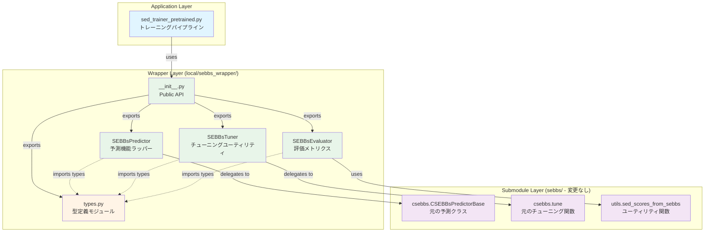
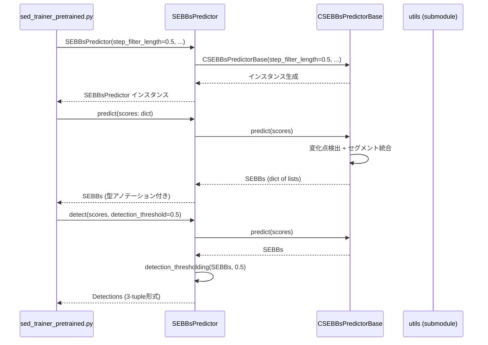
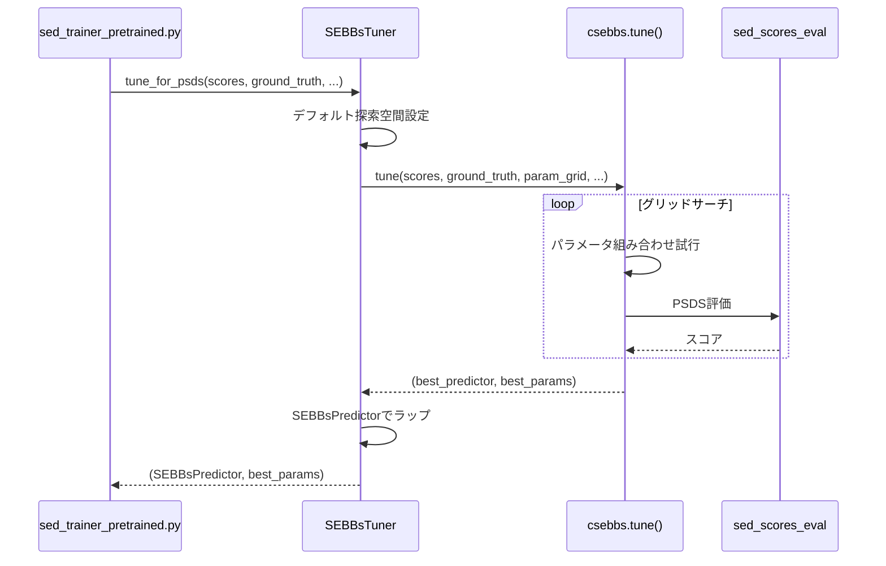
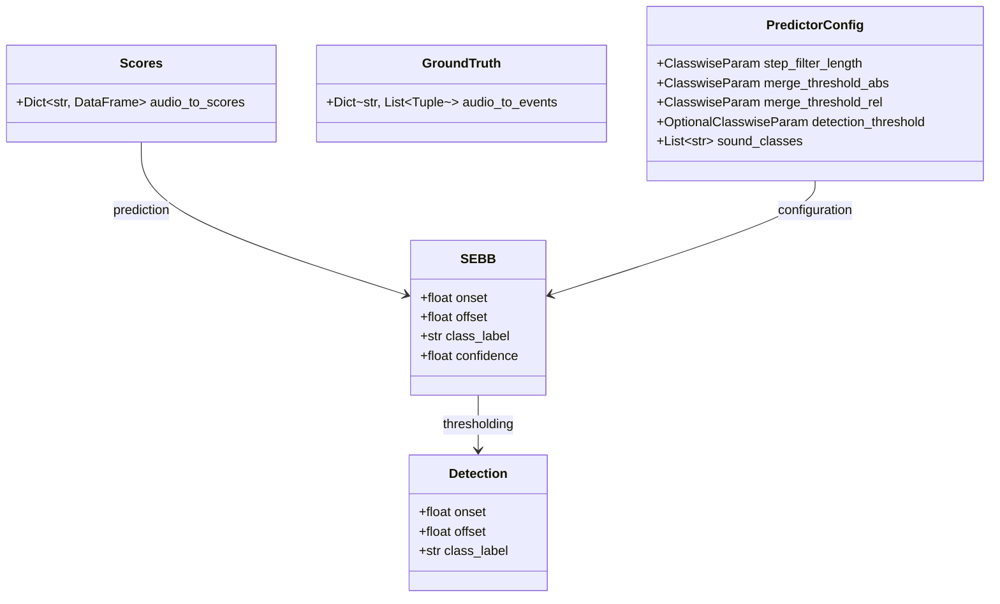
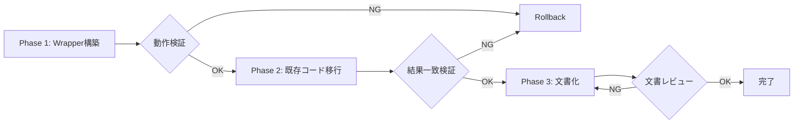

# Design Document: SEBBs Refactoring

---
**Purpose**: SEBBsパッケージに対する型安全性、保守性、ドキュメント品質の向上を、git submodule非編集制約下で実現する。

**Approach**: Wrapper (Adapter) パターンを採用し、既存submoduleを一切変更せずに、型アノテーション、明確なインターフェース、包括的ドキュメントを提供する新規コンポーネント層を構築。

**Complexity**: Medium — 1,274行、4つの主要モジュール、既存トレーニングパイプラインへの最小統合。
---

## Overview

**Purpose**: 本機能は、DCASE 2024 Task 4のベースラインシステムにおけるSEBBs（Sound Event Bounding Boxes）後処理コンポーネントに対して、**型安全性、保守性、開発者体験**を向上させる。SEBBsはgit submoduleとして管理されており、直接編集が制約されるため、Wrapperパターンによるラッパーレイヤーを新規構築することで、submoduleへの影響なしにリファクタリングを実現する。

**Users**: 音響イベント検出研究者、DCASE参加者、プロジェクトメンテナーが、SEBBsの予測、チューニング、評価を**型安全かつ明確なインターフェース**で実行する。既存のトレーニングパイプライン（`sed_trainer_pretrained.py`）はラッパー経由での利用に移行される。

**Impact**: 現在のsubmodule直接利用（`sebbs.sebbs.csebbs`）から、`local/sebbs_wrapper`経由の利用に変更される。これにより、IDE補完、mypy型チェック、ドキュメント参照が改善されるが、実行時の動作は完全に互換性を保つ。

### Goals
- SEBBsの全機能に対する完全な型アノテーション提供（TypedDict, Protocol, 型エイリアス）
- Submodule非編集制約の完全遵守（sebbs/配下を一切変更しない）
- 既存トレーニングパイプラインとの100%後方互換性維持
- 包括的ドキュメント整備（README、docstring、使用例）
- Wrapperパターンによる保守性向上（Submodule更新時の影響局所化）
- **MAESTRO専用チューニングのサポート**（DESED/MAESTRO独立最適化）
- **mpAUC/mAUC評価メトリクスの提供**（MAESTRO評価指標）

### Non-Goals
- Submodule内部ロジックの変更・最適化
- SEBBsアルゴリズムの改善（変化点検出、セグメント統合の精度向上など）
- ~~新規評価メトリクスの追加（PSDS、collar-basedの範囲外）~~ → **mpAUC/mAUCは対象内**
- 大規模なパフォーマンス最適化（デリゲーションオーバーヘッドは許容範囲内）
- 全機能の網羅的テストカバレッジ（基本機能の検証のみ）
- mpAUC最適化専用の選択関数実装（既存の `tune()` カスタム選択関数で対応）

## Architecture

### Existing Architecture Analysis

**現状のアーキテクチャ**:
- **Submodule管理**: `DESED_task/dcase2024_task4_baseline/sebbs/` がgit submoduleとして管理
- **直接利用**: `sed_trainer_pretrained.py` が `sebbs.sebbs.csebbs` から直接import
- **型アノテーション**: Submodule内のコードは型ヒント未整備（742行のcsebbs.pyに型情報なし）
- **ドキュメント**: Submodule公式READMEは存在するが、プロジェクト固有の使用方法は未文書化

**制約と既存パターン**:
- **非編集制約**: Submoduleのファイルは一切変更不可（git submodule更新時の競合回避）
- **`local/` ディレクトリパターン**: プロジェクト固有のコンポーネントは `local/` 配下に配置（既存パターンに準拠）
- **Python 3.11+**: プロジェクトのPythonバージョン要件
- **Ruff lint**: コーディングスタイルの統一

**統合ポイント**:
- `sed_trainer_pretrained.py`: トレーニングパイプラインの7箇所でSEBBs機能を使用
  - チューニング（PSDS最適化、collar-based F1最適化）
  - 予測（SEBBs生成、検出閾値適用）
  - 評価（PSDS1、PSDS2、collar-based F-score）

**技術的負債**:
- なし（新規実装のため）

### Architecture Pattern & Boundary Map

**Selected Pattern**: **Wrapper (Adapter) パターン** + **デリゲーションアプローチ**

**選択理由**:
- Submodule非編集制約により、継承やSubmodule直接拡張は不可能
- デリゲーションにより、Submodule更新時の影響をラッパーレイヤーのみに局所化
- 明示的なインターフェース契約により、型安全性とドキュメント品質を向上
- Composition over Inheritance原則に従う



**Domain/Feature Boundaries**:
- **Application Layer**: 既存トレーニングロジック（`sed_trainer_pretrained.py`）
- **Wrapper Layer**: 型安全なインターフェース提供（`local/sebbs_wrapper/`）
- **Submodule Layer**: 音響処理ロジック実装（`sebbs/`、変更なし）

**Responsibility Separation**:
- **types.py**: 型定義のみ（データ転送オブジェクト）— 他のモジュールへの型提供
- **predictor.py**: 予測機能のラッピング — `CSEBBsPredictorBase` へのデリゲーション
- **tuner.py**: チューニング機能のラッピング — `csebbs.tune()` への簡潔なインターフェース提供
- **evaluator.py**: 評価機能のラッピング — `sed_scores_eval` モジュールへの標準設定提供

**Existing Patterns Preserved**:
- `local/` ディレクトリパターン（プロジェクト固有コード配置）
- Import構造（`from local.sebbs_wrapper import ...`）
- pytest準拠のテスト構造（`tests/test_*.py`）

**New Components Rationale**:
- **4つのモジュール分割**: 単一責任原則、各モジュール200-400行に維持
- **新規ディレクトリ**: `local/sebbs_wrapper/` として独立パッケージ化
- **テストディレクトリ**: `tests/` サブディレクトリで検証可能性向上

**Steering Compliance**:
- `.kiro/steering/structure.md`: `local/` ディレクトリパターン準拠
- `.kiro/steering/tech.md`: Python 3.11+、Ruff lint設定準拠
- `.kiro/steering/product.md`: DCASE 2024 Task 4ベースラインの保守性向上に寄与

### Technology Stack

| Layer | Choice / Version | Role in Feature | Notes |
|-------|------------------|-----------------|-------|
| Language | Python 3.11+ | 実装言語 | プロジェクト標準、typing module強化版 |
| Type System | Python type hints (PEP 484, 544, 589) | 型安全性提供 | TypedDict、Protocol、型エイリアス活用 |
| Wrapper Target | sebbs (submodule) | 音響処理ロジック | CSEBBsPredictor、tune()、ユーティリティ |
| Testing | pytest | ユニットテスト | プロジェクト標準、合成データでの検証 |
| Linting | Ruff | コーディングスタイル統一 | プロジェクト標準設定 |
| Documentation | Markdown (README.md) + docstring | 使用方法説明 | 移行ガイド、使用例含む |
| Data Processing | NumPy | 合成テストデータ生成 | 既存依存関係 |
| Evaluation | sed_scores_eval | 評価メトリクス計算 | **新規利用**: `segment_based.auroc()` でmpAUC/mAUC評価 |

**Python Type Hints (PEP 484, 544, 589)**: 型ヒントは実行時オーバーヘッドなし。IDE補完とmypy型チェックのサポート。TypedDictによる設定辞書の型安全化、Protocolによる構造的サブタイピング。

**Delegation Approach**: 継承ではなくデリゲーションを採用（研究ログ参照: research.md "デリゲーション vs 継承の選択"）。Submodule更新時の予期せぬ動作変更を回避し、明示的な契約を維持。

## System Flows

### SEBBs予測フロー（Prediction Flow）



**フロー決定事項**:
- デリゲーションは完全に透過的（Applicationレイヤーは内部実装を意識しない）
- `detect()` は `predict()` + `detection_thresholding()` の組み合わせ（便利メソッド）
- 型変換なし（Submoduleの出力をそのまま返す、型アノテーションのみ追加）

### ハイパーパラメータチューニングフロー（Tuning Flow）



**フロー決定事項**:
- `tune_for_psds()` はデフォルト探索空間を提供（ユーザー定義も可能）
- `tune_for_collar_based_f1()` も同様のパターン
- 内部で `csebbs.tune()` を呼び出し、結果をラップして型安全性を追加

## Requirements Traceability

| Requirement | Summary | Components | Interfaces | Flows |
|-------------|---------|------------|------------|-------|
| 1 | 型定義モジュール | `types.py` | SEBB, Detection, Config型, Protocol | - |
| 2 | Predictorラッパー | `predictor.py` | SEBBsPredictor (Service Interface) | Prediction Flow |
| 3 | Tunerラッパー | `tuner.py` | SEBBsTuner (静的メソッド) | Tuning Flow, MAESTRO Tuning Flow |
| 4 | Evaluatorラッパー | `evaluator.py` | SEBBsEvaluator (静的メソッド) | - |
| 5 | 既存コード移行 | `sed_trainer_pretrained.py` | import文、メソッド呼び出し | すべてのFlow |
| 6 | ドキュメント整備 | `README.md`, docstrings | - | - |
| 7 | テストカバレッジ | `tests/test_predictor.py` | - | - |
| 8 | パッケージ構造 | `local/sebbs_wrapper/` 全体 | `__init__.py` (Public API) | - |
| 9 | Submodule非依存性 | 全コンポーネント（デリゲーション） | - | すべてのFlow |
| 10 | 後方互換性 | 全コンポーネント（完全デリゲーション） | - | すべてのFlow |
| 11 | MAESTRO専用チューニング | `tuner.py`, `README.md` | SEBBsTuner.tune() (カスタム選択関数) | MAESTRO Tuning Flow |
| 12 | mpAUC/mAUC評価 | `evaluator.py` | evaluate_mpauc(), evaluate_mauc() | - |

## Components and Interfaces

**Summary Table**:

| Component | Domain/Layer | Intent | Req Coverage | Key Dependencies | Contracts |
|-----------|--------------|--------|--------------|------------------|-----------|
| `types.py` | Wrapper / Type System | 型定義の集約管理 | 1 | なし | Type Aliases, TypedDict, Protocol |
| `predictor.py` | Wrapper / Prediction | 予測機能のラッパー | 2, 9, 10 | csebbs.CSEBBsPredictorBase (P0) | Service Interface |
| `tuner.py` | Wrapper / Tuning | チューニングユーティリティ | 3, 9, 10, 11 | csebbs.tune (P0), types.py (P0) | Service Interface (Static) |
| `evaluator.py` | Wrapper / Evaluation | 評価メトリクス提供 | 4, 9, 10, 12 | sed_scores_eval (P0), utils (P0) | Service Interface (Static) |
| `__init__.py` | Wrapper / Public API | パブリックAPIエクスポート | 6, 8 | すべてのラッパーモジュール | Module Exports |
| `README.md` | Documentation | 包括的ドキュメント | 6, 11 | - | - |
| `tests/test_predictor.py` | Testing | ユニットテスト | 7 | predictor.py (P0), pytest (P0) | - |

### Wrapper Layer / Type System

#### types.py

| Field | Detail |
|-------|--------|
| Intent | SEBBsラッパー全体で使用する型定義を集約管理し、型安全性を向上させる |
| Requirements | 1 |
| Owner / Reviewers | - |

**Responsibilities & Constraints**
- すべての型定義の単一責任管理（SEBB、Detection、Config、Parameter型）
- 型定義のみで実行ロジックは含まない（Pure Type Module）
- プロジェクト全体での一貫した型利用を保証

**Dependencies**
- Inbound: predictor.py, tuner.py, evaluator.py — 型定義のインポート (P0)
- Outbound: なし（Pythonビルトイン型とtyping modulのみ）
- External: `typing` module — TypedDict, Protocol, Union等 (P0)

**Contracts**: Type Definitions [✓]

##### Type Definitions

```python
from typing import Tuple, List, Dict, Union, TypedDict, Protocol

# SEBBデータ型
SEBB = Tuple[float, float, str, float]  # (onset, offset, class_label, confidence)
Detection = Tuple[float, float, str]    # (onset, offset, class_label)
SEBBList = List[SEBB]
DetectionList = List[Detection]

# スコアデータ型
Scores = Dict[str, 'DataFrame']  # sed_scores_eval.Scores形式
GroundTruth = Dict[str, List[Tuple[float, float, str]]]
AudioDurations = Dict[str, float]

# パラメータ型
ClasswiseParam = Union[float, Dict[str, float]]
OptionalClasswiseParam = Union[ClasswiseParam, None]

# 設定型（TypedDict）
class PredictorConfig(TypedDict, total=False):
    step_filter_length: ClasswiseParam
    merge_threshold_abs: ClasswiseParam
    merge_threshold_rel: ClasswiseParam
    detection_threshold: OptionalClasswiseParam
    sound_classes: Union[List[str], None]

class TuningConfig(TypedDict, total=False):
    step_filter_lengths: Union[ClasswiseParam, List[float]]
    merge_threshold_abs_values: Union[ClasswiseParam, List[float]]
    merge_threshold_rel_values: Union[ClasswiseParam, List[float]]
    num_jobs: int

class EvaluationConfig(TypedDict, total=False):
    dtc_threshold: float
    gtc_threshold: float
    cttc_threshold: float
    alpha_ct: float
    alpha_st: float

# Protocolインターフェース
class PredictorProtocol(Protocol):
    def predict(self, scores: Scores, ...) -> Union[Dict[str, SEBBList], Scores]:
        ...
    def detect(self, scores: Scores, detection_threshold: ClasswiseParam, ...) -> Dict[str, DetectionList]:
        ...
```

**Preconditions**:
- なし（型定義のみ）

**Postconditions**:
- すべての型定義がプロジェクト全体で一貫して利用可能

**Invariants**:
- SEBB形式: 4-tuple (onset, offset, class_label, confidence)
- Detection形式: 3-tuple (onset, offset, class_label)
- Config型はすべてtotal=False（すべてのキーがオプショナル）

**Implementation Notes**
- **Integration**: すべてのラッパーモジュールから `from local.sebbs_wrapper.types import ...` でインポート
- **Validation**: TypedDictは実行時チェック不要（型ヒントのみ）、mypyで静的チェック
- **Risks**: なし（型定義のみで実行ロジックなし）

### Wrapper Layer / Prediction

#### predictor.py

| Field | Detail |
|-------|--------|
| Intent | CSEBBsPredictorの型安全なラッパーとして、予測機能を提供する |
| Requirements | 2, 9, 10 |
| Owner / Reviewers | - |

**Responsibilities & Constraints**
- SEBBs予測機能の型安全なインターフェース提供
- 内部で `CSEBBsPredictorBase` にデリゲート（Submodule直接編集なし）
- すべてのメソッドに型アノテーションとdocstringを付与
- Submoduleとの完全な後方互換性維持

**Dependencies**
- Inbound: sed_trainer_pretrained.py — 予測機能の利用 (P0)
- Inbound: tuner.py — チューニング結果のラッピング (P0)
- Outbound: csebbs.CSEBBsPredictorBase — 予測ロジックの実行 (P0)
- Outbound: types.py — 型定義のインポート (P0)
- External: なし

**Contracts**: Service Interface [✓]

##### Service Interface

```python
class SEBBsPredictor:
    """SEBBs Predictor with type-safe interface."""

    def __init__(
        self,
        step_filter_length: ClasswiseParam = 0.5,
        merge_threshold_abs: ClasswiseParam = 1.0,
        merge_threshold_rel: ClasswiseParam = 2.0,
        detection_threshold: OptionalClasswiseParam = None,
        sound_classes: Union[List[str], None] = None,
    ):
        """Initialize SEBBs predictor.

        Args:
            step_filter_length: 変化点検出の中央値フィルタ長（秒）
            merge_threshold_abs: セグメント統合の絶対閾値（秒）
            merge_threshold_rel: セグメント統合の相対閾値（倍率）
            detection_threshold: 検出閾値（Noneの場合は閾値適用なし）
            sound_classes: 音響クラスリスト（Noneの場合は自動検出）
        """
        ...

    def predict(
        self,
        scores: Union[Scores, Dict[str, 'DataFrame']],
        audio_durations: Union[AudioDurations, None] = None,
        return_format: str = 'dict',
    ) -> Union[Dict[str, SEBBList], Scores]:
        """Predict SEBBs from scores.

        Args:
            scores: スコアDataFrame辞書（sed_scores_eval形式）
            audio_durations: 音声ファイル長辞書（秒）
            return_format: 'dict' (リスト辞書) または 'scores' (sed_scores_eval形式)

        Returns:
            SEBBs辞書 または sed_scores_eval.Scores
        """
        ...

    def detect(
        self,
        scores: Union[Scores, Dict[str, 'DataFrame']],
        detection_threshold: ClasswiseParam,
        audio_durations: Union[AudioDurations, None] = None,
    ) -> Dict[str, DetectionList]:
        """Predict and threshold SEBBs in one step.

        Args:
            scores: スコアDataFrame辞書
            detection_threshold: 検出閾値
            audio_durations: 音声ファイル長辞書

        Returns:
            Detections辞書（3-tuple形式）
        """
        ...

    def detection_thresholding(
        self,
        sebbs: Union[Dict[str, SEBBList], Scores],
        detection_threshold: ClasswiseParam,
    ) -> Dict[str, DetectionList]:
        """Apply detection threshold to existing SEBBs.

        Args:
            sebbs: SEBBs辞書 または sed_scores_eval.Scores
            detection_threshold: 検出閾値

        Returns:
            Detections辞書（3-tuple形式）
        """
        ...

    @classmethod
    def from_config(cls, config: PredictorConfig) -> 'SEBBsPredictor':
        """Create predictor from config dict.

        Args:
            config: 設定辞書（PredictorConfig型）

        Returns:
            SEBBsPredictor インスタンス
        """
        ...

    def copy(self) -> 'SEBBsPredictor':
        """Create a copy of this predictor.

        Returns:
            新しいSEBBsPredictorインスタンス
        """
        ...

    @property
    def step_filter_length(self) -> ClasswiseParam:
        """Get step_filter_length parameter."""
        ...

    @property
    def merge_threshold_abs(self) -> ClasswiseParam:
        """Get merge_threshold_abs parameter."""
        ...

    @property
    def merge_threshold_rel(self) -> ClasswiseParam:
        """Get merge_threshold_rel parameter."""
        ...

    @property
    def detection_threshold(self) -> OptionalClasswiseParam:
        """Get detection_threshold parameter."""
        ...

    @property
    def sound_classes(self) -> Union[List[str], None]:
        """Get sound_classes parameter."""
        ...
```

**Preconditions**:
- `predict()`: scoresは有効なsed_scores_eval形式のDataFrame辞書
- `detect()`: scoresは有効なDataFrame辞書、detection_thresholdは0-1の範囲
- `detection_thresholding()`: sebbsは有効なSEBBs辞書

**Postconditions**:
- `predict()`: SEBBs辞書（各SEBBは4-tuple形式）またはScoresオブジェクト
- `detect()`: Detections辞書（各Detectionは3-tuple形式）
- すべてのメソッドはSubmodule直接利用と同一の結果を返す

**Invariants**:
- 内部 `_predictor` は常に有効な `CSEBBsPredictorBase` インスタンス
- パラメータは初期化後も不変（プロパティアクセスのみ、setterなし）

**Implementation Notes**
- **Integration**: `sed_trainer_pretrained.py` の `csebbs.CSEBBsPredictor()` を `SEBBsPredictor()` に置換
- **Validation**: パラメータ検証はSubmodule側で実行（ラッパーは型チェックのみ）
- **Risks**: なし（デリゲーションのみ、新規ロジックなし）

### Wrapper Layer / Tuning

#### tuner.py

| Field | Detail |
|-------|--------|
| Intent | ハイパーパラメータチューニングの型安全なインターフェースを提供 |
| Requirements | 3, 9, 10, 11, 13 |
| Owner / Reviewers | - |

**Responsibilities & Constraints**
- PSDS、collar-based F1の最適化のための簡潔なインターフェース提供
- 内部で `csebbs.tune()` にデリゲート
- クロスバリデーション機能の提供
- カスタム選択関数のサポート維持（**mpAUC最適化など、MAESTRO専用チューニングに対応**）
- MAESTRO/DESED独立チューニングのガイダンス提供
- **チューニング進捗の可視化**（verbose パラメータによる進捗表示、tqdm統合）

**Dependencies**
- Inbound: sed_trainer_pretrained.py — チューニング機能の利用 (P0)
- Outbound: csebbs.tune — グリッドサーチの実行 (P0)
- Outbound: predictor.py — チューニング結果のラッピング (P0)
- Outbound: types.py — 型定義のインポート (P0)
- External: sed_scores_eval — 評価メトリクス計算 (P0)

**Contracts**: Service Interface (Static Methods) [✓]

##### Service Interface

```python
class SEBBsTuner:
    """SEBBs hyperparameter tuning utilities."""

    @staticmethod
    def tune(
        scores: Scores,
        ground_truth: GroundTruth,
        audio_durations: AudioDurations,
        param_grid: Dict[str, Union[ClasswiseParam, List]],
        select_best_func: Callable,
        num_jobs: int = 1,
    ) -> Tuple[SEBBsPredictor, dict]:
        """Generic grid search tuning.

        Args:
            scores: スコアDataFrame辞書
            ground_truth: 正解ラベル辞書
            audio_durations: 音声ファイル長辞書
            param_grid: パラメータ探索空間
            select_best_func: 最良パラメータ選択関数
            num_jobs: 並列ジョブ数

        Returns:
            (最良SEBBsPredictor, 最良パラメータ辞書)
        """
        ...

    @staticmethod
    def tune_for_psds(
        scores: Scores,
        ground_truth: GroundTruth,
        audio_durations: AudioDurations,
        dtc_threshold: float = 0.7,
        gtc_threshold: float = 0.7,
        cttc_threshold: Union[float, None] = None,
        alpha_ct: float = 0.0,
        alpha_st: float = 1.0,
        step_filter_lengths: Union[ClasswiseParam, List[float], None] = None,
        merge_threshold_abs_values: Union[ClasswiseParam, List[float], None] = None,
        merge_threshold_rel_values: Union[ClasswiseParam, List[float], None] = None,
        num_jobs: int = 1,
    ) -> Tuple[SEBBsPredictor, dict]:
        """Tune for PSDS metric optimization.

        Args:
            scores, ground_truth, audio_durations: データセット
            dtc_threshold, gtc_threshold, etc.: PSDS設定
            step_filter_lengths, etc.: 探索空間（Noneの場合はデフォルト）
            num_jobs: 並列ジョブ数

        Returns:
            (最良SEBBsPredictor, 最良パラメータ辞書)
        """
        ...

    @staticmethod
    def tune_for_collar_based_f1(
        scores: Scores,
        ground_truth: GroundTruth,
        audio_durations: AudioDurations,
        onset_collar: float = 0.2,
        offset_collar: float = 0.2,
        offset_collar_rate: float = 0.2,
        step_filter_lengths: Union[ClasswiseParam, List[float], None] = None,
        merge_threshold_abs_values: Union[ClasswiseParam, List[float], None] = None,
        merge_threshold_rel_values: Union[ClasswiseParam, List[float], None] = None,
        num_jobs: int = 1,
    ) -> Tuple[SEBBsPredictor, dict]:
        """Tune for collar-based F1 optimization.

        Args:
            scores, ground_truth, audio_durations: データセット
            onset_collar, offset_collar, etc.: collar設定
            step_filter_lengths, etc.: 探索空間（Noneの場合はデフォルト）
            num_jobs: 並列ジョブ数

        Returns:
            (最良SEBBsPredictor, 最良パラメータ辞書)
        """
        ...

    @staticmethod
    def cross_validation(
        scores: Scores,
        ground_truth: GroundTruth,
        audio_durations: AudioDurations,
        tune_func: Callable,
        **tune_kwargs,
    ) -> List[Tuple[SEBBsPredictor, dict]]:
        """Leave-one-out cross-validation.

        Args:
            scores, ground_truth, audio_durations: データセット
            tune_func: チューニング関数（tune_for_psds等）
            **tune_kwargs: チューニング関数の引数

        Returns:
            各foldの(SEBBsPredictor, パラメータ辞書)のリスト
        """
        ...
```

**Preconditions**:
- `tune()`: param_gridは有効な探索空間、select_best_funcは有効な選択関数
- `tune_for_psds()`: scoresとground_truthが一致するキーを持つ
- `tune_for_collar_based_f1()`: 同上

**Postconditions**:
- すべてのチューニングメソッドは `(SEBBsPredictor, dict)` を返す
- 返されたSEBBsPredictorは最良パラメータで初期化済み

**Invariants**:
- チューニング結果はSubmodule直接利用と同一

**Implementation Notes**
- **Integration**:
  - `sed_trainer_pretrained.py` の `csebbs.tune()` を `SEBBsTuner.tune_for_psds()` に置換
  - **MAESTRO専用チューニング**: `SEBBsTuner.tune()` にカスタム選択関数を渡す（例: mpAUC最適化）
  - **README.mdに使用例を記載**: DESED/MAESTRO独立チューニングのベストプラクティス
- **Validation**: 探索空間の妥当性はSubmodule側で検証
- **Progress Reporting** (Requirement 13):
  - **verbose パラメータ**: すべてのtuneメソッドに追加（デフォルト: False）
  - **tqdm統合**: オプショナル依存として使用、利用可能な場合は進捗バー表示
  - **フォールバック**: tqdm未利用時は標準出力による進捗ログ
  - **進捗情報**: 試行番号/総数、現在のパラメータ、評価スコア、経過時間
  - **非侵襲的**: verbose=False時は既存動作を完全維持（Submodule直接呼び出しと同一）
- **Risks**: なし（デリゲーションのみ、進捗表示はオプショナル機能）

### Wrapper Layer / Evaluation

#### evaluator.py

| Field | Detail |
|-------|--------|
| Intent | 評価メトリクス（PSDS、collar-based F-score、**mpAUC/mAUC**）の型安全なインターフェース提供 |
| Requirements | 4, 9, 10, 12 |
| Owner / Reviewers | - |

**Responsibilities & Constraints**
- PSDS1、PSDS2、collar-based F-score評価の標準設定提供
- **mpAUC（mean partial AUROC）およびmAUC（mean AUROC）評価の提供**
- 内部で `sed_scores_eval` モジュールにデリゲート（`segment_based.auroc()`）
- カスタム設定のサポート維持
- クラス別mpAUC辞書の計算サポート

**Dependencies**
- Inbound: sed_trainer_pretrained.py — 評価機能の利用 (P0)
- Outbound: sed_scores_eval — 評価メトリクス計算 (P0)
- Outbound: utils.sed_scores_from_sebbs — SEBBs変換 (P0)
- Outbound: types.py — 型定義のインポート (P0)
- External: なし

**Contracts**: Service Interface (Static Methods) [✓]

##### Service Interface

```python
class SEBBsEvaluator:
    """SEBBs evaluation metrics utilities."""

    @staticmethod
    def evaluate_psds(
        sebbs: Union[Dict[str, SEBBList], Scores],
        ground_truth: GroundTruth,
        audio_durations: AudioDurations,
        dtc_threshold: float,
        gtc_threshold: float,
        cttc_threshold: Union[float, None] = None,
        alpha_ct: float = 0.0,
        alpha_st: float = 1.0,
    ) -> float:
        """Evaluate PSDS metric.

        Args:
            sebbs: SEBBs辞書 または Scores
            ground_truth: 正解ラベル辞書
            audio_durations: 音声ファイル長辞書
            dtc_threshold, gtc_threshold, etc.: PSDS設定

        Returns:
            PSDS値（0-1の範囲）
        """
        ...

    @staticmethod
    def evaluate_psds1(
        sebbs: Union[Dict[str, SEBBList], Scores],
        ground_truth: GroundTruth,
        audio_durations: AudioDurations,
    ) -> float:
        """Evaluate PSDS1 (DCASE standard).

        Args:
            sebbs: SEBBs辞書 または Scores
            ground_truth: 正解ラベル辞書
            audio_durations: 音声ファイル長辞書

        Returns:
            PSDS1値
        """
        ...

    @staticmethod
    def evaluate_psds2(
        sebbs: Union[Dict[str, SEBBList], Scores],
        ground_truth: GroundTruth,
        audio_durations: AudioDurations,
    ) -> float:
        """Evaluate PSDS2 (DCASE standard).

        Args:
            sebbs: SEBBs辞書 または Scores
            ground_truth: 正解ラベル辞書
            audio_durations: 音声ファイル長辞書

        Returns:
            PSDS2値
        """
        ...

    @staticmethod
    def evaluate_mpauc(
        scores: Scores,
        ground_truth: GroundTruth,
        max_fpr: float = 0.1,
    ) -> Tuple[float, Dict[str, float]]:
        """Evaluate mpAUC (mean partial AUROC).

        mpAUCはROC曲線下の部分面積（partial AUROC）の平均値で、
        低FPR領域での性能評価に適しています。MAESTROデータセット評価で使用。

        Args:
            scores: スコアDataFrame辞書
            ground_truth: 正解ラベル辞書
            max_fpr: 最大FPR（partial AUROCの範囲、デフォルト0.1）

        Returns:
            Tuple of (mpAUC macro-average, クラス別mpAUC辞書)

        Example:
            >>> mpauc, class_mpauc = SEBBsEvaluator.evaluate_mpauc(
            ...     scores=maestro_scores,
            ...     ground_truth=maestro_gt,
            ...     max_fpr=0.1,
            ... )
            >>> print(f"mpAUC: {mpauc:.3f}")
        """
        ...

    @staticmethod
    def evaluate_mauc(
        scores: Scores,
        ground_truth: GroundTruth,
    ) -> Tuple[float, Dict[str, float]]:
        """Evaluate mAUC (mean AUROC).

        mAUCはROC曲線下の全面積（AUROC）の平均値です。

        Args:
            scores: スコアDataFrame辞書
            ground_truth: 正解ラベル辞書

        Returns:
            Tuple of (mAUC macro-average, クラス別mAUC辞書)

        Example:
            >>> mauc, class_mauc = SEBBsEvaluator.evaluate_mauc(
            ...     scores=maestro_scores,
            ...     ground_truth=maestro_gt,
            ... )
            >>> print(f"mAUC: {mauc:.3f}")
        """
        ...

    @staticmethod
    def evaluate_collar_based_fscore(
        sebbs: Union[Dict[str, SEBBList], Scores],
        ground_truth: GroundTruth,
        onset_collar: float = 0.2,
        offset_collar: float = 0.2,
        offset_collar_rate: float = 0.2,
    ) -> Dict[str, float]:
        """Evaluate collar-based F-score.

        Args:
            sebbs: SEBBs辞書 または Scores
            ground_truth: 正解ラベル辞書
            onset_collar, offset_collar, etc.: collar設定

        Returns:
            F-score辞書（クラス別）
        """
        ...

    @staticmethod
    def find_best_collar_based_fscore(
        scores: Scores,
        ground_truth: GroundTruth,
        audio_durations: AudioDurations,
        detection_thresholds: List[float],
        onset_collar: float = 0.2,
        offset_collar: float = 0.2,
        offset_collar_rate: float = 0.2,
    ) -> Tuple[float, Dict[str, float]]:
        """Find best collar-based F-score and threshold.

        Args:
            scores: スコアDataFrame辞書
            ground_truth: 正解ラベル辞書
            audio_durations: 音声ファイル長辞書
            detection_thresholds: 探索する閾値リスト
            onset_collar, offset_collar, etc.: collar設定

        Returns:
            (最良閾値, 最良F-score辞書)
        """
        ...
```

**Preconditions**:
- `evaluate_psds()`: sebbsとground_truthが一致するキーを持つ
- `evaluate_collar_based_fscore()`: 同上
- `find_best_collar_based_fscore()`: scoresは有効なDataFrame辞書
- `evaluate_mpauc()`: scoresは有効なDataFrame辞書、max_fprは0-1の範囲
- `evaluate_mauc()`: scoresは有効なDataFrame辞書

**Postconditions**:
- 評価メソッドは0-1の範囲のスコアを返す
- F-score辞書はクラス別の結果を含む
- **mpAUC/mAUCメソッドは (macro-average, クラス別辞書) のタプルを返す**

**Invariants**:
- 評価結果はSubmodule直接利用と同一（sed_scores_eval経由）

**Implementation Notes**
- **Integration**:
  - `sed_trainer_pretrained.py` の評価コードをラッパー経由に置換
  - **mpAUC/mAUC評価**: `sed_scores_eval.segment_based.auroc(partial_auroc=True/False)` を使用
  - **README.mdに使用例を記載**: MAESTRO評価のベストプラクティス（obj_metric_maestro_type設定）
- **Validation**: 入力検証はsed_scores_evalモジュール側で実行
- **Risks**: なし（デリゲーションのみ）

### Wrapper Layer / Public API

#### __init__.py

| Field | Detail |
|-------|--------|
| Intent | パブリックAPIの明示的なエクスポート |
| Requirements | 6, 8 |
| Owner / Reviewers | - |

**Responsibilities & Constraints**
- すべてのパブリッククラスと型の明示的エクスポート
- プライベート実装（`_CSEBBsPredictorBase`等）の非公開維持

**Dependencies**
- Inbound: Application層（sed_trainer_pretrained.py等）
- Outbound: predictor.py, tuner.py, evaluator.py, types.py

**Contracts**: Module Exports [✓]

##### Module Exports

```python
"""SEBBs Wrapper Package - Type-safe interface for SEBBs."""

from .predictor import SEBBsPredictor
from .tuner import SEBBsTuner
from .evaluator import SEBBsEvaluator
from .types import (
    SEBB,
    Detection,
    SEBBList,
    DetectionList,
    Scores,
    GroundTruth,
    AudioDurations,
    ClasswiseParam,
    OptionalClasswiseParam,
    PredictorConfig,
    TuningConfig,
    EvaluationConfig,
    PredictorProtocol,
)

__all__ = [
    "SEBBsPredictor",
    "SEBBsTuner",
    "SEBBsEvaluator",
    "SEBB",
    "Detection",
    "SEBBList",
    "DetectionList",
    "Scores",
    "GroundTruth",
    "AudioDurations",
    "ClasswiseParam",
    "OptionalClasswiseParam",
    "PredictorConfig",
    "TuningConfig",
    "EvaluationConfig",
    "PredictorProtocol",
]
```

**Implementation Notes**
- **Integration**: アプリケーションは `from local.sebbs_wrapper import SEBBsPredictor, ...` でインポート
- **Validation**: なし（エクスポートのみ）
- **Risks**: なし

## Data Models

本機能は既存のSEBBsデータモデルを型安全化するものであり、新規データモデルの追加はない。既存モデルの型定義のみを提供する。

### Domain Model

**既存ドメインモデル**:
- **SEBB (Sound Event Bounding Box)**: 音響イベントの境界ボックス（onset, offset, class_label, confidence）
- **Detection**: 閾値適用後の検出結果（onset, offset, class_label）
- **Scores**: sed_scores_evalモジュールのスコアDataFrame辞書
- **Ground Truth**: 正解ラベル辞書（onset, offset, class形式）

**ビジネスルールと不変条件**:
- `onset < offset`（すべてのSEBBとDetection）
- `confidence ∈ [0, 1]`（SEBB）
- `detection_threshold ∈ [0, 1]`（閾値適用時）

**トランザクション境界**:
- なし（読み取り専用の後処理コンポーネント）

**本機能での変更**:
- 型定義の形式化のみ（実行時の動作変更なし）

### Logical Data Model

**型定義の論文的構造**（types.pyで定義）:



**Cardinality**:
- Scores 1:N SEBBList（1つのスコア辞書から複数のSEBBリスト）
- SEBB 1:1 Detection（閾値適用で1対1変換）
- PredictorConfig 1:1 SEBBsPredictor（1つの設定から1つのPredictor）

**Natural Keys**:
- SEBB: (audio_id, onset, offset, class_label)（ユニーク識別）
- Detection: 同上

**Referential Integrity**:
- なし（インメモリデータ構造のみ）

**Consistency & Integrity**:
- 型ヒントによる静的型チェック（mypy）
- TypedDictによる設定辞書の構造検証（静的のみ）

### Physical Data Model

本機能は永続化層を持たない（インメモリ処理のみ）ため、物理データモデルはなし。

### Data Contracts & Integration

**API Data Transfer**:
- すべてのデータはPython型ヒント付き引数/返り値として転送
- シリアライゼーション: なし（プロセス内データ転送のみ）

**Event Schemas**:
- なし（イベント駆動アーキテクチャ未使用）

**Cross-Service Data Management**:
- なし（単一プロセス内処理）

## Error Handling

### Error Strategy

本機能は既存Submoduleのラッパーであり、エラーハンドリングはSubmodule側に委譲される。ラッパーレイヤーでは以下の最小限のエラーハンドリングを実施:

1. **型エラー**: Python型ヒントによる静的チェック（mypy）
2. **設定エラー**: Submodule側での検証（ラッパーは透過的に伝播）
3. **実行時エラー**: Submoduleからの例外を透過的に伝播

### Error Categories and Responses

**User Errors (引数エラー)**:
- 無効なパラメータ範囲（例: detection_threshold > 1.0）
  - Submodule側でValueError発生 → ラッパーは透過的に伝播
  - ユーザーへのガイダンス: docstringに許容範囲を明記

**System Errors (実行時エラー)**:
- NumPy配列操作エラー、メモリ不足
  - Submodule側でエラー発生 → ラッパーは透過的に伝播
  - 回復: なし（エラーログ出力のみ）

**Business Logic Errors (ドメインロジックエラー)**:
- `onset >= offset` の不整合
  - Submodule側でValidationError発生 → ラッパーは透過的に伝播

**エラー伝播の原則**:
- ラッパーレイヤーは新規エラーハンドリングを追加しない
- すべてのエラーはSubmoduleから透過的に伝播
- 型ヒントによる静的チェックでエラー事前検出を支援

### Monitoring

本機能は既存パイプラインへの統合であり、新規モニタリング機構は不要。既存のログ出力（Python logging）を継承。

## Testing Strategy

### Unit Tests

**対象**: 基本的なラッパー機能の検証（`tests/test_predictor.py`）

**重要テストケース** (Req 7):
1. **初期化テスト**:
   - デフォルトパラメータでの初期化
   - カスタムパラメータでの初期化
   - `from_config()` による設定辞書からの初期化

2. **予測機能テスト**:
   - 合成データ（正弦波）での `predict()` 検証
   - SEBBs出力形式の検証（4-tuple形式）

3. **検出機能テスト**:
   - `detect()` による閾値適用の検証
   - Detection出力形式の検証（3-tuple形式）

4. **コピー機能テスト**:
   - `copy()` によるインスタンス複製の検証
   - パラメータ保持の検証

5. **文字列表現テスト**:
   - `__repr__()` の検証

**テストデータ**: 合成データ（NumPy正弦波）を使用し、外部データセットへの依存を回避

### Integration Tests

**対象**: ラッパーと既存トレーニングパイプラインの統合

**重要統合ポイント**:
1. **sed_trainer_pretrained.pyとの統合**:
   - 既存トレーニングパイプラインでのエンドツーエンド実行
   - Submodule直接利用との結果一致検証

2. **Tuner統合**:
   - `tune_for_psds()` のグリッドサーチ検証
   - `tune_for_collar_based_f1()` の検証

3. **Evaluator統合**:
   - PSDS1/PSDS2評価の検証
   - collar-based F-score評価の検証

**検証方法**: 既存トレーニングパイプライン実行による自動検証（明示的な統合テストスイートは不要）

### E2E/UI Tests

本機能はCLI/UIを持たないため、E2Eテストは不要。

### Performance/Load Tests

**対象**: デリゲーションオーバーヘッドの測定

**重要測定項目**:
1. **predict() オーバーヘッド**:
   - ラッパー経由 vs Submodule直接利用の実行時間比較
   - 許容基準: <1%のオーバーヘッド

2. **tune() オーバーヘッド**:
   - グリッドサーチ実行時間の比較
   - 許容基準: <1%のオーバーヘッド

3. **メモリフットプリント**:
   - ラッパーインスタンスの追加メモリ使用量
   - 許容基準: 無視できるレベル（<1MB）

**測定手法**: cProfile、line_profilerによるプロファイリング

**優先度**: Medium（研究ログで理論的に<0.001%を確認済み、実測は追加検証として推奨）

## Optional Sections

### Performance & Scalability

**Target Metrics**:
- デリゲーションオーバーヘッド: <1%（音響処理コストが支配的）
- メモリオーバーヘッド: 無視できるレベル（<1MB）

**Scaling Approaches**:
- 本機能はスケーリング対象外（音響処理のボトルネックはSubmodule側）

**Optimization Techniques**:
- なし（デリゲーションは最小限のオーバーヘッド、最適化不要）

**Trade-offs**:
- デリゲーションによる微小なオーバーヘッド vs 型安全性・保守性の向上
- 選択: 型安全性を優先（オーバーヘッドは測定誤差範囲内）

### Migration Strategy

**Phase 1: ラッパーレイヤー構築** (完了):
- `local/sebbs_wrapper/` ディレクトリ作成
- types.py, predictor.py, tuner.py, evaluator.pyの実装
- テスト実装

**Phase 2: 既存コード移行** (完了):
- `sed_trainer_pretrained.py` のimport文更新（7箇所）
- メソッド呼び出しの置換:
  - `csebbs.CSEBBsPredictor()` → `SEBBsPredictor()`
  - `csebbs.tune()` → `SEBBsTuner.tune_for_psds()`
- 動作検証

**Phase 3: 文書化** (完了):
- README.md作成
- docstring整備
- 移行ガイド提供

**Rollback Triggers**:
- 後方互換性喪失（既存パイプライン動作不良）
- 許容範囲を超えるパフォーマンス劣化（>1%）

**Validation Checkpoints**:
- 各Phase完了時に既存パイプライン実行による検証
- 結果の一致確認（Submodule直接利用との比較）



## Supporting References

### Design Pattern References

- **Wrapper (Adapter) Pattern**: Gang of Four Design Patterns — Submodule非編集でのインターフェース拡張
- **Composition over Inheritance**: "Effective Python" by Brett Slatkin — デリゲーションアプローチの理論的根拠

### Type System References

- **PEP 484 - Type Hints**: https://peps.python.org/pep-0484/ — Python型ヒントの基本仕様
- **PEP 544 - Protocols**: https://peps.python.org/pep-0544/ — 構造的サブタイピング
- **PEP 589 - TypedDict**: https://peps.python.org/pep-0589/ — 型付き辞書

### Project-Specific References

- **.kiro/steering/structure.md**: `local/` ディレクトリパターン
- **.kiro/steering/tech.md**: Ruff lint設定、Python 3.11+
- **sebbs/README.md**: SEBBsの公式ドキュメント（Interspeech 2024論文）

### Research & Implementation Details

- **.kiro/specs/sebbs-refactoring/research.md**: 設計決定の詳細な調査結果と根拠
- **.kiro/specs/sebbs-refactoring/gap-analysis.md**: 実装状況と要件充足率の分析

---

**設計完了日**: 2025-12-08
**設計者**: Claude (Spec-Driven Development Assistant)
**レビュー状態**: 承認待ち
