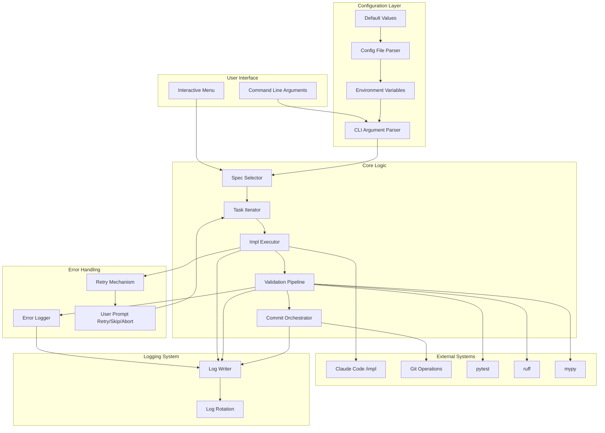
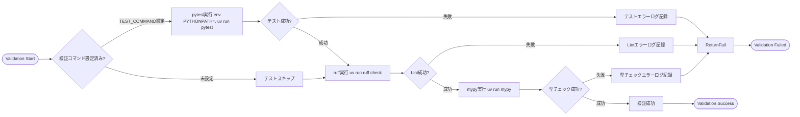
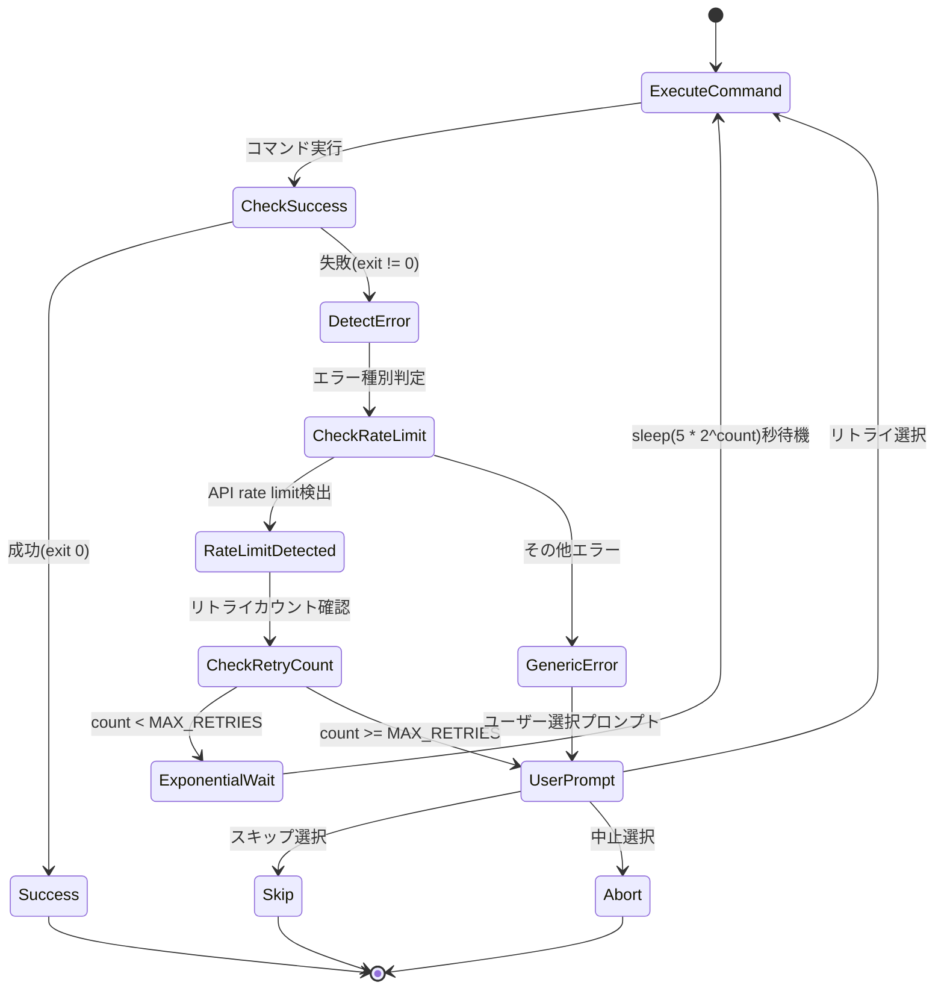

# Technical Design Document: auto_impl.sh Improvement

## Overview

本機能は、Kiro仕様駆動開発における自動タスク実行スクリプト `.kiro/auto_impl.sh` (既存254行)の包括的な改善を実現する。既存スクリプトは基本的なタスクループ機能を提供しているが、複数スペック対応、明示的な検証プロセス、エラーリカバリー、設定管理、ログ記録が未実装。本設計は、既存の関数ベース構造を保持しつつ、6つの改善領域を追加実装する。

**Purpose**: `.kiro/specs/` 配下の仕様に対し、未完了タスクを自動実行し、品質チェック(テスト・Lint・型チェック)を統合した堅牢な自動化ツールを提供する

**Users**: Kiro仕様駆動開発を行う開発者が、複数の機能仕様を並行管理し、エラー発生時の回復を容易にし、実行履歴を追跡可能にする

**Impact**: 既存の`.kiro/auto_impl.sh`を拡張(約254行→推定600-800行)。`run_exp.sh`等の他スクリプトとは独立、ログ出力パターンは統一

### Goals

- ドキュメントと実装の一致により、誤用を防ぐ
- テスト・Lint・型チェックの各ステップを明示的に分離し、品質保証プロセスを透明化
- 複数スペック環境での効率的なワークフロー提供
- エラー発生時の適切なリトライ・スキップ・中止選択による中断最小化
- プロジェクトごとの要件に合わせた設定カスタマイズ可能性
- トラブルシューティング支援のための包括的ログ記録

### Non-Goals

- GUIインターフェースの提供(CLI専用)
- 既存の`run_exp.sh`等のスクリプトの置き換えや統合
- リアルタイムダッシュボードやWeb UIの実装
- Git操作の自動化(コミットメッセージ作成のみサポート)
- 他のCI/CDツールとの統合(将来の拡張として検討可能)

## Architecture

### Existing Architecture Analysis

既存の`.kiro/auto_impl.sh`(254行)は基本的なタスク自動実行機能を提供しているが、要求仕様の6改善領域のうち大半が未実装:

**現在の実装状況**:
- ✅ **基本構造**: 関数ベース分割(detect_active_feature, validate_spec, run_impl等)で可読性確保
- ✅ **防御的プログラミング**: `set -euo pipefail`採用、trapでSIGINT/SIGTERM対応(36-42行目)
- ✅ **スペック検証**: spec.jsonの`ready_for_implementation`チェック(87-109行目)
- ✅ **タスク検出**: `grep '^- \[ \]'`で未完了タスクカウント(129-149行目)
- ✅ **イテレーションループ**: MAX_ITERATIONS上限付きwhile loop(211-237行目)

**未実装・不十分な領域**(要求仕様との乖離):
- ❌ **複数スペック対応**(Req 3): 73-75行目で複数スペック時にエラー終了→選択機能が必須
- ❌ **コミットプロセス分離**(Req 2): 182行目でClaudeに丸投げ(`テストやLint、型チェックでエラーが出ないことを確認したら...`)→pytest/ruff/mypyを個別実行する必要
- ❌ **エラーハンドリング強化**(Req 4): error_exit関数のみ(48-51行目)→リトライ/スキップ/中止プロンプト、exponential backoff未実装
- ❌ **設定の柔軟性**(Req 5): MAX_ITERATIONS等がハードコード(26行目)→設定ファイル・環境変数・CLI引数サポート必須
- ❌ **ログ機能**(Req 6): stdout出力のみ→タイムスタンプ付きファイルログ、ローテーション未実装
- ⚠️ **ドキュメント**(Req 1): ヘッダーコメント(3-15行目)が簡素、複数スペック対応後の使い方が未記載

**保持する既存パターン**:
- 関数ベースの責務分離アプローチ
- `set -euo pipefail`による早期失敗検出
- jqのフォールバック処理(94-102行目: jq不在時はgrepで代替)
- API制限対策の待機時間(236行目: sleep 3)

**プロジェクト全体のパターン**(他スクリプトとの整合性):
- **ログ出力**: `run_exp.sh`のタイムスタンプ付き`logs/`ディレクトリ出力を踏襲
- **Python実行**: `uv run`を標準コマンドランナーとして使用
- **ディレクトリ構造**: `.kiro/specs/`配下のspec.json/tasks.mdメタデータ構造

### Architecture Pattern & Boundary Map

**Architecture Integration**:
- **Selected pattern**: Monolithic Script with Functional Decomposition(既存パターン継続)
- **Rationale**: 既存の254行スクリプトは関数ベース分割を採用しており、このパターンを維持しつつ新機能を追加関数として実装
- **Domain/feature boundaries**(既存→拡張):
  - **Spec Selection**: `detect_active_feature()`を拡張→複数スペック対応の`select_spec_interactive()`追加
  - **Task Execution**: `run_impl()`を保持→エラーハンドリングを`ErrorHandler`関数群で強化
  - **Validation Pipeline**: 新規追加(`run_validation_pipeline()`, `run_tests()`, `run_lint()`, `run_typecheck()`)→既存の`run_commit()`(182行目)を置き換え
  - **Commit Orchestration**: 新規追加(`create_commit()`)→ValidationPipeline成功後の明示的コミット実行
  - **Logging**: 新規追加(`log_message()`, `create_log_file()`, `cleanup_old_logs()`)→既存のecho文を段階的に置き換え
  - **Configuration Management**: 新規追加(`load_config()`, `parse_arguments()`)→ハードコードされたMAX_ITERATIONS(26行目)等を設定可能化
- **Existing patterns preserved**:
  - `set -euo pipefail`による防御的プログラミング(17行目)
  - trap SIGINT/SIGTERMによるクリーンアップ(36-42行目)
  - jqフォールバック処理パターン(94-102行目)
  - `grep '^- \[ \]'`によるタスク検出(133行目)
- **New components rationale**: 要求仕様1-6に対応、既存関数との共存を考慮した命名(既存: `run_*`, 新規: `handle_*`, `log_*`, `load_*`)
- **Steering compliance**: Python 3.11+環境、Ruff/mypy品質基準、防御的プログラミング原則(既存スクリプトで遵守済み)



### Technology Stack

| Layer | Choice / Version | Role in Feature | Notes |
|-------|------------------|-----------------|-------|
| Shell | Bash 4.0+ | スクリプト実行環境 | `set -euo pipefail`で防御的プログラミング |
| Configuration | Bash source format (KEY=value) | 設定ファイル読み込み | `.kiro/auto_impl.config`, KIRO_AUTO_IMPL_* env vars |
| JSON Parsing | jq (POSIX) | spec.json メタデータ解析 | スペック選択時のフィールド抽出 |
| File Operations | find, grep, cat (POSIX) | ファイル検索と内容解析 | スペック一覧、タスクカウント |
| Logging | tee, date (POSIX) | タイムスタンプ付きログ出力 | `.kiro/logs/auto_impl_YYYYMMDD_HHMMSS.log` |
| Python Execution | uv run | `/impl`コマンド、テスト、Lint、型チェック実行 | 既存プロジェクトパターンに従う |
| Git | git (system) | コミット作成 | ユーザー設定のgit config使用 |
| Quality Tools | ShellCheck (dev) | 静的解析 | 開発時のみ、SC2086/SC2068準拠 |

**Rationale**:
- **Bash 4.0+**: POSIX互換性とselect構文サポート。MacOS/Linux標準環境
- **jq**: JSON解析のデファクトスタンダード、軽量で高速
- **POSIX tools**: 移植性とゼロ追加依存の両立
- **ShellCheck**: 静的解析による品質保証、research.mdで詳述

## System Flows

### Main Execution Flow

```mermaid
flowchart TD
    Start([Script Start]) --> LoadConfig[設定読み込み ConfigFile→EnvVars→CLIArgs]
    LoadConfig --> SetupLog[ログファイル作成 .kiro/logs/auto_impl_TIMESTAMP.log]
    SetupLog --> SetupTrap[trapでEXIT/ERRハンドラ登録]
    SetupTrap --> SelectSpec{スペック選択}

    SelectSpec -->|CLI引数あり| ValidateSpec[引数スペック検証]
    SelectSpec -->|引数なし| DiscoverSpecs[スペック一覧取得 find .kiro/specs]

    DiscoverSpecs -->|1件| AutoSelect[自動選択]
    DiscoverSpecs -->|複数| InteractiveMenu[select メニュー表示]
    DiscoverSpecs -->|0件| ErrorNoSpecs[エラー: スペックなし]

    InteractiveMenu --> ValidateSpec
    AutoSelect --> ValidateSpec
    ValidateSpec --> CheckReady{ready_for_implementation?}

    CheckReady -->|false| ErrorNotReady[エラー: 実装準備未完了]
    CheckReady -->|true| CountTasks[未完了タスクカウント grep '- \[ \]']

    CountTasks -->|0件| InfoNoTasks[情報: タスクなし]
    CountTasks -->|1件以上| IterationLoop{イテレーション < MAX_ITERATIONS?}

    IterationLoop -->|Yes| ExecuteImpl[/impl コマンド実行]
    IterationLoop -->|No| InfoMaxReached[情報: 最大イテレーション到達]

    ExecuteImpl --> CheckImplResult{実行結果}
    CheckImplResult -->|成功| RunValidation[検証パイプライン実行]
    CheckImplResult -->|失敗| LogError[エラーログ記録]

    LogError --> RetryPrompt{リトライ/スキップ/中止?}
    RetryPrompt -->|リトライ| ExecuteImpl
    RetryPrompt -->|スキップ| RecountTasks[タスク再カウント]
    RetryPrompt -->|中止| Cleanup[クリーンアップ処理]

    RunValidation --> ValidationResult{すべて成功?}
    ValidationResult -->|成功| CommitChanges[git commit実行]
    ValidationResult -->|失敗| ValidationError[検証エラーログ記録]

    ValidationError --> FixPrompt{修正してリトライ/スキップ/中止?}
    FixPrompt -->|リトライ| RunValidation
    FixPrompt -->|スキップ| RecountTasks
    FixPrompt -->|中止| Cleanup

    CommitChanges --> RecountTasks
    RecountTasks --> IterationLoop

    InfoMaxReached --> Cleanup
    InfoNoTasks --> Cleanup
    ErrorNoSpecs --> Cleanup
    ErrorNotReady --> Cleanup

    Cleanup --> RotateLogs[古いログ削除 find -mtime +retention]
    RotateLogs --> WriteSummary[実行サマリーログ出力]
    WriteSummary --> End([Script End])
```

### Validation Pipeline Flow



### Error Retry Flow with Exponential Backoff



## Requirements Traceability

| Requirement | Summary | Components | Interfaces | Flows |
|-------------|---------|------------|------------|-------|
| 1.1 | ヘッダーコメントの実装一致 | DocumentationHeader | N/A | N/A |
| 1.2 | 前提条件セクション正確性 | DocumentationHeader | N/A | N/A |
| 1.3 | 使い方セクション正確性 | DocumentationHeader | N/A | N/A |
| 1.4 | 機能説明セクション詳細記載 | DocumentationHeader | N/A | N/A |
| 2.1 | 検証ステップ個別実行 | ValidationPipeline | run_validation_pipeline() | Validation Pipeline Flow |
| 2.2 | テストエラー検出と中止 | ValidationPipeline | run_tests() | Validation Pipeline Flow |
| 2.3 | Lintエラー検出と中止 | ValidationPipeline | run_lint() | Validation Pipeline Flow |
| 2.4 | 型チェックエラー検出と中止 | ValidationPipeline | run_typecheck() | Validation Pipeline Flow |
| 2.5 | 検証成功時のコミット実行 | CommitOrchestrator | create_commit() | Main Execution Flow |
| 2.6 | 検証コマンド設定可能化 | ConfigurationManager | load_config() | N/A |
| 3.1 | 複数スペック時の対話的選択 | SpecSelector | select_spec_interactive() | Main Execution Flow |
| 3.2 | CLI引数でのスペック指定 | SpecSelector | parse_arguments() | Main Execution Flow |
| 3.3 | 存在しないスペックのエラー | SpecSelector | validate_spec() | Main Execution Flow |
| 3.4 | 単一スペック時の自動選択 | SpecSelector | auto_select_spec() | Main Execution Flow |
| 3.5 | スペック0件時のエラー | SpecSelector | discover_specs() | Main Execution Flow |
| 3.6 | スペック情報表示 | SpecSelector | display_spec_info() | Main Execution Flow |
| 4.1 | /implエラー時のプロンプト | ErrorHandler | handle_impl_error() | Error Retry Flow |
| 4.2 | コミットエラー時のプロンプト | ErrorHandler | handle_commit_error() | Error Retry Flow |
| 4.3 | リトライ選択時の再実行 | ErrorHandler | retry_action() | Error Retry Flow |
| 4.4 | スキップ選択時の次タスク | ErrorHandler | skip_task() | Error Retry Flow |
| 4.5 | 中止選択時の停止 | ErrorHandler | abort_execution() | Error Retry Flow |
| 4.6 | API制限エラー自動リトライ | ErrorHandler | handle_rate_limit() | Error Retry Flow |
| 4.7 | 予期しないエラーログ記録 | ErrorHandler | log_unexpected_error() | Main Execution Flow |
| 5.1 | 設定ファイル読み込み | ConfigurationManager | load_config_file() | N/A |
| 5.2 | 環境変数オーバーライド | ConfigurationManager | load_env_vars() | N/A |
| 5.3 | 設定ファイル不在時デフォルト | ConfigurationManager | use_defaults() | N/A |
| 5.4 | CLI引数オーバーライド | ConfigurationManager | parse_arguments() | N/A |
| 5.5 | 設定優先順位 | ConfigurationManager | merge_config() | N/A |
| 5.6 | --dry-runオプション | ConfigurationManager | handle_dry_run() | Main Execution Flow |
| 6.1 | タイムスタンプ付きログ生成 | LogWriter | create_log_file() | Main Execution Flow |
| 6.2 | 実行開始時ログ記録 | LogWriter | log_start() | Main Execution Flow |
| 6.3 | イテレーション実行ログ | LogWriter | log_iteration() | Main Execution Flow |
| 6.4 | エラー発生時ログ記録 | LogWriter | log_error() | Error Retry Flow |
| 6.5 | スクリプト完了時ログ記録 | LogWriter | log_summary() | Main Execution Flow |
| 6.6 | --log-levelオプション | LogWriter | set_log_level() | N/A |
| 6.7 | 古いログ自動削除 | LogRotation | cleanup_old_logs() | Main Execution Flow |

## Components and Interfaces

### Component Summary Table

| Component | Domain/Layer | Intent | Req Coverage | Key Dependencies (P0/P1) | Contracts |
|-----------|--------------|--------|--------------|--------------------------|-----------|
| ConfigurationManager | Configuration | 設定読み込みと優先順位制御 | 2.6, 5.1-5.6 | bash source (P0), jq (P1) | State |
| SpecSelector | Core Logic | スペック選択と検証 | 3.1-3.6 | jq (P0), find/grep (P0) | Service |
| TaskIterator | Core Logic | タスクイテレーションループ制御 | - | SpecSelector (P0) | Service |
| ImplExecutor | Core Logic | /implコマンド実行とリトライ | 4.1, 4.3-4.7 | Claude Code CLI (P0), ErrorHandler (P0) | Service |
| ValidationPipeline | Core Logic | テスト・Lint・型チェック実行 | 2.1-2.4 | pytest/ruff/mypy (P0), ConfigurationManager (P1) | Service |
| CommitOrchestrator | Core Logic | 検証成功後のコミット処理 | 2.5, 4.2 | git (P0), ValidationPipeline (P0) | Service |
| ErrorHandler | Error Handling | エラー検出とユーザープロンプト | 4.1-4.7 | read/select (P0), LogWriter (P1) | Service |
| LogWriter | Logging | ログ記録とフォーマット | 6.1-6.6 | tee/date (P0) | Service |
| LogRotation | Logging | 古いログファイル削除 | 6.7 | find (P0) | Batch |
| DocumentationHeader | Documentation | スクリプトヘッダーコメント | 1.1-1.4 | N/A | N/A |

### Core Logic

#### ConfigurationManager

| Field | Detail |
|-------|--------|
| Intent | 設定の読み込みと優先順位に基づくマージ |
| Requirements | 2.6, 5.1, 5.2, 5.3, 5.4, 5.5, 5.6 |

**Responsibilities & Constraints**
- デフォルト値、設定ファイル、環境変数、CLI引数の4層から設定を読み込む
- 優先順位: CLI args > env vars > config file > defaults
- 設定ファイル不在時は警告を出しデフォルト値を使用
- `--dry-run`モードでは実行計画のみ表示し実際の処理はスキップ

**Dependencies**
- Inbound: N/A (script entry point)
- Outbound: All components — 設定値の提供 (P0)
- External: `.kiro/auto_impl.config` — bash source可能なKEY=value形式 (P1)

**Contracts**: State [x]

##### State Management

- **State model**:
  ```bash
  # Global state variables
  MAX_ITERATIONS=10          # default value
  SLEEP_DURATION=5
  CLAUDE_COMMAND="claude-code"
  TEST_COMMAND="env PYTHONPATH=. uv run pytest"
  LINT_COMMAND="uv run ruff check ."
  TYPECHECK_COMMAND="uv run mypy ."
  LOG_LEVEL="INFO"           # DEBUG|INFO|WARNING|ERROR
  LOG_RETENTION_DAYS=30
  DRY_RUN=false
  SELECTED_SPEC=""
  ```
- **Persistence & consistency**: 設定は起動時に1回読み込み、実行中は不変
- **Concurrency strategy**: N/A (単一プロセス実行)

**Implementation Notes**
- **Integration**: スクリプト起動直後に `load_config()` 関数を呼び出し
- **Validation**: 必須パラメータ(MAX_ITERATIONS, SLEEP_DURATION)は正の整数であることを検証
- **Risks**: 設定ファイルに任意のbashコードを記述可能なため、信頼できるソースからのみ読み込むべき(ドキュメントで明記)

#### SpecSelector

| Field | Detail |
|-------|--------|
| Intent | スペック一覧取得、選択、検証(既存`detect_active_feature()`を拡張) |
| Requirements | 3.1, 3.2, 3.3, 3.4, 3.5, 3.6 |

**Responsibilities & Constraints**
- **既存機能**: 現在の`detect_active_feature()`(57-81行目)は`archives`を除外し、ちょうど1つのスペックを検出、複数時はエラー(73-75行目)
- **拡張内容**:
  - 複数スペック時に対話的メニュー(`select`構文)を表示→Req 3.1対応
  - CLI引数でスペック名指定をサポート→Req 3.2対応
  - 単一スペック時の自動選択は既存動作を維持→Req 3.4
  - 0件時のエラー処理は既存動作を維持(69-71行目)→Req 3.5
- spec.jsonから `ready_for_implementation` フラグと `phase` を取得(既存の`validate_spec()`87-109行目を流用)
- tasks.mdから未完了タスク数をカウント(既存の`get_pending_task_count()`146-149行目を流用)

**Dependencies**
- Inbound: TaskIterator — スペック情報の要求 (P0)
- Outbound: N/A
- External: find (P0), jq (P0), grep (P0)

**Contracts**: Service [x]

##### Service Interface

```bash
# Discover all specs excluding archives
# Returns: space-separated spec names
discover_specs() -> string

# Display interactive menu for spec selection
# Returns: selected spec name
select_spec_interactive(specs: string[]) -> string

# Validate spec directory and metadata
# Args: spec name
# Returns: 0 if valid, 1 if invalid
validate_spec(spec_name: string) -> exit_code

# Count pending tasks in tasks.md
# Args: spec name
# Returns: number of pending tasks
count_pending_tasks(spec_name: string) -> integer

# Display spec metadata (phase, ready_for_implementation, task count)
# Args: spec name
display_spec_info(spec_name: string) -> void
```

- **Preconditions**: `.kiro/specs/` ディレクトリが存在
- **Postconditions**: `SELECTED_SPEC` グローバル変数に選択されたスペック名を設定
- **Invariants**: `ready_for_implementation: true` のスペックのみ実行可能

**Implementation Notes**
- **Integration**: Main flowの初期段階で呼び出し、スペック選択完了後にTaskIteratorへ制御を渡す
- **Validation**: spec.jsonの必須フィールド(`phase`, `ready_for_implementation`)が存在することを確認、tasks.mdファイルの存在確認
- **Risks**: jqが利用不可の環境での実行失敗(プリフライトチェックでjq存在確認を推奨)

#### TaskIterator

| Field | Detail |
|-------|--------|
| Intent | タスクイテレーションループの制御 |
| Requirements | (implicit from main flow) |

**Responsibilities & Constraints**
- MAX_ITERATIONS回まで、または未完了タスク0件になるまでループ
- 各イテレーションでImplExecutorを呼び出し
- イテレーション間でタスクカウントを再取得

**Dependencies**
- Inbound: Main script — イテレーション実行要求 (P0)
- Outbound: ImplExecutor (P0), SpecSelector.count_pending_tasks (P0)
- External: N/A

**Contracts**: Service [x]

##### Service Interface

```bash
# Execute iteration loop for selected spec
# Args: spec name
# Returns: 0 if all tasks completed, 1 if max iterations reached or user aborted
run_iteration_loop(spec_name: string) -> exit_code
```

- **Preconditions**: `SELECTED_SPEC`が設定済み、`ready_for_implementation: true`
- **Postconditions**: すべてのタスクが完了、または最大イテレーション到達、またはユーザー中止
- **Invariants**: イテレーションカウントは単調増加

**Implementation Notes**
- **Integration**: while ループで `count_pending_tasks` が0より大きい間実行
- **Validation**: イテレーション開始前に必ずタスク数を再カウント(コミット後にtasks.mdが更新される可能性)
- **Risks**: 無限ループ防止のためMAX_ITERATIONS上限必須

#### ImplExecutor

| Field | Detail |
|-------|--------|
| Intent | `/impl`コマンド実行とエラーハンドリング(既存`run_impl()`を拡張) |
| Requirements | 4.1, 4.3, 4.4, 4.5, 4.6, 4.7 |

**Responsibilities & Constraints**
- **既存機能保持**: 現在の`run_impl()`(155-169行目)は`claude -p '/impl'`を実行し、exit codeで成功/失敗を判定
- **拡張内容**:
  - エラー発生時はErrorHandlerを呼び出し、リトライ/スキップ/中止を処理(現在は164行目でreturn 1のみ)
  - API rate limit検出時は自動リトライ(exponential backoff)を追加
  - ログ出力を`LogWriter`関数群に統合(現在のecho文を置き換え)

**Dependencies**
- Inbound: TaskIterator(`run_workflow()`の226行目から呼び出し) — タスク実行要求 (P0)
- Outbound: ErrorHandler (P0 新規), ValidationPipeline (P0 新規), LogWriter (P1 新規)
- External: Claude Code CLI(`claude`コマンド、162行目で使用中) (P0)

**Contracts**: Service [x]

##### Service Interface

```bash
# Execute /impl command for selected spec
# Args: spec name
# Returns: 0 if success, 1 if failed after retries or user abort
execute_impl(spec_name: string) -> exit_code

# Detect API rate limit from command output
# Args: command output (stdout/stderr)
# Returns: 0 if rate limit detected, 1 otherwise
detect_rate_limit(output: string) -> exit_code
```

- **Preconditions**: Claude Code CLIがインストール済み、`SELECTED_SPEC`が設定済み
- **Postconditions**: `/impl`が成功した場合、変更がstaged状態、失敗した場合はエラーログ記録
- **Invariants**: リトライ回数は最大3回まで(rate limit時のみ)

**Implementation Notes**
- **Integration**: `${CLAUDE_COMMAND} /impl ${spec_name}` を実行し、exit codeと出力を解析
- **Validation**: Claude Code CLIの存在確認(command -v)、spec_nameの正当性確認
- **Risks**: Claude Code CLIの出力形式変更によるrate limit検出失敗→保守的パターンマッチングで対応

#### ValidationPipeline

| Field | Detail |
|-------|--------|
| Intent | テスト・Lint・型チェックの順次実行(既存`run_commit()`を置き換え) |
| Requirements | 2.1, 2.2, 2.3, 2.4 |

**Responsibilities & Constraints**
- **既存の問題**: 現在の`run_commit()`(175-189行目)はClaudeに「テストやLint、型チェックでエラーが出ないことを確認したら未コミットの内容をコミットする」と丸投げ→検証プロセスが不透明
- **新規実装**: pytest → ruff → mypy の順に明示的に実行
- いずれかが失敗した場合、そこで停止し失敗を返す
- 各ステップの実行コマンドは設定可能(`TEST_COMMAND`, `LINT_COMMAND`, `TYPECHECK_COMMAND`)
- コマンドが空文字列の場合、そのステップはスキップ

**Dependencies**
- Inbound: CommitOrchestrator — 検証要求 (P0)
- Outbound: LogWriter (P1)
- External: pytest (P0), ruff (P0), mypy (P0)

**Contracts**: Service [x]

##### Service Interface

```bash
# Run validation pipeline (test -> lint -> typecheck)
# Returns: 0 if all pass, 1 if any fail
run_validation_pipeline() -> exit_code

# Run tests using TEST_COMMAND
# Returns: 0 if pass, 1 if fail
run_tests() -> exit_code

# Run linter using LINT_COMMAND
# Returns: 0 if pass, 1 if fail
run_lint() -> exit_code

# Run type checker using TYPECHECK_COMMAND
# Returns: 0 if pass, 1 if fail
run_typecheck() -> exit_code
```

- **Preconditions**: 実行コマンドが設定済み(または空文字列)
- **Postconditions**: すべてのステップが成功、または最初の失敗箇所で停止
- **Invariants**: 実行順序はtest→lint→typecheck固定

**Implementation Notes**
- **Integration**: ImplExecutor成功後、CommitOrchestratorに進む前に実行
- **Validation**: 各コマンドのexit codeを検証、stderr出力をログに記録
- **Risks**: コマンドタイムアウト処理なし(将来拡張として検討)

#### CommitOrchestrator

| Field | Detail |
|-------|--------|
| Intent | 検証成功後のgitコミット作成(既存`run_commit()`の検証部分を分離) |
| Requirements | 2.5, 4.2 |

**Responsibilities & Constraints**
- **既存からの分離**: 現在の`run_commit()`は検証とコミットを混在→ValidationPipeline(検証)とCommitOrchestrator(コミット)に責務分離
- ValidationPipeline成功後にのみコミット実行
- コミットメッセージに検証結果概要を含める
- コミット失敗時はErrorHandlerを呼び出し

**Dependencies**
- Inbound: TaskIterator — コミット要求 (P0)
- Outbound: ValidationPipeline (P0), ErrorHandler (P0), LogWriter (P1)
- External: git (P0)

**Contracts**: Service [x]

##### Service Interface

```bash
# Create git commit with validation summary
# Args: spec name
# Returns: 0 if success, 1 if commit failed
create_commit(spec_name: string) -> exit_code

# Generate commit message with validation summary
# Args: spec name
# Returns: commit message string
generate_commit_message(spec_name: string) -> string
```

- **Preconditions**: ValidationPipeline成功、変更がstaged状態
- **Postconditions**: 新しいコミットが作成される、またはエラーログ記録
- **Invariants**: ValidationPipeline失敗時はコミット実行しない

**Implementation Notes**
- **Integration**: ValidationPipeline成功後に自動実行
- **Validation**: `git status --porcelain`で変更有無確認、user.nameとuser.emailの設定確認
- **Risks**: gitフックによるコミット失敗→ErrorHandlerで手動修正リトライを提示

### Error Handling

#### ErrorHandler

| Field | Detail |
|-------|--------|
| Intent | エラー検出、ログ記録、ユーザープロンプト処理 |
| Requirements | 4.1, 4.2, 4.3, 4.4, 4.5, 4.6, 4.7 |

**Responsibilities & Constraints**
- ImplExecutor、ValidationPipeline、CommitOrchestratorからのエラーを受け取る
- エラー種別に応じて自動リトライまたはユーザープロンプトを表示
- API rate limitエラーはexponential backoffで自動リトライ(最大3回)
- その他エラーは(1)リトライ、(2)スキップ、(3)中止の選択肢を提示

**Dependencies**
- Inbound: ImplExecutor (P0), ValidationPipeline (P0), CommitOrchestrator (P0)
- Outbound: LogWriter (P0)
- External: read/select (P0)

**Contracts**: Service [x]

##### Service Interface

```bash
# Handle /impl command error
# Args: error output, retry count
# Returns: 0 for retry, 1 for skip, 2 for abort
handle_impl_error(error_output: string, retry_count: integer) -> exit_code

# Handle commit error
# Args: error output
# Returns: 0 for retry, 1 for skip, 2 for abort
handle_commit_error(error_output: string) -> exit_code

# Handle API rate limit with exponential backoff
# Args: retry count
# Returns: 0 to continue retry, 1 to escalate to user prompt
handle_rate_limit(retry_count: integer) -> exit_code

# Log unexpected error with stack trace
# Args: error message, context
log_unexpected_error(error_message: string, context: string) -> void

# Prompt user for action (retry/skip/abort)
# Returns: 0 for retry, 1 for skip, 2 for abort
prompt_user_action() -> exit_code
```

- **Preconditions**: エラーが発生済み
- **Postconditions**: ユーザー選択に応じてリトライ/スキップ/中止の制御フロー
- **Invariants**: 自動リトライは最大3回、それ以降はユーザープロンプト

**Implementation Notes**
- **Integration**: ImplExecutor/ValidationPipeline/CommitOrchestratorの失敗時に即座に呼び出し
- **Validation**: retry_countが非負整数であることを確認
- **Risks**: rate limit検出パターンのfalse positive/negative→保守的マッチングと手動プロンプトで対応

### Logging

#### LogWriter

| Field | Detail |
|-------|--------|
| Intent | タイムスタンプ付きログファイルへの記録 |
| Requirements | 6.1, 6.2, 6.3, 6.4, 6.5, 6.6 |

**Responsibilities & Constraints**
- `.kiro/logs/auto_impl_YYYYMMDD_HHMMSS.log` 形式でログファイル作成
- スクリプト起動時にログファイルを作成、trap EXITで終了時サマリー記録
- ログレベル(DEBUG/INFO/WARNING/ERROR)に応じたフィルタリング
- teeで標準出力とログファイルに同時出力

**Dependencies**
- Inbound: All components — ログ記録要求 (P1)
- Outbound: N/A
- External: tee (P0), date (P0), mkdir (P0)

**Contracts**: Service [x]

##### Service Interface

```bash
# Create log file with timestamp
# Returns: log file path
create_log_file() -> string

# Log message with level and timestamp
# Args: level (DEBUG|INFO|WARNING|ERROR), message
log_message(level: string, message: string) -> void

# Log script start with metadata
# Args: spec name, initial task count
log_start(spec_name: string, task_count: integer) -> void

# Log iteration details
# Args: iteration number, remaining tasks, impl output
log_iteration(iteration: integer, remaining_tasks: integer, output: string) -> void

# Log error with details
# Args: error type, error message, timestamp
log_error(error_type: string, error_message: string) -> void

# Log execution summary
# Args: total iterations, completed tasks, skipped tasks, duration
log_summary(total_iterations: integer, completed: integer, skipped: integer, duration: integer) -> void

# Set log level (DEBUG|INFO|WARNING|ERROR)
# Args: level
set_log_level(level: string) -> void
```

- **Preconditions**: `.kiro/logs/` ディレクトリが作成済み(mkdir -pで自動作成)
- **Postconditions**: ログファイルに実行履歴が記録される
- **Invariants**: ログレベルがDEBUG < INFO < WARNING < ERRORの順に優先度

**Implementation Notes**
- **Integration**: スクリプト起動直後に `create_log_file()` 呼び出し、以降全ログを記録
- **Validation**: LOG_LEVELが有効な値(DEBUG/INFO/WARNING/ERROR)であることを確認
- **Risks**: ログファイル書き込み権限不足→起動時チェックで早期エラー表示

#### LogRotation

| Field | Detail |
|-------|--------|
| Intent | 古いログファイルの自動削除 |
| Requirements | 6.7 |

**Responsibilities & Constraints**
- スクリプト終了時(trap EXIT)に実行
- LOG_RETENTION_DAYS日より古いログファイルを削除
- `find .kiro/logs -name "auto_impl_*.log" -mtime +${LOG_RETENTION_DAYS} -delete` 使用

**Dependencies**
- Inbound: Main script EXIT trap — クリーンアップ要求 (P1)
- Outbound: N/A
- External: find (P0)

**Contracts**: Batch [x]

##### Batch / Job Contract

- **Trigger**: スクリプト終了時(EXIT trap)
- **Input / validation**: LOG_RETENTION_DAYS環境変数(デフォルト30日)、正の整数であること
- **Output / destination**: `.kiro/logs/` ディレクトリから古いログ削除
- **Idempotency & recovery**: 冪等(同じ条件で複数回実行しても同じ結果)、失敗してもスクリプト終了を妨げない

**Implementation Notes**
- **Integration**: trap EXIT で登録、cleanup_old_logs関数として実装
- **Validation**: LOG_RETENTION_DAYSが正の整数であることを確認、find実行前に `.kiro/logs/` 存在確認
- **Risks**: find -delete実行失敗時のエラーハンドリング→ログ記録のみ、スクリプト終了は継続

### Documentation

#### DocumentationHeader

| Field | Detail |
|-------|--------|
| Intent | スクリプトヘッダーコメントの正確性確保 |
| Requirements | 1.1, 1.2, 1.3, 1.4 |

**Responsibilities & Constraints**
- スクリプト冒頭にヘッダーコメントを記載
- 使い方、前提条件、機能説明、設定方法を記載
- 実装と一致した内容であることを保証

**Implementation Notes**
- 以下のセクションを含む:
  - **概要**: スクリプトの目的と動作
  - **前提条件**: spec.json必須フィールド、tasks.md存在、ready_for_implementation: true
  - **使い方**: CLI引数オプション、対話的選択方法、設定ファイルパス
  - **機能説明**: 6つの主要機能(ドキュメント、コミットプロセス、複数スペック、エラーハンドリング、設定、ログ)
  - **設定例**: `.kiro/auto_impl.config`サンプル

## Error Handling

### Error Strategy

- **早期失敗**: `set -euo pipefail` によりコマンド失敗時に即座に停止
- **trap使用**: EXIT/ERRシグナルでクリーンアップ処理を実行
- **retry機構**: API rate limitエラーはexponential backoffで自動リトライ
- **ユーザー介入**: 自動リトライ失敗後、手動でリトライ/スキップ/中止を選択可能

### Error Categories and Responses

**User Errors** (入力エラー):
- 存在しないスペック指定 → 利用可能なスペック一覧表示、スクリプト終了(exit 1)
- ready_for_implementation: false → エラーメッセージ表示、要件満たす手順提示
- 設定ファイル構文エラー → bash source失敗、デフォルト値使用と警告表示

**System Errors** (システムエラー):
- Claude Code CLI不在 → コマンド存在確認、インストールガイド表示、exit 1
- jq/find/git不在 → 依存コマンド確認、インストール指示、exit 1
- ログファイル書き込み権限不足 → 権限エラー表示、代替パス提示、exit 1

**Business Logic Errors** (実行エラー):
- `/impl`コマンド失敗 → エラー出力ログ記録、リトライ/スキップ/中止プロンプト
- Validation Pipeline失敗 → 失敗ステップ特定、エラー内容表示、修正してリトライ/スキップ/中止プロンプト
- Commitエラー → gitエラー出力表示、手動修正指示、リトライ/スキップ/中止プロンプト
- API rate limit → exponential backoff自動リトライ(5s, 10s, 20s)、3回超過後ユーザープロンプト

### Monitoring

- **実行ログ**: `.kiro/logs/auto_impl_YYYYMMDD_HHMMSS.log` に全イベント記録
- **ログレベル**: DEBUG(詳細トレース)、INFO(イベント記録)、WARNING(潜在的問題)、ERROR(失敗)
- **エラーコンテキスト**: エラー発生時に以下を記録
  - エラー種別(impl/validation/commit)
  - エラーメッセージ
  - 発生タイムスタンプ
  - コンテキスト情報(spec名、イテレーション番号、コマンド出力)
- **サマリー出力**: スクリプト終了時に以下を記録
  - 総イテレーション数
  - 完了タスク数
  - スキップタスク数
  - 実行時間
  - 終了ステータス(成功/失敗/中止)

## Testing Strategy

### Unit Tests (手動検証)

- **設定読み込み**: デフォルト→設定ファイル→環境変数→CLI引数の優先順位検証
- **スペック選択**: 0件/1件/複数件の各ケースでの動作確認
- **タスクカウント**: tasks.md内の `- [ ]` パターンカウント精度
- **エラー検出**: rate limit/テスト失敗/Lintエラー各パターンの検出精度
- **ログフォーマット**: タイムスタンプ形式、ログレベルフィルタリング

### Integration Tests (手動検証)

- **フルフロー**: スペック選択→タスク実行→検証→コミットの一連の流れ
- **エラーリカバリー**: 各エラータイプでのリトライ/スキップ/中止動作
- **並行実行**: 複数スペック対応での切り替え動作
- **ログローテーション**: 古いログ削除の実行タイミングと正確性
- **dry-runモード**: 実際の変更なしで計画表示のみ

### Edge Cases

- **空tasks.md**: 未完了タスク0件での即座終了
- **最大イテレーション到達**: MAX_ITERATIONS到達時の適切な停止
- **spec.json破損**: jqパースエラー時のエラーメッセージ
- **git未設定**: user.name/user.email未設定時のコミット失敗処理
- **ログディレクトリ不在**: mkdir -pでの自動作成確認

### Performance Tests

- **大量ログ処理**: 100回イテレーション実行時のログファイルサイズと書き込み速度
- **スペック数スケール**: 50個のスペックでの選択メニュー表示速度

## Security Considerations

- **設定ファイル実行リスク**: `.kiro/auto_impl.config` は bash source で読み込まれるため、任意のbashコードが実行可能。信頼できるソースからのみ読み込むことをドキュメントで警告
- **コマンドインジェクション**: spec名やコマンド引数は必ずクォートして展開(`"${spec_name}"`)、変数展開時の意図しないコマンド実行を防ぐ
- **ログ情報漏洩**: ログファイルにAPI keyやsecretが含まれる可能性→`.kiro/logs/`を`.gitignore`に追加することを推奨
- **権限**: スクリプトは実行権限(`chmod +x`)必須だが、setuidは不要(一般ユーザー権限で実行)

## Supporting References

### Configuration File Example

```bash
# .kiro/auto_impl.config
# 最大イテレーション数
MAX_ITERATIONS=20

# イテレーション間のスリープ時間(秒)
SLEEP_DURATION=10

# Claude Codeコマンド
CLAUDE_COMMAND="claude-code"

# テストコマンド(空文字列でスキップ)
TEST_COMMAND="env PYTHONPATH=. uv run pytest"

# Lintコマンド
LINT_COMMAND="uv run ruff check ."

# 型チェックコマンド
TYPECHECK_COMMAND="uv run mypy ."

# ログレベル(DEBUG|INFO|WARNING|ERROR)
LOG_LEVEL="INFO"

# ログ保持期間(日数)
LOG_RETENTION_DAYS=30
```

### Environment Variable Reference

```bash
# 環境変数オーバーライド例
export KIRO_AUTO_IMPL_MAX_ITERATIONS=15
export KIRO_AUTO_IMPL_LOG_LEVEL=DEBUG
export KIRO_AUTO_IMPL_LOG_RETENTION_DAYS=60
```

### CLI Usage Examples

```bash
# 基本的な使い方(対話的スペック選択)
./auto_impl.sh

# スペック名を引数で指定
./auto_impl.sh improve-auto-impl-sh

# dry-runモード(実行計画のみ表示)
./auto_impl.sh --dry-run improve-auto-impl-sh

# 最大イテレーション数をオーバーライド
./auto_impl.sh --max-iterations 5 improve-auto-impl-sh

# ログレベルをDEBUGに設定
./auto_impl.sh --log-level DEBUG improve-auto-impl-sh

# 複数オプション組み合わせ
./auto_impl.sh --max-iterations 10 --log-level INFO --sleep 15 improve-auto-impl-sh
```
