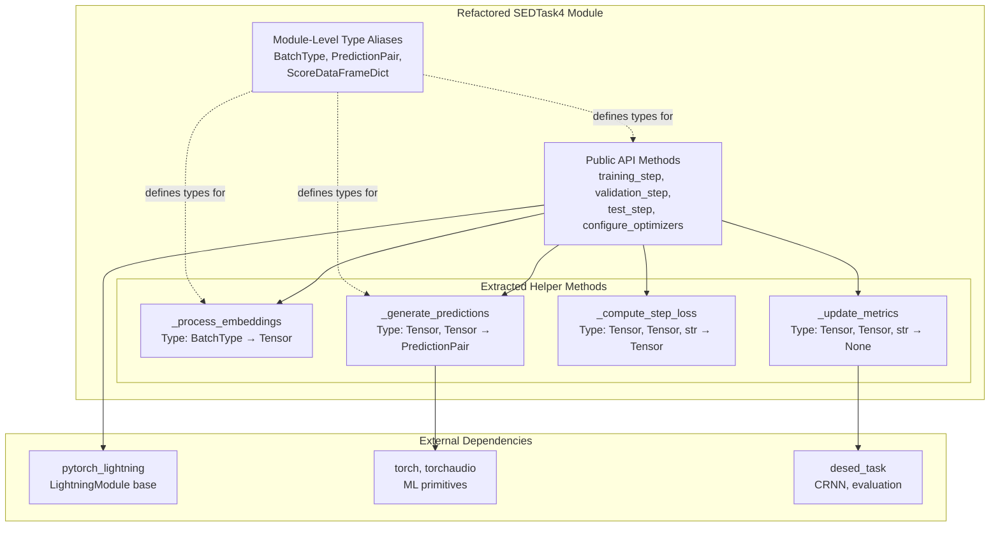
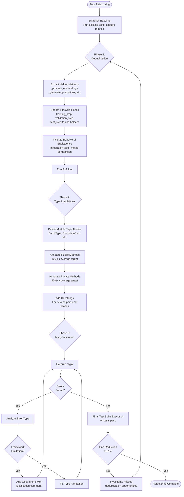

# Technical Design Document

## Overview

This refactoring enhances the maintainability and type safety of `sed_trainer_pretrained.py`, the core 2609-line PyTorch Lightning module for sound event detection training. The refactoring eliminates redundant code patterns across training lifecycle hooks, introduces comprehensive type annotations for all 39 methods, and integrates mypy static type checking validation.

**Purpose**: Improve code quality and developer experience for the DCASE baseline codebase by reducing technical debt through deduplication and type safety.

**Users**: Researchers and developers maintaining and extending the sound event detection training pipeline will benefit from clearer, self-documenting code with early error detection.

**Impact**: Transforms the current monolithic implementation (2609 lines, ~8% type coverage) into a maintainable, type-safe module (~2300-2350 lines target, 100% public method type coverage, 90%+ private method coverage) while preserving all existing functionality and API compatibility.

### Goals

- Reduce `sed_trainer_pretrained.py` line count by 10-15% through systematic deduplication of repeated logic patterns
- Achieve 100% type annotation coverage for public methods and 90%+ for private methods using Python 3.11 native syntax
- Enable mypy validation to pass with zero errors using existing infrastructure (mypy.ini configuration)
- Maintain complete backward compatibility with existing training scripts, configurations, and experiment checkpoints

### Non-Goals

- Architectural redesign (no mixin decomposition or strategy pattern refactoring)
- Performance optimization beyond maintaining numerical equivalence
- Expansion of type annotations to other modules (`desed_task/`, `local/utils.py`)
- Strict mypy mode adoption during initial refactoring (deferred to Phase 2 per research.md)

## Architecture

### Existing Architecture Analysis

**Current State**:
- Single monolithic `SEDTask4(pl.LightningModule)` class (2609 lines) with teacher-student semi-supervised learning
- Helper utility classes: `_NoneSafeIterator`, `SafeCollate`, `SafeDataLoader` for robust batch handling
- PyTorch Lightning lifecycle hooks: `training_step:515`, `validation_step:800`, `test_step:1213`
- Minimal type annotations (3/39 methods with return types, no parameter annotations)
- Existing mypy infrastructure present but permissive (`disallow_untyped_defs = False`)

**Preserved Patterns**:
- PyTorch Lightning module structure and lifecycle hook contracts
- Teacher-student EMA update mechanism
- Wandb/TensorBoard logging integration
- Metric computation patterns (PSDS, F1-score, intersection-based evaluation)

**Technical Debt Addressed**:
- Duplicate embedding processing logic (4 occurrences across lifecycle hooks)
- Repeated prediction generation patterns (student/teacher model inference)
- Inconsistent loss computation logic duplication
- Absent type annotations preventing early error detection

### Architecture Pattern & Boundary Map



**Architecture Integration**:
- **Selected Pattern**: Monolithic refactoring with private helper method extraction
- **Domain Boundaries**: Single `SEDTask4` class maintains all training logic (preserves Lightning module cohesion)
- **Existing Patterns Preserved**: PyTorch Lightning lifecycle hooks, teacher-student architecture, metric computation pipeline
- **New Components Rationale**:
  - `_process_embeddings()`: Eliminates 4 duplicate embedding extraction blocks
  - `_generate_predictions()`: Consolidates student/teacher model inference pattern
  - `_compute_step_loss()`: Unifies loss calculation logic across train/val/test steps
  - `_update_metrics()`: Extracts metric accumulation pattern
  - Module-level type aliases: Provides reusable type definitions per Python 3.11 best practices
- **Steering Compliance**: Aligns with "Ruff-based code quality framework" (tech.md) and "separation of concerns" principle (structure.md)

### Technology Stack

| Layer | Choice / Version | Role in Feature | Notes |
|-------|------------------|-----------------|-------|
| Language | Python 3.11+ | Type annotation syntax (native `dict`, `list`, `tuple`) | Existing constraint from `.python-version` |
| Type Checking | mypy 1.19.0+ | Static type validation | Already in `[dependency-groups] dev` |
| Linter | Ruff (configured) | Code quality enforcement post-refactoring | Existing tool, no changes required |
| Framework | PyTorch Lightning 1.9.x | Training lifecycle management | Type hints have known limitations (see research.md) |
| Type Hints | `typing` module | `TypeAlias`, `Optional`, `Protocol` imports | Use built-in types (`dict`, `list`) where possible per Python 3.11 |

**Mypy Configuration** (no changes to existing mypy.ini for Phase 1):
- Current settings: `disallow_untyped_defs = False`, `check_untyped_defs = True`
- Exclusions maintained: `sebbs.*`, `sed_scores_eval.*` (ignore_missing_imports)
- Future: Per-module strict mode (`[mypy-local.sed_trainer_pretrained]`) in Phase 2

## System Flows

### Refactoring Flow (Development Process)



**Key Flow Decisions**:
- Gating condition after Phase 1: Behavioral equivalence must be verified before proceeding to type annotations
- Mypy error handling: Distinguish between real type errors (fix immediately) and framework limitations (document with `type: ignore`)
- Iterative approach: Ruff checks between phases to maintain code quality continuously

## Requirements Traceability

| Requirement | Summary | Components | Interfaces | Flows |
|-------------|---------|------------|------------|-------|
| 1.1 | Consolidate duplicate code blocks into reusable helpers | `_process_embeddings`, `_generate_predictions`, `_compute_step_loss` | Helper method signatures (see Components section) | Refactoring Flow (Phase 1) |
| 1.2 | Extract common logic from validation_step and test_step | `_update_metrics`, shared loss computation | Private method contracts | Refactoring Flow (Phase 1) |
| 1.3 | Refactor repeated data processing into utility functions | `_process_embeddings` (embedding extraction) | BatchType → Tensor | Refactoring Flow (Phase 1) |
| 1.4 | Maintain behavioral equivalence after deduplication | All refactored components | N/A (validation step) | Refactoring Flow (ValidateBehavior gate) |
| 1.5 | Reduce line count by ≥10% through consolidation | All extracted helpers | N/A (metric) | Refactoring Flow (LineCount gate) |
| 2.1 | Add type annotations to all method signatures | SEDTask4 class (39 methods) | See Components section for signatures | Refactoring Flow (Phase 2) |
| 2.2 | Use specific type hints for complex data structures | Module-level type aliases (BatchType, ScoreDataFrameDict, etc.) | TypeAlias definitions | Refactoring Flow (DefineAliases step) |
| 2.3 | Use Optional[T] for optional parameters | All method signatures with nullable types | Method parameter lists | Refactoring Flow (AnnotatePublic/Private steps) |
| 2.4 | Use typing module constructs appropriately | TypeAlias, Optional imports; native dict/list/tuple | Import statements, type alias definitions | Refactoring Flow (Phase 2) |
| 2.5 | Include type annotations for class attributes | `__init__` method attribute annotations | SEDTask4.__init__ signature | Refactoring Flow (AnnotatePrivate step) |
| 2.6 | Achieve 100% public / 90%+ private method coverage | All 39 methods in SEDTask4 | Full class interface | Refactoring Flow (Phase 2 completion) |
| 3.1 | Pass mypy validation with no errors | Entire sed_trainer_pretrained.py module | N/A (validation requirement) | Refactoring Flow (Phase 3) |
| 3.2 | Document mypy exceptions in mypy.ini | mypy.ini per-library ignore sections | Configuration file | Refactoring Flow (Phase 3 - AddIgnore step) |
| 3.3 | Resolve type incompatibilities with third-party libraries | Framework integration points (Lightning hooks, torch operations) | LightningModule overrides | Refactoring Flow (Phase 3 - Framework decision) |
| 3.4 | Define type aliases for ambiguous types | BatchType, PredictionPair, ScoreDataFrameDict | Module-level TypeAlias declarations | Refactoring Flow (DefineAliases step) |
| 3.5 | Include mypy in pyproject.toml | N/A (already present in dev dependencies) | N/A | N/A (no action required) |
| 3.6 | Maintain Ruff compatibility | All refactored code | N/A (validation requirement) | Refactoring Flow (RuffCheck1 gate) |
| 4.1 | Preserve SEDTask4 public API | SEDTask4 class methods | See Components section (SEDTask4 Public Interface) | N/A (constraint on all phases) |
| 4.2 | Maintain YAML config compatibility | `__init__` signature and hparams usage | SEDTask4.__init__ | N/A (constraint on all phases) |
| 4.3 | Keep backward-compatible module exports | `from local.sed_trainer_pretrained import SEDTask4` | Module __all__ (implicit) | N/A (constraint on all phases) |
| 4.4 | Maintain Lightning lifecycle hook behavior | training_step, validation_step, test_step, etc. | LightningModule override contracts | Refactoring Flow (ValidateBehavior gate) |
| 4.5 | Ensure checkpoint loading compatibility | Class name, attribute names, state_dict keys | SEDTask4 class structure | Refactoring Flow (ValidateBehavior gate) |
| 5.1 | Execute existing test suites successfully | All refactored code | N/A (validation requirement) | Refactoring Flow (FinalValidation step) |
| 5.2 | Validate through integration tests if no unit tests | Training run with small dataset | N/A (validation requirement) | Refactoring Flow (ValidateBehavior gate) |
| 5.3 | Produce identical validation metrics | All metric computation code | Metric computation methods | Refactoring Flow (ValidateBehavior gate) |
| 5.4 | Pass all Ruff lint checks | All refactored code | N/A (validation requirement) | Refactoring Flow (RuffCheck1 gate) |
| 5.5 | Pass mypy validation | All refactored code | N/A (validation requirement) | Refactoring Flow (Phase 3 completion) |
| 6.1 | Define docstrings for complex type aliases | BatchType, PredictionPair, ScoreDataFrameDict | Type alias definitions with docstrings | Refactoring Flow (DefineAliases step) |
| 6.2 | Add docstrings to refactored/extracted methods | All new helper methods | Method docstrings (Google/NumPy style) | Refactoring Flow (AddDocs step) |
| 6.3 | Update class-level docstrings if needed | SEDTask4 class docstring | Class-level documentation | Refactoring Flow (AddDocs step) |
| 6.4 | Justify type: ignore comments with inline explanations | Framework integration points with mypy conflicts | Inline comments | Refactoring Flow (Phase 3 - AddIgnore step) |
| 6.5 | Maintain DCASE baseline documentation consistency | All new documentation | Docstring format | Refactoring Flow (AddDocs step) |

## Components and Interfaces

### Component Summary

| Component | Domain/Layer | Intent | Req Coverage | Key Dependencies (P0/P1) | Contracts |
|-----------|--------------|--------|--------------|--------------------------|-----------|
| SEDTask4 (refactored) | Training / PyTorch Lightning | Main LightningModule for teacher-student SED training | 1.4, 2.1, 2.5, 2.6, 3.1, 4.1, 4.4, 4.5 | LightningModule (P0), CRNN (P0), BEATsModel (P1) | Service, State |
| _process_embeddings | Training / Helper | Extract and process BEATs embeddings conditionally | 1.1, 1.3, 2.1, 3.4 | pretrained_model (P0) | Service |
| _generate_predictions | Training / Helper | Generate student/teacher model predictions from mel spectrograms | 1.1, 1.2, 2.1, 3.4 | sed_student (P0), sed_teacher (P0), mel_spec (P0) | Service |
| _compute_step_loss | Training / Helper | Compute supervised loss for given prediction/label pair | 1.1, 1.2, 2.1 | supervised_loss (P0) | Service |
| _update_metrics | Training / Helper | Accumulate metrics based on predictions and ground truth | 1.2, 2.1 | torchmetrics instances (P0) | Service |
| Module Type Aliases | Type System / Definitions | Define reusable types for batch data, predictions, scores | 2.2, 2.4, 3.4, 6.1 | typing.TypeAlias (P0) | N/A (type definitions) |

### Training / PyTorch Lightning

#### SEDTask4 (Refactored)

| Field | Detail |
|-------|--------|
| Intent | PyTorch Lightning module orchestrating teacher-student semi-supervised SED training with type-safe interfaces |
| Requirements | 1.4, 2.1, 2.5, 2.6, 3.1, 4.1, 4.4, 4.5 |

**Responsibilities & Constraints**
- Orchestrate training/validation/test steps using extracted helper methods to eliminate duplication
- Maintain identical public API (method signatures, hparams structure) for backward compatibility
- Preserve Lightning lifecycle hook contracts while adding comprehensive type annotations
- Domain boundary: All training logic, metric computation, and model checkpointing remain within this class

**Dependencies**
- Inbound: PyTorch Lightning Trainer (P0) - invokes lifecycle hooks
- Outbound: `_process_embeddings`, `_generate_predictions`, `_compute_step_loss`, `_update_metrics` (P0) - internal helpers
- Outbound: CRNN models (sed_student, sed_teacher) (P0) - inference
- External: pytorch_lightning.LightningModule (P0), torch (P0), pandas (P1), wandb (P1)

**Contracts**: Service [✓] / API [ ] / Event [ ] / Batch [ ] / State [✓]

##### Service Interface

```python
# Public Lifecycle Hooks (LightningModule overrides)
class SEDTask4(pl.LightningModule):
    def training_step(
        self,
        batch: BatchType,
        batch_indx: int
    ) -> torch.Tensor:  # type: ignore[override]  # Lightning base uses Any return
        """Execute single training step with teacher-student learning.

        Preconditions:
        - batch must be valid BatchType (6-element tuple from _unpack_batch)
        - Models (sed_student, sed_teacher) must be initialized

        Postconditions:
        - Returns scalar loss tensor for optimizer
        - Logs training metrics to wandb/tensorboard
        - Updates EMA teacher model parameters
        """
        ...

    def validation_step(
        self,
        batch: BatchType,
        batch_indx: int
    ) -> None:
        """Execute single validation step for both student and teacher models.

        Preconditions:
        - batch must be valid BatchType
        - Validation metrics must be initialized in setup()

        Postconditions:
        - Accumulates validation metrics (F1, loss) for epoch-end aggregation
        - No model parameter updates
        """
        ...

    def test_step(
        self,
        batch: BatchType,
        batch_indx: int
    ) -> None:
        """Execute single test step with optional cSEBBs post-processing.

        Preconditions:
        - batch must be valid BatchType
        - Ground truth metadata files must exist if sebbs_enabled=True

        Postconditions:
        - Accumulates test scores for PSDS/F1 computation
        - Triggers cSEBBs tuning on first test batch if enabled
        """
        ...

    def configure_optimizers(
        self
    ) -> dict[str, torch.optim.Optimizer | dict]:
        """Configure AdamW optimizer with ReduceLROnPlateau scheduler.

        Preconditions:
        - hparams must contain 'opt' and 'lr_scheduler' configuration

        Postconditions:
        - Returns optimizer and scheduler configuration dict
        """
        ...
```

##### State Management

- **State model**: PyTorch Lightning checkpoint state (model parameters, optimizer state, hyperparameters)
- **Persistence**: Automatic checkpointing via Lightning Trainer callbacks (preserve attribute names per 4.5)
- **Concurrency strategy**: Single-process training (PyTorch Lightning DDP for distributed - out of scope)

**Implementation Notes**
- **Integration**: Helper methods (`_process_embeddings`, `_generate_predictions`) called within lifecycle hooks to eliminate code duplication while maintaining hook signatures
- **Validation**: Behavioral equivalence verified via integration tests (small dataset training run) and metric comparison (PSDS, F1-score must match pre-refactoring values within numerical precision)
- **Risks**:
  - PyTorch Lightning type stub incompleteness may require `type: ignore[override]` for lifecycle hook returns
  - Checkpoint compatibility depends on preserving exact attribute names and class structure
  - Line count reduction may fall short of 10% if helper method overhead exceeds deduplication savings

#### _process_embeddings

| Field | Detail |
|-------|--------|
| Intent | Conditionally extract BEATs embeddings with model eval mode enforcement |
| Requirements | 1.1, 1.3, 2.1, 3.4 |

**Responsibilities & Constraints**
- Extract duplicate embedding processing logic (4 occurrences in original code)
- Ensure pretrained model is in eval mode when frozen
- Return processed embeddings or pass through unchanged based on hparams configuration

**Dependencies**
- Outbound: self.pretrained_model (P0) - BEATs embedding extraction
- Outbound: self.hparams (P0) - configuration access

**Contracts**: Service [✓]

##### Service Interface

```python
def _process_embeddings(
    self,
    embeddings: torch.Tensor
) -> torch.Tensor:
    """Extract embeddings from pretrained model if e2e mode enabled.

    Preconditions:
    - embeddings tensor must match pretrained_model expected input shape
    - self.pretrained_model must be initialized if hparams["pretrained"]["e2e"] is True

    Postconditions:
    - Returns processed embeddings if e2e=True, otherwise returns input unchanged
    - Ensures pretrained_model is in eval mode if frozen=True

    Invariants:
    - Does not modify model weights (inference only)
    """
    if self.hparams["pretrained"]["e2e"]:
        if self.pretrained_model.training and self.hparams["pretrained"]["freezed"]:
            self.pretrained_model.eval()
        return self.pretrained_model(embeddings)[self.hparams["net"]["embedding_type"]]
    return embeddings
```

**Implementation Notes**
- **Integration**: Called at start of `training_step`, `validation_step`, `test_step` after `_unpack_batch()`
- **Validation**: Integration tests verify embedding extraction logic matches original behavior
- **Risks**: None (pure function, no side effects beyond model mode change)

#### _generate_predictions

| Field | Detail |
|-------|--------|
| Intent | Generate both student and teacher model predictions from mel spectrograms |
| Requirements | 1.1, 1.2, 2.1, 3.4 |

**Responsibilities & Constraints**
- Consolidate duplicate prediction generation pattern (3 lifecycle hooks × 2 models)
- Compute mel spectrograms once and reuse for both models
- Return structured prediction tuple for strong and weak predictions

**Dependencies**
- Outbound: self.mel_spec (P0) - mel spectrogram computation
- Outbound: self.detect (P0) - model inference wrapper
- Outbound: self.sed_student, self.sed_teacher (P0) - student/teacher models

**Contracts**: Service [✓]

##### Service Interface

```python
def _generate_predictions(
    self,
    audio: torch.Tensor,
    embeddings: torch.Tensor,
    classes_mask: torch.Tensor | None = None
) -> tuple[PredictionPair, PredictionPair]:
    """Generate student and teacher model predictions from audio.

    Preconditions:
    - audio tensor shape: (batch_size, audio_length)
    - embeddings must be processed via _process_embeddings()
    - classes_mask optional tensor for masked class predictions

    Postconditions:
    - Returns ((strong_student, weak_student), (strong_teacher, weak_teacher))
    - Each prediction tensor shape: (batch_size, time_steps, num_classes) for strong,
      (batch_size, num_classes) for weak

    Invariants:
    - Mel spectrogram computed once and shared across both models
    """
    mels = self.mel_spec(audio)
    strong_student, weak_student = self.detect(
        mels, self.sed_student, embeddings=embeddings, classes_mask=classes_mask
    )
    strong_teacher, weak_teacher = self.detect(
        mels, self.sed_teacher, embeddings=embeddings, classes_mask=classes_mask
    )
    return (strong_student, weak_student), (strong_teacher, weak_teacher)
```

**Implementation Notes**
- **Integration**: Called in all lifecycle hooks after `_process_embeddings()`
- **Validation**: Integration tests verify prediction shapes and values match original implementation
- **Risks**: None (deterministic computation, no state modification)

#### _compute_step_loss

| Field | Detail |
|-------|--------|
| Intent | Compute supervised loss for predictions with optional masking |
| Requirements | 1.1, 1.2, 2.1 |

**Responsibilities & Constraints**
- Unify loss computation logic across train/val/test steps
- Support both strong (frame-level) and weak (clip-level) label formats
- Apply dataset-specific masking when needed

**Dependencies**
- Outbound: self.supervised_loss (P0) - binary cross-entropy loss function

**Contracts**: Service [✓]

##### Service Interface

```python
def _compute_step_loss(
    self,
    predictions: torch.Tensor,
    labels: torch.Tensor,
    mask: torch.Tensor | None = None
) -> torch.Tensor:
    """Compute supervised loss for masked predictions.

    Preconditions:
    - predictions and labels must have compatible shapes for BCE loss
    - mask (if provided) must be boolean tensor matching batch dimension

    Postconditions:
    - Returns scalar loss tensor
    - If mask provided, loss computed only on masked subset

    Invariants:
    - Loss is non-negative
    """
    if mask is not None:
        predictions = predictions[mask]
        labels = labels[mask]
    return self.supervised_loss(predictions, labels)
```

**Implementation Notes**
- **Integration**: Replaces inline loss computation in lifecycle hooks (weak/strong loss calculation)
- **Validation**: Loss values must match pre-refactoring implementation within numerical precision
- **Risks**: Masking logic must preserve original semantics (weak vs strong dataset filtering)

#### _update_metrics

| Field | Detail |
|-------|--------|
| Intent | Update torchmetrics instances based on predictions and labels |
| Requirements | 1.2, 2.1 |

**Responsibilities & Constraints**
- Extract metric accumulation pattern from validation_step and test_step
- Support multiple metric types (weak F1, strong F1, AUROC, etc.)
- Handle dataset-specific masking for metric computation

**Dependencies**
- Outbound: torchmetrics metric instances (P0) - F1, AUROC, etc.

**Contracts**: Service [✓]

##### Service Interface

```python
def _update_metrics(
    self,
    predictions: torch.Tensor,
    labels: torch.Tensor,
    metric_name: str,
    mask: torch.Tensor | None = None
) -> None:
    """Update specified metric with predictions and labels.

    Preconditions:
    - metric_name must correspond to initialized torchmetrics instance (e.g., "weak_student_f1")
    - predictions and labels must match metric's expected format
    - mask (if provided) must be boolean tensor matching batch dimension

    Postconditions:
    - Updates internal metric state (accumulated for epoch-end computation)
    - No return value (side effect only)

    Invariants:
    - Metric state remains valid after update
    """
    metric = getattr(self, f"get_{metric_name}")
    if mask is not None:
        predictions = predictions[mask]
        labels = labels[mask]
    metric(predictions, labels.long() if "f1" in metric_name else labels)
```

**Implementation Notes**
- **Integration**: Replaces inline `self.get_weak_student_f1_seg_macro()` calls in lifecycle hooks
- **Validation**: Metric values at epoch end must match pre-refactoring implementation
- **Risks**: String-based metric lookup (`getattr`) may fail if metric naming convention changes

### Type System / Definitions

#### Module Type Aliases

| Field | Detail |
|-------|--------|
| Intent | Define reusable, self-documenting type aliases for complex data structures |
| Requirements | 2.2, 2.4, 3.4, 6.1 |

**Responsibilities & Constraints**
- Provide single source of truth for batch structure, prediction format, score dataframes
- Use Python 3.11 native syntax (`dict`, `list`, `tuple`) instead of `typing` module generics
- Include docstring explanations for complex types per Requirement 6.1

**Dependencies**
- External: typing.TypeAlias (P0) - type alias syntax

**Contracts**: N/A (type definitions only)

##### Type Alias Definitions

```python
from typing import TypeAlias
import torch
import pandas as pd

# Batch structure returned by DataLoader and unpacked by _unpack_batch
BatchType: TypeAlias = tuple[
    torch.Tensor,      # audio: (batch_size, audio_length) waveform
    torch.Tensor,      # labels: (batch_size, time_steps, num_classes) strong labels
    torch.Tensor,      # padded_indxs: (batch_size,) padding mask
    list[str],         # filenames: audio file paths
    torch.Tensor,      # embeddings: (batch_size, embedding_dim, time_steps) BEATs features
    torch.Tensor       # valid_class_mask: (batch_size, num_classes) class validity mask
]

# Student/teacher model prediction outputs
PredictionPair: TypeAlias = tuple[
    torch.Tensor,      # strong_preds: (batch_size, time_steps, num_classes)
    torch.Tensor       # weak_preds: (batch_size, num_classes)
]

# Score dataframes for PSDS evaluation (keyed by audio clip ID)
ScoreDataFrameDict: TypeAlias = dict[str, pd.DataFrame]

# PSDS evaluation results structure
PSDSResult: TypeAlias = dict[str, float | dict[str, float]]
```

**Implementation Notes**
- **Integration**: Used throughout SEDTask4 method signatures, replacing inline type annotations
- **Validation**: Type aliases must align with actual data structures (verified via mypy)
- **Risks**: Changes to batch structure in DataLoader require updating BatchType definition

## Data Models

### Domain Model

**Aggregates**:
- **Training Batch**: Audio waveforms, labels, embeddings, metadata (atomic unit for training step)
- **Model Predictions**: Strong (frame-level) and weak (clip-level) event detection scores
- **Evaluation Scores**: PSDS, F1-score, AUROC metrics computed across datasets

**Entities**:
- SEDTask4 LightningModule (training orchestrator)
- Student/Teacher CRNN models (event detection networks)
- BEATs pretrained model (embedding extractor)

**Value Objects**:
- BatchType (immutable batch data structure)
- PredictionPair (immutable prediction output)
- Hyperparameters dictionary (configuration)

**Business Rules & Invariants**:
- Teacher model parameters updated via EMA (exponential moving average) from student, never via gradients
- Strong labels (frame-level) always refined to weak labels (clip-level) via temporal aggregation
- Validation metrics accumulated across batches, computed at epoch end

**Domain Events**: N/A (no event-driven architecture for refactoring)

### Data Contracts & Integration

**Type Alias Contracts** (module-level definitions):

| Alias | Structure | Purpose | Validation Rules |
|-------|-----------|---------|------------------|
| BatchType | 6-element tuple (audio, labels, padded_indxs, filenames, embeddings, valid_class_mask) | Standardize batch unpacking across lifecycle hooks | Element types must match DataLoader output |
| PredictionPair | 2-element tuple (strong_preds, weak_preds) | Represent model inference output | Tensor shapes must match (batch, time, classes) and (batch, classes) |
| ScoreDataFrameDict | dict[str, pd.DataFrame] | Store per-clip evaluation scores | Keys must be audio clip IDs, DataFrames must have onset/offset/class columns |
| PSDSResult | dict[str, float \| dict[str, float]] | PSDS evaluation metrics | Must contain 'psds' key with float value, optional per-class breakdown |

**Serialization**: No changes to existing checkpoint format (PyTorch state_dict, pickle-based)

**Schema Versioning**: N/A (internal refactoring only, no API schema changes)

## Error Handling

### Error Strategy

This refactoring focuses on **early error detection** via static type checking (mypy) rather than runtime error handling changes. Existing error handling patterns (try-except blocks, assertions) are preserved.

**Key Error Prevention Mechanisms**:
1. **Type Annotations**: Catch type mismatches at development time via mypy
2. **Preconditions**: Document expected input constraints in method docstrings
3. **Integration Tests**: Verify behavioral equivalence during refactoring

### Error Categories and Responses

**Type Errors (Development Time - Mypy)**:
- **Cause**: Incorrect type annotations or type mismatches
- **Detection**: `mypy local/sed_trainer_pretrained.py` during development
- **Response**:
  - If real type error → Fix annotation or code
  - If PyTorch Lightning framework limitation → Add `type: ignore[code] - Reason` comment per Requirement 6.4

**Runtime Errors (Unchanged from Original)**:
- **Tensor Shape Mismatches**: Existing assertions in `self.detect()` and loss functions preserved
- **Missing Configuration Keys**: Existing KeyError handling in hparams access preserved
- **File I/O Errors**: Existing exception handling for dataset loading preserved

### Monitoring

No changes to existing logging/monitoring infrastructure:
- Wandb/TensorBoard logging maintained
- PyTorch Lightning automatic exception logging preserved
- Ruff lint errors reported via pre-commit hooks

## Testing Strategy

### Unit Tests

**Scope**: Helper method correctness (new extracted methods)

1. **_process_embeddings** unit test:
   - Input: Mock embeddings tensor, various hparams configurations (e2e=True/False, freezed=True/False)
   - Expected: Correct embedding extraction or pass-through, model eval mode when frozen
   - Method: PyTorch tensor equality, model mode assertions

2. **_generate_predictions** unit test:
   - Input: Mock audio tensor, embeddings, classes_mask
   - Expected: Correct student/teacher prediction shapes, mel spectrogram computed once
   - Method: Shape assertions, mock call count verification for self.mel_spec

3. **_compute_step_loss** unit test:
   - Input: Mock predictions/labels with known values, various masks
   - Expected: Correct loss values, proper masking application
   - Method: Loss value assertions (compare to manual BCE calculation)

4. **_update_metrics** unit test:
   - Input: Mock predictions/labels, various metric names
   - Expected: Correct metric instance updated, masking applied
   - Method: Mock metric object verification, call count checks

5. **Type alias validation**:
   - Input: Sample batch data structures
   - Expected: mypy validation passes for correctly typed data
   - Method: Static type checking (mypy --strict on test file)

### Integration Tests

**Scope**: End-to-end training pipeline behavioral equivalence

1. **Small dataset training run**:
   - Input: DESED synth validation subset (10 clips)
   - Expected: Training completes without errors, metrics computed
   - Method: Execute `train_pretrained.py` with refactored code, verify no exceptions

2. **Validation step equivalence**:
   - Input: Pre-refactoring validation metrics (F1, loss) from fixed random seed run
   - Expected: Post-refactoring metrics match within 1e-6 numerical precision
   - Method: Compare logged metric values (wandb/tensorboard logs)

3. **Test step equivalence with cSEBBs**:
   - Input: DESED synth test set with cSEBBs enabled
   - Expected: PSDS scores match pre-refactoring values within 1e-6
   - Method: Compare PSDS evaluation output files

4. **Checkpoint loading compatibility**:
   - Input: Pre-refactoring model checkpoint
   - Expected: Refactored code loads checkpoint without state_dict key errors
   - Method: Load checkpoint and verify model weights identical

5. **Configuration compatibility**:
   - Input: Existing YAML config files (confs/default.yaml, etc.)
   - Expected: Training initializes without hparams KeyError exceptions
   - Method: Hydra config loading test with all config variants

### Performance Tests

**Scope**: Verify no performance regression from helper method overhead

1. **Training step throughput**:
   - Input: 1000 batches with fixed batch size
   - Expected: Refactored code completes within 5% of pre-refactoring time
   - Method: Timing comparison (averaged over 3 runs)

2. **Memory usage**:
   - Input: Full DESED training set (weak + synthetic strong)
   - Expected: Peak GPU memory usage within 5% of pre-refactoring baseline
   - Method: PyTorch profiler memory tracking

## Optional Sections

### Migration Strategy

**Phase 1: Deduplication** (1-2 days)
- Extract helper methods (`_process_embeddings`, `_generate_predictions`, `_compute_step_loss`, `_update_metrics`)
- Update lifecycle hooks to use helpers
- **Validation checkpoint**: Run integration tests, verify metrics match
- **Rollback trigger**: Any metric divergence >1e-6

**Phase 2: Type Annotations** (2-3 days)
- Define module-level type aliases (BatchType, PredictionPair, etc.)
- Annotate all 39 methods (public 100%, private 90%+)
- Add docstrings for new helpers and type aliases
- **Validation checkpoint**: Run mypy, fix type errors
- **Rollback trigger**: Mypy errors exceed 10 (framework limitation threshold)

**Phase 3: Validation** (1 day)
- Execute full test suite (unit + integration)
- Verify line count reduction ≥10%
- Run Ruff lint checks
- Final mypy validation (zero errors)
- **Rollback trigger**: Any test failure or Ruff errors

**Rollback Plan**: Git branch-based development, revert to pre-refactoring commit if validation fails

### Performance & Scalability

**Performance Targets**:
- Training throughput: Within 5% of pre-refactoring baseline (helper method overhead minimal due to Python function call optimizations)
- Memory usage: No increase (no new data structures, only code reorganization)

**Non-Performance Requirements**: This refactoring prioritizes maintainability over performance optimization. No algorithmic changes that could improve/degrade training speed are in scope.

## Supporting References

N/A (all design decisions captured in main sections and research.md)
