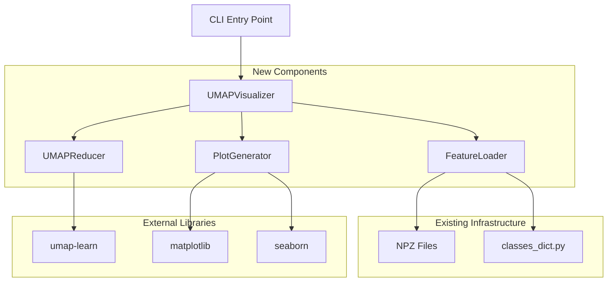
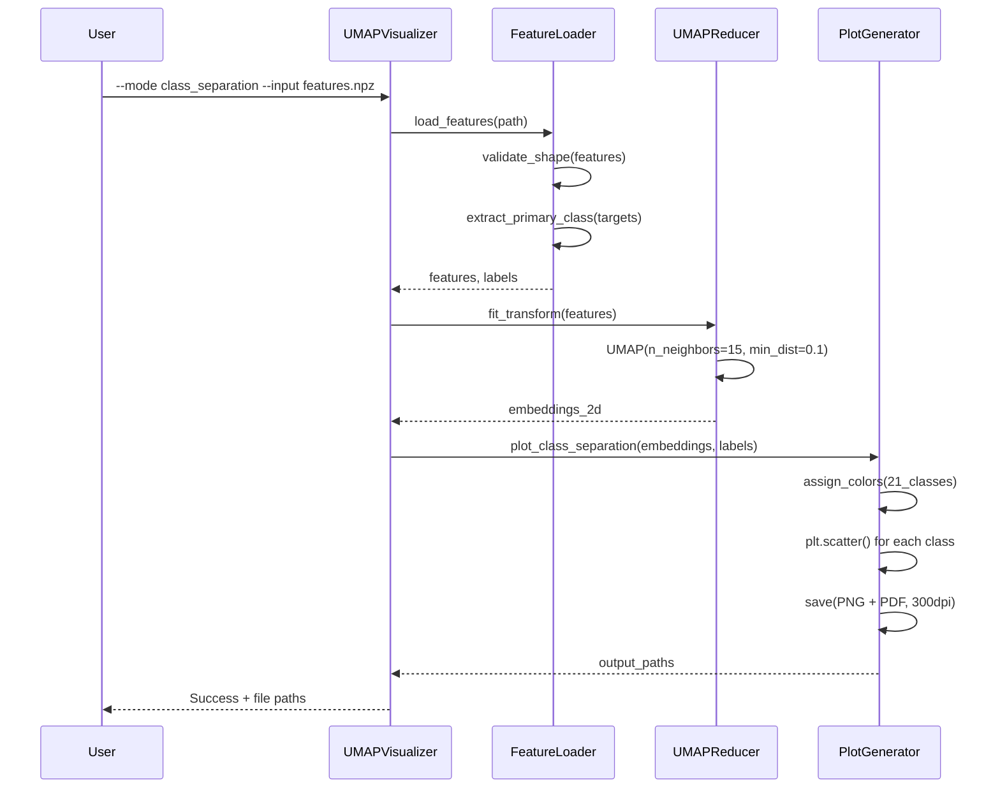
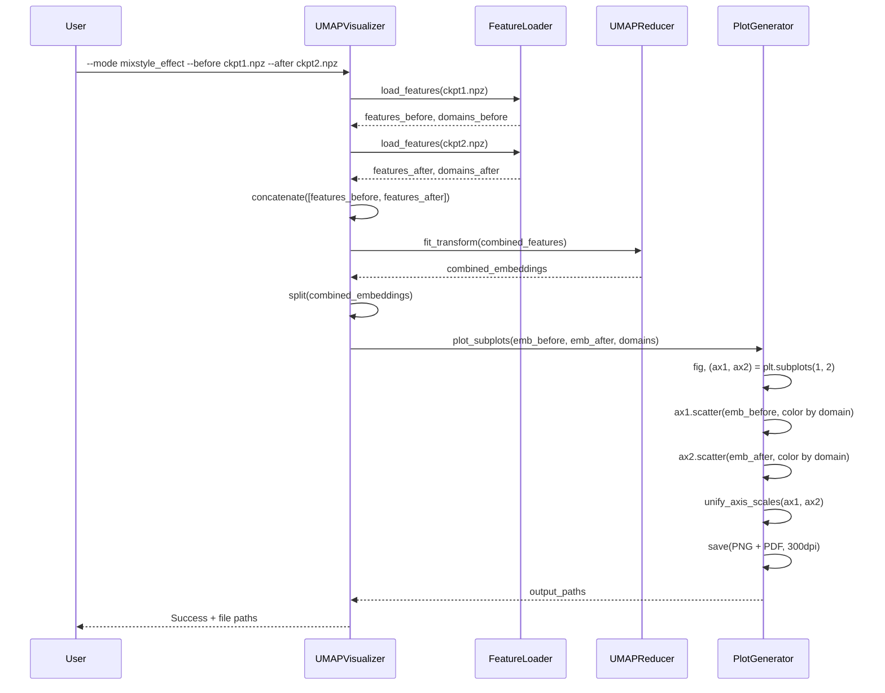
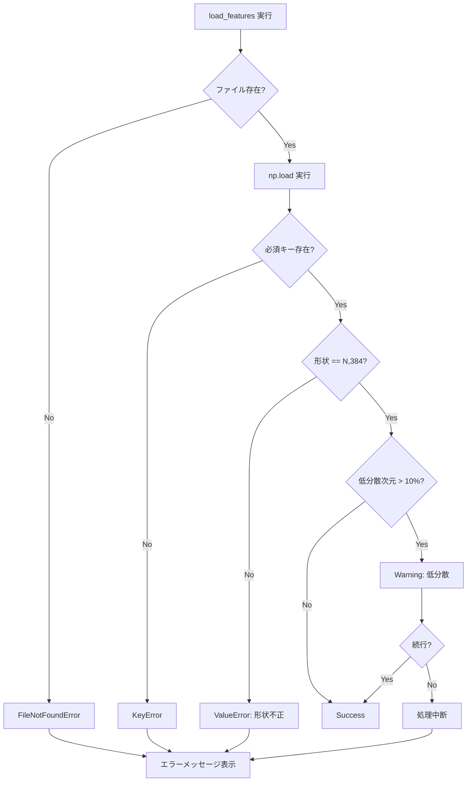

# 技術設計書: UMAP可視化システム

## Overview

本機能は、DCASE2024音響イベント検出モデルの学習済み特徴表現をUMAPで可視化し、クラス分離性とドメイン汎化効果を論文掲載品質で示すシステムを提供する。384次元RNN出力特徴量(dropout前、時間平均済み)を2次元に削減し、3種類の可視化(クラス分離、ドメイン比較、MixStyle効果検証)を生成する。

**Purpose**: 研究者がモデルの学習状態とドメイン汎化手法の効果を視覚的に評価し、学術論文に掲載可能な高品質プロットを生成する。

**Users**: DCASE2024 Task 4の研究者とモデル開発者が、訓練済みモデルの特徴空間分析とMixStyle効果の検証に利用する。

**Impact**: 既存の`visualize/`ディレクトリに新規スクリプト`visualize_umap.py`を追加し、特徴量分析ツールを拡張する。既存システムへの影響なし。

### Goals
- 21クラス(DESED 10 + MAESTRO 11)の特徴空間におけるクラス分離性の可視化
- ドメイン(DESED合成/実録音、MAESTRO)間の特徴分布比較の可視化
- MixStyle適用前後の特徴分布変化の並列比較可視化
- 論文掲載品質(300 DPI以上、PDF/PNG、色覚多様性対応)の出力
- UMAPパラメータと可視化設定の柔軟なカスタマイズ

### Non-Goals
- リアルタイム可視化やインタラクティブUI(静的プロット生成に限定)
- UMAP以外の次元削減手法(t-SNE、PCA)の実装(将来拡張として残す)
- 特徴量抽出パイプラインの変更(既存の`.npz`形式を使用)
- クラスタリング分析や定量的メトリクス計算(可視化のみ)

## Architecture

### Existing Architecture Analysis

本システムは既存の可視化インフラに統合される:

- **既存パターン**: `visualize/`ディレクトリ内のスタンドアロンスクリプト(`check_feature_properties.py`等)
- **既存データフロー**:
  1. `extract_inference_features.py`が特徴量を`.npz`形式で生成
  2. 可視化スクリプトが`.npz`を読み込み、プロット生成
- **統合点**: 既存の`CatManyHotEncoder`とクラス定義(`classes_dict.py`)を再利用
- **制約**: PyTorch Lightning 1.9.x、umap-learn 0.5.9との互換性維持

### Architecture Pattern & Boundary Map

**選択パターン**: Modular Class-Based Architecture

**理由**:
- 8つの要件を明確な責任境界で分離
- 型安全性と単体テスト容易性を確保
- 既存のPyTorch Lightningパターンと一貫性

**ドメイン境界**:
- **Data Layer**: 特徴量の読み込み、検証、マルチラベル処理
- **Processing Layer**: UMAP次元削減の実行
- **Presentation Layer**: プロット生成と出力
- **Orchestration Layer**: CLI引数処理と実行制御



**ステアリング準拠**:
- snake_case命名規則(tech.md)
- Ruff準拠のコード品質(tech.md)
- type hints強制(tech.md)
- `visualize/`ディレクトリ配置(structure.md)

### Technology Stack

| Layer | Choice / Version | Role in Feature | Notes |
|-------|------------------|-----------------|-------|
| CLI | argparse (標準ライブラリ) | コマンドライン引数パース | 既存パターンと一貫性 |
| Configuration | PyYAML 6.0+ | YAML設定ファイル読み込み | 既存プロジェクトで使用中 |
| Dimensionality Reduction | umap-learn 0.5.9 | UMAP次元削減 | プロジェクトに既存 |
| Visualization | matplotlib 3.5+, seaborn 0.13.2+ | プロット生成、色覚多様性対応 | 既存の可視化依存 |
| Data Processing | numpy 1.21+, pandas 1.3+ | 特徴量処理、データフレーム操作 | 既存依存 |
| Logging | Python logging (標準ライブラリ) | エラーハンドリング、デバッグ | tech.mdでLOGGER使用推奨 |

**新規依存**: なし(全て既存ライブラリ)

## System Flows

### Flow 1: Class Separation Visualization (要件2)



### Flow 2: MixStyle Effect Comparison (要件4)



**キー決定**:
- MixStyle比較では特徴量を結合後に1回のUMAP fittingを実行し、共通埋め込み空間を保証(要件4.2, 4.5)
- ドメインラベルはファイル名から自動抽出(要件3.1)

## Requirements Traceability

| 要件 | 概要 | コンポーネント | インターフェース | フロー |
|-----|------|--------------|----------------|-------|
| 1.1-1.5 | 特徴量データの読み込み | FeatureLoader | load_features(), validate_features() | Flow 1, 2 |
| 2.1-2.6 | クラス分離性の可視化 | UMAPReducer, PlotGenerator | fit_transform(), plot_class_separation() | Flow 1 |
| 3.1-3.5 | ドメイン別の可視化 | FeatureLoader, PlotGenerator | extract_domain_labels(), plot_domain_comparison() | - |
| 4.1-4.5 | MixStyle効果の検証可視化 | All components | - | Flow 2 |
| 5.1-5.5 | マルチラベル処理 | FeatureLoader | extract_primary_class() | Flow 1, 2 |
| 6.1-6.8 | 論文掲載用プロット出力 | PlotGenerator | save_plot(), apply_publication_style() | Flow 1, 2 |
| 7.1-7.5 | 設定のカスタマイズ | UMAPVisualizer, Config | parse_args(), load_config() | Flow 1, 2 |
| 8.1-8.5 | エラーハンドリングとログ | All components | logger, validate_*() | Flow 1, 2 |

## Components and Interfaces

### Component Summary

| Component | Domain/Layer | Intent | Req Coverage | Key Dependencies (P0/P1) | Contracts |
|-----------|--------------|--------|--------------|--------------------------|-----------|
| UMAPVisualizer | Orchestration | CLI entry point, workflow orchestration | 7, 8 | FeatureLoader (P0), UMAPReducer (P0), PlotGenerator (P0) | Service |
| FeatureLoader | Data | Feature loading, validation, preprocessing | 1, 3, 5, 8 | numpy (P0), classes_dict (P0) | Service |
| UMAPReducer | Processing | UMAP dimensionality reduction | 2, 4, 7 | umap-learn (P0) | Service |
| PlotGenerator | Presentation | Plot generation and file output | 2, 3, 4, 6, 7 | matplotlib (P0), seaborn (P0) | Service |

### Data Layer

#### FeatureLoader

| Field | Detail |
|-------|--------|
| Intent | 特徴量ファイルの読み込み、検証、前処理を担当 |
| Requirements | 1.1, 1.2, 1.3, 1.4, 1.5, 3.1, 5.1, 5.2, 5.3, 5.4, 5.5, 8.2, 8.3 |

**Responsibilities & Constraints**:
- `.npz`形式の特徴量ファイル読み込みと形状検証
- マルチラベルGround Truthからargmaxによる主要クラス抽出
- ファイル名/データセット名からドメインラベル抽出
- 不正なデータに対する明確なエラー報告

**Dependencies**:
- External: numpy (array操作) (P0)
- External: local.classes_dict (クラス定義) (P0)
- Inbound: UMAPVisualizer — ファイルパス指定 (P0)

**Contracts**: Service [✓]

##### Service Interface

```python
from typing import Tuple, Dict, List
import numpy as np
from numpy.typing import NDArray

class FeatureLoader:
    """特徴量の読み込みと前処理"""

    def __init__(self, class_labels: Dict[str, int]):
        """
        Args:
            class_labels: クラス名->インデックスのマッピング
        """
        self.class_labels = class_labels
        self.class_names = list(class_labels.keys())

    def load_features(
        self,
        npz_path: str,
        model_type: str = "student"
    ) -> Tuple[NDArray[np.float32], NDArray[np.int32], NDArray[np.float32], List[str]]:
        """
        .npzファイルから特徴量を読み込む

        Args:
            npz_path: .npzファイルのパス
            model_type: "student" or "teacher"

        Returns:
            features: (N, 384) 特徴量行列
            primary_classes: (N,) 主要クラスインデックス
            targets: (N, 27) マルチラベルGround Truth
            filenames: (N,) ファイル名リスト

        Raises:
            FileNotFoundError: ファイルが存在しない
            ValueError: 形状が不正
        """
        ...

    def load_multiple_datasets(
        self,
        npz_paths: List[str],
        model_type: str = "student"
    ) -> Tuple[NDArray[np.float32], NDArray[np.int32], NDArray[np.float32], List[str]]:
        """
        複数の.npzファイルを読み込み結合する

        Args:
            npz_paths: .npzファイルのパスリスト
            model_type: "student" or "teacher"

        Returns:
            combined_features: (N_total, 384)
            combined_classes: (N_total,)
            combined_targets: (N_total, 27)
            combined_filenames: (N_total,)
        """
        ...

    def extract_primary_class(
        self,
        targets: NDArray[np.float32]
    ) -> Tuple[NDArray[np.int32], Dict[int, List[int]]]:
        """
        マルチラベルからargmaxで主要クラスを抽出

        Args:
            targets: (N, 27) マルチラベル配列

        Returns:
            primary_classes: (N,) 主要クラスインデックス
            multi_label_info: サンプルインデックス -> 全該当クラスのマッピング
        """
        ...

    def extract_domain_labels(
        self,
        filenames: List[str]
    ) -> NDArray[np.int32]:
        """
        ファイル名からドメインラベルを抽出

        Args:
            filenames: ファイル名リスト

        Returns:
            domain_labels: (N,) ドメインインデックス配列
                0: desed_synthetic
                1: desed_real
                2: maestro_training
                3: maestro_validation

        Raises:
            ValueError: ドメインを識別できない
        """
        ...

    def validate_features(
        self,
        features: NDArray[np.float32],
        expected_dim: int = 384
    ) -> None:
        """
        特徴量の形状と統計量を検証

        Args:
            features: (N, D) 特徴量配列
            expected_dim: 期待される特徴量次元数

        Raises:
            ValueError: 次元数が不一致

        Warnings:
            分散が極端に低い次元が存在する場合
        """
        ...
```

- **Preconditions**: `.npz`ファイルが存在し、必要なキー(`features_student`, `targets`, `filenames`)を含む
- **Postconditions**:
  - 返却される特徴量は(N, 384)形状で、NaNやInfを含まない
  - primary_classesは0-20の範囲(21クラス)
  - ログにマルチラベル対応関係が記録される(要件5.5)
- **Invariants**: ファイル名リストと特徴量配列のサンプル数が一致

**Implementation Notes**:
- Integration: 既存の`check_feature_properties.py`の検証ロジックを統合
- Validation: numpy配列の形状チェック、`np.isnan()`, `np.isinf()`でデータ品質検証
- Risks: メモリ使用量が大規模データセットで問題になる可能性 → 要件8.1で対処

### Processing Layer

#### UMAPReducer

| Field | Detail |
|-------|--------|
| Intent | UMAP次元削減の実行とパラメータ管理 |
| Requirements | 2.1, 4.1, 4.2, 4.5, 7.1, 7.4, 8.1, 8.3 |

**Responsibilities & Constraints**:
- UMAPパラメータ(`n_neighbors`, `min_dist`, `metric`, `random_state`)の管理
- 高次元特徴量の2次元埋め込み生成
- 大規模データセットのメモリ効率的な処理
- 実行時間のログ出力

**Dependencies**:
- External: umap-learn (次元削減) (P0)
- External: numpy (配列操作) (P0)
- Inbound: UMAPVisualizer — 特徴量配列 (P0)

**Contracts**: Service [✓]

##### Service Interface

```python
from typing import Optional
import numpy as np
from numpy.typing import NDArray
import umap

class UMAPReducer:
    """UMAP次元削減の実行"""

    def __init__(
        self,
        n_neighbors: int = 15,
        min_dist: float = 0.1,
        metric: str = "euclidean",
        random_state: int = 42,
        n_components: int = 2
    ):
        """
        Args:
            n_neighbors: 近傍点数(5-50推奨)
            min_dist: 埋め込み空間の最小距離(0.001-0.5推奨)
            metric: 距離メトリック(euclidean, cosine等)
            random_state: 再現性のための乱数シード
            n_components: 出力次元数(通常2)
        """
        self.n_neighbors = n_neighbors
        self.min_dist = min_dist
        self.metric = metric
        self.random_state = random_state
        self.n_components = n_components
        self.reducer: Optional[umap.UMAP] = None

    def fit_transform(
        self,
        features: NDArray[np.float32]
    ) -> NDArray[np.float32]:
        """
        特徴量を2次元に削減

        Args:
            features: (N, D) 高次元特徴量

        Returns:
            embeddings: (N, 2) 2次元埋め込み

        Raises:
            MemoryError: メモリ不足時
        """
        ...

    def transform(
        self,
        features: NDArray[np.float32]
    ) -> NDArray[np.float32]:
        """
        学習済みUMAPモデルで新規データを変換

        Args:
            features: (N, D) 高次元特徴量

        Returns:
            embeddings: (N, 2) 2次元埋め込み

        Raises:
            ValueError: fit_transform()が未実行
        """
        ...

    def get_params(self) -> dict:
        """現在のUMAPパラメータを取得"""
        ...
```

- **Preconditions**:
  - 入力特徴量が(N, D)形状でN>=n_neighbors
  - NaNやInfを含まない
- **Postconditions**:
  - 返却される埋め込みは(N, 2)形状
  - 実行時間がINFOレベルでログ出力される(要件8.3)
- **Invariants**: サンプル数が保存される(入力N == 出力N)

**Implementation Notes**:
- Integration: `umap.UMAP`クラスのラッパー、デフォルト値を要件7.4に合わせる
- Validation: サンプル数<n_neighborsの場合に警告、自動調整
- Risks:
  - メモリ不足(N>10,000) → 要件8.1で事前チェック、ダウンサンプリング提案
  - 実行時間(数分~数十分) → tqdmでプログレスバー表示検討

### Presentation Layer

#### PlotGenerator

| Field | Detail |
|-------|--------|
| Intent | 論文掲載品質のプロット生成とファイル出力 |
| Requirements | 2.2, 2.3, 2.4, 2.5, 2.6, 3.2, 3.3, 3.4, 3.5, 4.3, 4.4, 4.5, 6.1, 6.2, 6.3, 6.4, 6.5, 6.6, 6.7, 6.8, 7.2, 7.5 |

**Responsibilities & Constraints**:
- 3種類のプロット生成(クラス分離、ドメイン比較、MixStyle効果)
- 論文掲載品質(300 DPI、大きいフォント、色覚多様性対応)
- PNG/PDF両形式での出力
- カスタムカラーパレットと図サイズのサポート

**Dependencies**:
- External: matplotlib (プロット) (P0)
- External: seaborn (カラーパレット) (P0)
- Inbound: UMAPVisualizer — 埋め込み、ラベル (P0)

**Contracts**: Service [✓]

##### Service Interface

```python
from typing import Optional, Tuple, List
from pathlib import Path
import numpy as np
from numpy.typing import NDArray
import matplotlib.pyplot as plt
import matplotlib.figure

class PlotGenerator:
    """プロット生成と出力"""

    def __init__(
        self,
        output_dir: str = "output",
        dpi: int = 300,
        figsize: Tuple[int, int] = (12, 8),
        palette: str = "colorblind",
        font_size_title: int = 14,
        font_size_label: int = 12,
        font_size_legend: int = 10
    ):
        """
        Args:
            output_dir: 出力ディレクトリ
            dpi: 解像度(300以上推奨)
            figsize: 図のサイズ(幅, 高さ)インチ
            palette: seabornカラーパレット名
            font_size_*: フォントサイズ設定
        """
        self.output_dir = Path(output_dir)
        self.output_dir.mkdir(parents=True, exist_ok=True)
        self.dpi = dpi
        self.figsize = figsize
        self.palette = palette
        self.font_sizes = {
            "title": font_size_title,
            "label": font_size_label,
            "legend": font_size_legend
        }

    def plot_class_separation(
        self,
        embeddings: NDArray[np.float32],
        class_labels: NDArray[np.int32],
        class_names: List[str],
        title: str = "UMAP: Class Separation",
        filename_prefix: str = "class_separation"
    ) -> Tuple[str, str]:
        """
        クラス分離性のプロットを生成

        Args:
            embeddings: (N, 2) UMAP埋め込み
            class_labels: (N,) クラスインデックス(0-20)
            class_names: 21クラスの名前リスト
            title: プロットタイトル
            filename_prefix: 出力ファイル名プレフィックス

        Returns:
            png_path: 保存されたPNGファイルパス
            pdf_path: 保存されたPDFファイルパス
        """
        ...

    def plot_domain_comparison(
        self,
        embeddings: NDArray[np.float32],
        domain_labels: NDArray[np.int32],
        domain_names: List[str],
        title: str = "UMAP: Domain Comparison",
        filename_prefix: str = "domain_comparison"
    ) -> Tuple[str, str]:
        """
        ドメイン別のプロットを生成

        Args:
            embeddings: (N, 2) UMAP埋め込み
            domain_labels: (N,) ドメインインデックス(0-3)
            domain_names: ドメイン名リスト
            title: プロットタイトル
            filename_prefix: 出力ファイル名プレフィックス

        Returns:
            png_path, pdf_path: 出力ファイルパス
        """
        ...

    def plot_mixstyle_comparison(
        self,
        embeddings_before: NDArray[np.float32],
        embeddings_after: NDArray[np.float32],
        domain_labels: NDArray[np.int32],
        domain_names: List[str],
        title_before: str = "Before MixStyle",
        title_after: str = "After MixStyle",
        filename_prefix: str = "mixstyle_effect"
    ) -> Tuple[str, str]:
        """
        MixStyle適用前後のサブプロット比較を生成

        Args:
            embeddings_before: (N, 2) MixStyle適用前
            embeddings_after: (N, 2) MixStyle適用後
            domain_labels: (N,) ドメインインデックス
            domain_names: ドメイン名リスト
            title_before, title_after: サブプロットタイトル
            filename_prefix: 出力ファイル名プレフィックス

        Returns:
            png_path, pdf_path: 出力ファイルパス

        Notes:
            両サブプロットで軸スケールを統一(要件4.5)
        """
        ...

    def _apply_publication_style(self, fig: matplotlib.figure.Figure, ax) -> None:
        """
        論文掲載用のスタイルを適用
        - 軸ラベル、タイトルのフォントサイズ
        - 凡例の配置(図外、右上)
        - グリッド、スパイン等の調整
        """
        ...

    def _get_color_palette(self, n_colors: int) -> List[Tuple[float, float, float]]:
        """
        指定された色数のパレットを生成

        Args:
            n_colors: 必要な色数

        Returns:
            colors: RGB色のリスト
        """
        ...

    def _generate_filename(self, prefix: str, extension: str) -> str:
        """
        タイムスタンプ付きファイル名を生成

        Args:
            prefix: ファイル名プレフィックス
            extension: 拡張子("png" or "pdf")

        Returns:
            filename: "{prefix}_{timestamp}.{extension}"
        """
        ...
```

- **Preconditions**:
  - embeddings, labelsの長さが一致
  - クラス/ドメインインデックスが有効範囲内
- **Postconditions**:
  - PNG/PDFファイルが指定ディレクトリに保存される
  - 保存成功がINFOレベルでログ出力される(要件8.4)
- **Invariants**: 両形式(PNG/PDF)が常に生成される

**Implementation Notes**:
- Integration:
  - `plt.scatter()`でクラス/ドメインごとに色分け
  - `plt.legend(bbox_to_anchor=(1.05, 1), loc='upper left')`で凡例を図外配置(要件6.8)
- Validation: 出力ディレクトリの書き込み権限チェック
- Risks:
  - 21クラスのカラーパレットが視覚的に区別困難 → colorblindパレット+凡例最適化で緩和
  - PDFファイルサイズが大規模データで肥大化 → サンプル数制限で対処

### Orchestration Layer

#### UMAPVisualizer

| Field | Detail |
|-------|--------|
| Intent | CLI entry point、全コンポーネントの統合と実行制御 |
| Requirements | 7.1, 7.2, 7.3, 7.4, 7.5, 8.4, 8.5 |

**Responsibilities & Constraints**:
- コマンドライン引数のパース
- YAML設定ファイルの読み込みとマージ(優先度: CLI > YAML > デフォルト)
- 3種類の可視化モードの実行制御
- ログレベル設定とエラーハンドリング

**Dependencies**:
- Outbound: FeatureLoader (特徴量読み込み) (P0)
- Outbound: UMAPReducer (次元削減) (P0)
- Outbound: PlotGenerator (プロット生成) (P0)

**Contracts**: Service [✓]

##### Service Interface

```python
from typing import Optional, Dict, Any
from pathlib import Path
import argparse
import logging

class UMAPVisualizer:
    """UMAP可視化システムのエントリーポイント"""

    def __init__(self, config: Optional[Dict[str, Any]] = None):
        """
        Args:
            config: 設定辞書(YAMLから読み込み、またはデフォルト)
        """
        self.config = config or self._get_default_config()
        self.loader = FeatureLoader(...)
        self.reducer = UMAPReducer(...)
        self.generator = PlotGenerator(...)
        self.logger = logging.getLogger(__name__)

    def run_class_separation(
        self,
        input_path: str,
        model_type: str = "student"
    ) -> None:
        """
        クラス分離性可視化を実行(要件2)

        Args:
            input_path: .npzファイルパス
            model_type: "student" or "teacher"
        """
        ...

    def run_domain_comparison(
        self,
        input_paths: list[str],
        model_type: str = "student"
    ) -> None:
        """
        ドメイン比較可視化を実行(要件3)

        Args:
            input_paths: .npzファイルパスのリスト
            model_type: "student" or "teacher"
        """
        ...

    def run_mixstyle_comparison(
        self,
        before_path: str,
        after_path: str,
        model_type: str = "student"
    ) -> None:
        """
        MixStyle効果比較可視化を実行(要件4)

        Args:
            before_path: MixStyle適用前の.npzパス
            after_path: MixStyle適用後の.npzパス
            model_type: "student" or "teacher"
        """
        ...

    @staticmethod
    def parse_args() -> argparse.Namespace:
        """コマンドライン引数をパース"""
        ...

    @staticmethod
    def load_config(config_path: str) -> Dict[str, Any]:
        """YAML設定ファイルを読み込み"""
        ...

    @staticmethod
    def merge_config(
        cli_args: argparse.Namespace,
        yaml_config: Dict[str, Any],
        defaults: Dict[str, Any]
    ) -> Dict[str, Any]:
        """
        設定をマージ(優先度: CLI > YAML > デフォルト)
        """
        ...

    @staticmethod
    def _get_default_config() -> Dict[str, Any]:
        """
        デフォルト設定を返す(要件7.4)
        """
        return {
            "umap": {
                "n_neighbors": 15,
                "min_dist": 0.1,
                "metric": "euclidean",
                "random_state": 42
            },
            "plot": {
                "dpi": 300,
                "figsize": (12, 8),
                "palette": "colorblind"
            },
            "output": {
                "dir": "output"
            },
            "logging": {
                "level": "INFO"
            }
        }

def main():
    """CLI entry point"""
    args = UMAPVisualizer.parse_args()

    # 設定読み込みとマージ
    yaml_config = UMAPVisualizer.load_config(args.config) if args.config else {}
    config = UMAPVisualizer.merge_config(args, yaml_config, UMAPVisualizer._get_default_config())

    # ログ設定
    logging.basicConfig(
        level=getattr(logging, config["logging"]["level"]),
        format="%(asctime)s - %(name)s - %(levelname)s - %(message)s"
    )

    # Visualizer初期化
    visualizer = UMAPVisualizer(config)

    # モード別実行
    if args.mode == "class_separation":
        visualizer.run_class_separation(args.input, args.model_type)
    elif args.mode == "domain_comparison":
        visualizer.run_domain_comparison(args.inputs, args.model_type)
    elif args.mode == "mixstyle_effect":
        visualizer.run_mixstyle_comparison(args.before, args.after, args.model_type)
    else:
        raise ValueError(f"Unknown mode: {args.mode}")

if __name__ == "__main__":
    main()
```

- **Preconditions**: コマンドライン引数が有効(必須パラメータが存在)
- **Postconditions**:
  - 正常終了時に成功メッセージとファイルパスが表示される(要件8.4)
  - エラー時に明確なメッセージが表示される(要件8.1, 8.2)
- **Invariants**: ログレベルが正しく設定される(要件8.5)

**Implementation Notes**:
- Integration: argparseでsubcommands(`class_separation`, `domain_comparison`, `mixstyle_effect`)を定義
- Validation: 必須引数の存在チェック、ファイルパスの存在チェック
- Risks: YAML設定とCLI引数のマージロジックが複雑 → 優先度ルールを明確化

## Data Models

### Domain Model

**Entities**:
- **Feature**: 384次元RNN出力特徴量(時間平均済み、dropout前)
- **Sample**: 単一の音響サンプル(10秒オーディオクリップに対応)
- **Class**: 音響イベントクラス(DESED 10 + MAESTRO 11の21クラス)
- **Domain**: データセットドメイン(DESED合成/実録音、MAESTRO訓練/検証)

**Value Objects**:
- **UMAPEmbedding**: 2次元埋め込み座標(x, y)
- **ClassLabel**: 主要クラスインデックス(0-20)とクラス名のペア
- **DomainLabel**: ドメインインデックス(0-3)とドメイン名のペア

**Aggregates**:
- **FeatureDataset**: Sampleのコレクション(特徴量、クラス、ドメイン、ファイル名)
- **VisualizationResult**: プロット画像(PNG/PDF)とメタデータ(パラメータ、統計情報)

**Invariants**:
- Sampleの特徴量次元数は常に384
- ClassLabelは0-20の範囲
- DomainLabelは0-3の範囲
- FeatureDataset内の全Sampleは同じmodel_type(studentまたはteacher)

### Logical Data Model

**Structure Definition**:

```python
# .npzファイル構造(既存フォーマット)
NPZFile = {
    "features_student": NDArray[np.float32],  # (N, 384)
    "features_teacher": NDArray[np.float32],  # (N, 384)
    "probs_student": NDArray[np.float32],     # (N, 27) 弱ラベル予測
    "probs_teacher": NDArray[np.float32],     # (N, 27)
    "targets": NDArray[np.float32],           # (N, 27) Ground Truth
    "filenames": List[str]                    # (N,) ファイル名
}

# 内部データ構造
FeatureData = {
    "embeddings": NDArray[np.float32],        # (N, 2) UMAP埋め込み
    "class_labels": NDArray[np.int32],        # (N,) 主要クラス
    "domain_labels": NDArray[np.int32],       # (N,) ドメイン
    "filenames": List[str],                   # (N,) ファイル名
    "multi_label_info": Dict[int, List[int]]  # サンプルID -> 全該当クラス
}

# 出力メタデータ
VisualizationMetadata = {
    "mode": str,                              # "class_separation" | "domain_comparison" | "mixstyle_effect"
    "model_type": str,                        # "student" | "teacher"
    "umap_params": Dict[str, Any],            # UMAPパラメータ
    "n_samples": int,                         # サンプル数
    "n_classes": int,                         # クラス数(21)
    "output_files": List[str],                # 生成されたファイルパス
    "timestamp": str                          # ISO 8601形式
}
```

**Consistency & Integrity**:
- トランザクション境界: 単一ファイルの読み込みから出力まで(アトミック操作)
- 参照整合性: filenames、class_labels、embeddings配列の長さが一致
- 時系列: タイムスタンプベースのファイル名で自然順序保証

## Error Handling

### Error Strategy

**Error Categories and Responses**:

**User Errors** (入力関連):
- ファイルが存在しない → `FileNotFoundError`、明確なパス表示(要件1.2)
- 形状が不正 → `ValueError`、期待される形状と実際の形状を表示(要件1.3, 1.4, 8.2)
- ドメイン識別不可 → `ValueError`、有効なファイル名パターンを提示

**System Errors** (リソース/ライブラリ):
- メモリ不足 → `MemoryError`、サンプル数削減またはバッチ処理を提案(要件8.1)
- 書き込み権限なし → `PermissionError`、出力ディレクトリの確認を促す

**Business Logic Errors**:
- 低分散特徴量 → `Warning`、処理継続の確認(要件8.2)
- クラス不均衡 → `Warning`、クラス分布をログ出力(要件8.3)

### エラーフロー例



### Monitoring

**ログ出力レベル**(要件8.5):
- **DEBUG**: 内部処理詳細(配列形状、パラメータ値)
- **INFO**:
  - データセット読み込み成功(サンプル数、クラス分布)
  - UMAP実行開始/完了(実行時間)
  - ファイル保存成功(パス)
- **WARNING**:
  - 低分散特徴量検出
  - サンプル数が大規模(>10,000)
  - 次元数が期待値と異なる
- **ERROR**:
  - ファイル読み込み失敗
  - UMAP実行失敗
  - ファイル保存失敗

**統計情報出力**(要件8.3, 8.4):
```
INFO: Loaded 5000 samples from desed_validation.npz
INFO: Class distribution: {0: 235, 1: 198, ...}
INFO: Feature shape: (5000, 384), mean: 0.0234, std: 0.1567
INFO: UMAP execution time: 45.2 seconds
INFO: Saved plots: output/class_separation_student_20250101_120000.png, .pdf
```

## Testing Strategy

### Unit Tests
- `FeatureLoader.load_features()`: 正常系/異常系(ファイル不存在、形状不正、キー不足)
- `FeatureLoader.extract_primary_class()`: argmax処理、同点時の挙動、Unknownクラス処理
- `FeatureLoader.extract_domain_labels()`: 各ドメインパターンの識別、不明パターンのエラー
- `UMAPReducer.fit_transform()`: デフォルトパラメータ、カスタムパラメータ、小規模データ
- `PlotGenerator._get_color_palette()`: 21色生成、カスタムパレット指定

### Integration Tests
- `UMAPVisualizer.run_class_separation()`: 特徴量読み込み→UMAP→プロット→ファイル保存の完全フロー
- `UMAPVisualizer.run_mixstyle_comparison()`: 2つのモデルの特徴量結合、共通埋め込み空間、サブプロット生成
- 設定マージ: CLI引数 > YAML > デフォルトの優先度確認
- エラーハンドリング: メモリ不足シミュレーション、不正ファイルへの対応

### Manual Validation
- 論文掲載品質: 300 DPI、フォントサイズ、凡例配置の目視確認
- 色覚多様性: colorblindパレットのシミュレーションツールでの確認
- クラス分離性: 既知の良好/不良モデルでの視覚的検証
- MixStyle効果: 適用前後で期待されるドメイン重なり増加の確認

### Performance Tests
- 大規模データ: N=10,000サンプルでのメモリ使用量、実行時間測定
- UMAP収束: 異なるn_neighbors, min_distでの埋め込み品質比較

## Optional Sections

### Performance & Scalability

**Target Metrics**:
- UMAP実行時間: N=5000サンプルで<60秒(n_neighbors=15)
- メモリ使用量: N=5000サンプルで<4GB
- プロット生成時間: <10秒(21クラス、凡例含む)

**Scaling Approach**:
- N<5000: 通常処理
- 5000<=N<=10000: 警告表示、処理続行
- N>10000: エラー表示、`--max_samples`でダウンサンプリング提案

**Optimization**:
- UMAP並列化: `n_jobs=-1`でCPU全コア使用(umap-learnデフォルト)
- メモリ効率: 特徴量読み込み後に不要なキー(probs等)を即座に削除

### Migration Strategy

**該当なし** (新規機能追加、既存システム変更なし)

## Supporting References

### YAML設定ファイル例

```yaml
# config/umap_visualization.yaml
umap:
  n_neighbors: 15
  min_dist: 0.1
  metric: euclidean
  random_state: 42

plot:
  dpi: 300
  figsize: [12, 8]
  palette: colorblind
  font_size_title: 14
  font_size_label: 12
  font_size_legend: 10

output:
  dir: output/umap_plots

logging:
  level: INFO
```

### CLI Usage Examples

```bash
# クラス分離性可視化
python visualize_umap.py \
  --mode class_separation \
  --input inference_outputs/baseline/desed_validation.npz \
  --model_type student \
  --output_dir output/class_separation

# ドメイン比較
python visualize_umap.py \
  --mode domain_comparison \
  --inputs inference_outputs/baseline/desed_validation.npz \
           inference_outputs/baseline/maestro_validation.npz \
  --model_type teacher

# MixStyle効果比較
python visualize_umap.py \
  --mode mixstyle_effect \
  --before inference_outputs/baseline_no_mixstyle/desed_validation.npz \
  --after inference_outputs/baseline_with_mixstyle/desed_validation.npz \
  --config config/umap_visualization.yaml

# カスタムパラメータ
python visualize_umap.py \
  --mode class_separation \
  --input data.npz \
  --n_neighbors 30 \
  --min_dist 0.05 \
  --palette tab20 \
  --figsize 16 10 \
  --dpi 600
```

### 21クラスリスト(統合)

**DESED (10クラス)**:
1. Alarm_bell_ringing
2. Blender
3. Cat
4. Dishes
5. Dog
6. Electric_shaver_toothbrush
7. Frying
8. Running_water
9. Speech
10. Vacuum_cleaner

**MAESTRO Real Eval (11クラス)**:
11. birds_singing
12. car
13. people talking
14. footsteps
15. children voices
16. wind_blowing
17. brakes_squeaking
18. large_vehicle
19. cutlery and dishes
20. metro approaching
21. metro leaving

**マッピング注意**:
- "people talking", "children voices" → "Speech"(エイリアス処理)
- "cutlery and dishes" → "Dishes"(エイリアス処理)
