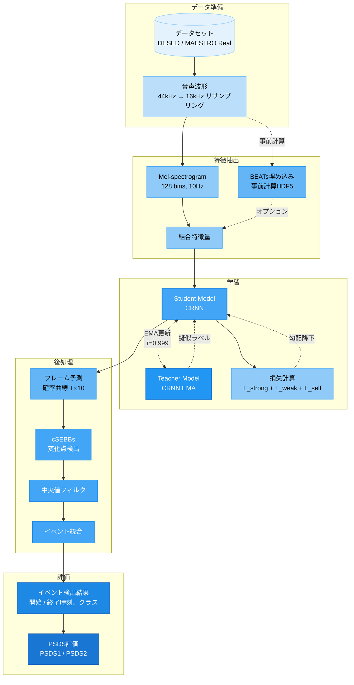
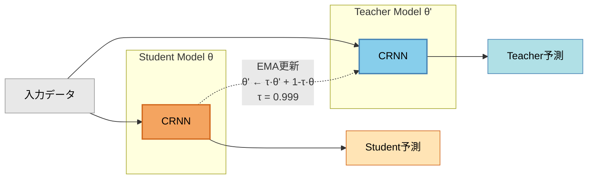
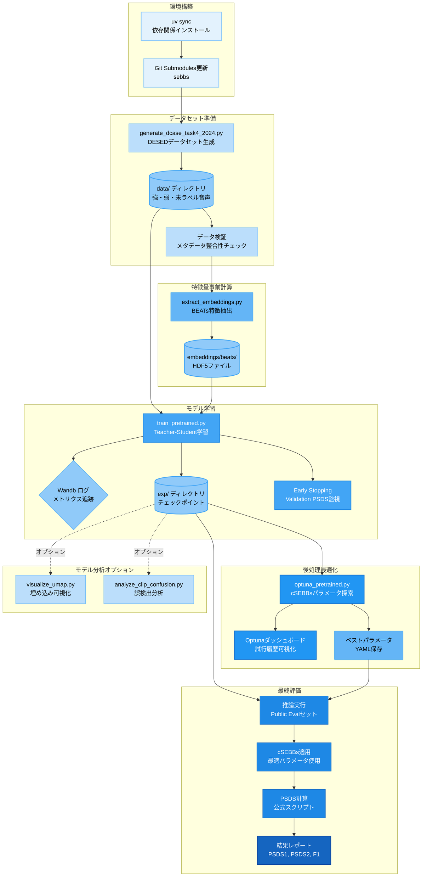

# DCASE 2024 Task 4 実装概要（論文執筆用）

## 1. システム概要

本システムは、DCASE 2024 Task 4（Sound Event Detection）のベースライン実装を拡張した音響イベント検出システムである。半教師あり学習に基づくTeacher-Studentアーキテクチャを採用し、少量のラベル付きデータと大量の未ラベルデータを活用して、10秒間のオーディオクリップ内の音響イベントを時系列的に検出・分類する。

### 主要な特徴

- **半教師あり学習**: Teacher-Studentモデルによる擬似ラベル生成とConfident Mean Teacher (CMT) 戦略
- **マルチスケール特徴抽出**: CRNN（CNN+RNN）ベースのアーキテクチャ
- **事前学習済み表現**: BEATs（Bidirectional Encoder representation from Audio Transformers）埋め込みの統合オプション
- **データ拡張**: Mixup、SpecAugment、MixStyleの組み合わせ
- **後処理**: cSEBBs（change-point based Sound Event Bounding Boxes）による変化点検出とイベント境界の最適化

## 2. システムアーキテクチャ

### 2.1 全体構成

#### 図1: システム全体俯瞰図



**各フェーズの概要**:
1. **データ準備**: DESEDデータセット（強・弱・未ラベル）の読み込みと音声リサンプリング
2. **特徴抽出**: Mel-spectrogram生成、オプションでBEATs埋め込み統合
3. **学習**: Teacher-Student半教師あり学習（EMA更新、擬似ラベル生成）
4. **後処理**: cSEBBsによる変化点検出とイベント境界精緻化
5. **評価**: PSDS（PSDS1/PSDS2）およびF1スコアによる性能評価

### 2.2 モデルアーキテクチャ

#### 図4: CRNNアーキテクチャ詳細

```mermaid
graph TD
    subgraph 入力層
        A1[音声波形<br/>16kHz, 10sec]:::input
        A2[Mel-spectrogram<br/>shape: 128×T]:::feature
        A3[BEATs埋め込み<br/>shape: 768×T]:::beats
        A4[結合特徴量<br/>shape: C_in×T]:::feature
    end

    subgraph CNNブロック
        C1[Conv2D + BatchNorm + ReLU<br/>filters: 64, kernel: 3×3]:::cnn
        C2[MaxPooling2D<br/>pool: 2×2]:::pool
        C3[Dropout<br/>p=0.2]:::dropout
        C4[Conv2D + BatchNorm + ReLU<br/>filters: 128, kernel: 3×3]:::cnn
        C5[MaxPooling2D<br/>pool: 2×2]:::pool
        C6[Dropout<br/>p=0.2]:::dropout
        C7[Conv2D + BatchNorm + ReLU<br/>filters: 256, kernel: 3×3]:::cnn
        C8[AdaptiveAvgPooling<br/>周波数軸を1に圧縮]:::pool
    end

    subgraph 次元変換
        T1[Permute & Reshape<br/>shape: T×256]:::transform
    end

    subgraph RNNブロック
        R1[Bidirectional LSTM/GRU<br/>hidden: 128<br/>出力: T×256]:::rnn
        R2[Dropout<br/>p=0.3]:::dropout
        R3[Bidirectional LSTM/GRU<br/>hidden: 128<br/>出力: T×256]:::rnn
    end

    subgraph 出力層
        O1[Linear<br/>256 → 10]:::output
        O2[Sigmoid<br/>フレームごとの確率]:::activation
        O3[予測結果<br/>shape: T×10<br/>各クラスの確率値 0-1]:::pred
    end

    A1 -->|特徴抽出| A2
    A1 -.->|事前計算| A3
    A2 --> A4
    A3 -.->|結合/置換| A4

    A4 --> C1 --> C2 --> C3
    C3 --> C4 --> C5 --> C6
    C6 --> C7 --> C8

    C8 --> T1

    T1 --> R1 --> R2
    R2 --> R3

    R3 --> O1 --> O2 --> O3

    classDef input fill:#E3F2FD,stroke:#90CAF9,color:#000
    classDef feature fill:#BBDEFB,stroke:#64B5F6,color:#000
    classDef beats fill:#90CAF9,stroke:#42A5F5,color:#000
    classDef cnn fill:#64B5F6,stroke:#2196F3,color:#000
    classDef pool fill:#90CAF9,stroke:#42A5F5,color:#000
    classDef dropout fill:#BBDEFB,stroke:#64B5F6,color:#000
    classDef transform fill:#42A5F5,stroke:#1E88E5,color:#fff
    classDef rnn fill:#2196F3,stroke:#1976D2,color:#fff
    classDef output fill:#1E88E5,stroke:#1565C0,color:#fff
    classDef activation fill:#1976D2,stroke:#0D47A1,color:#fff
    classDef pred fill:#1565C0,stroke:#0D47A1,color:#fff
```



**次元変化の詳細**:
1. **入力**: 128 (Mel bins) × T (時間フレーム)
2. **CNN第1層後**: 64 × 64 × T/2（周波数軸・時間軸が1/2）
3. **CNN第2層後**: 128 × 32 × T/4
4. **CNN第3層後**: 256 × 1 × T/4（周波数軸が1に圧縮）
5. **RNN入力**: T/4 × 256（シーケンス長 × 特徴次元）
6. **RNN出力**: T/4 × 256（BiLSTMで前後両方向）
7. **最終出力**: T/4 × 10（各時刻でのクラス確率）

**BEATs統合パターン**:
- **結合（Concatenation）**: Mel (128次元) + BEATs (768次元) = 896次元入力

**CRNN（Convolutional Recurrent Neural Network）**:
- **CNNブロック**: Mel-spectrogramから時間不変な特徴を抽出
  - 複数の畳み込み層（BatchNorm、Dropout含む）
  - プーリング層による時間周波数軸の次元削減
- **RNNブロック**: 双方向LSTM/GRUによる時系列依存関係のモデリング
- **出力層**: フレームごとのマルチラベル分類（10イベントクラス）

**Teacher-Student構造**:
- Student: 通常の勾配降下法で学習
- Teacher: StudentパラメータのExponential Moving Average（EMA、減衰率0.999）
- Teacherは未ラベルデータに対する擬似ラベルを生成

#### 図2: Mean Teacher - EMA更新メカニズム



**重要なポイント**:
- **Student（θ）**: 勾配降下法で重みを更新（オレンジ）
- **Teacher（θ'）**: StudentのEMA（指数移動平均）、勾配更新なし（青）
- **EMA更新式**: θ' ← 0.999×θ' + 0.001×θ
- Teacherは安定した予測を提供し、Studentの学習を誘導

### 2.3 BEATs統合

BEATs（Microsoft Research, 2022）は音響表現学習のための事前学習済みTransformerモデルである。本実装では：
- HDF5形式で事前計算された埋め込みを保存（トレーニング効率化）
- Mel-spectrogramとの結合による特徴量強化
- 768次元の埋め込みベクトルを使用

## 3. 学習プロセス

### 3.1 データセット構成

**DESED（Domestic Environment Sound Event Detection）データセット**:
- **強ラベルデータ（Strong labels）**: フレームレベルの時間的アノテーション
- **弱ラベルデータ（Weak labels）**: クリップレベルのイベント有無のみ
- **未ラベルデータ（Unlabeled）**: Teacher-Studentによる擬似ラベル生成対象
- **検証・評価データ**: Public Evalセット（DCASE公式）

**イベントクラス（10クラス）**:
Alarm_bell_ringing, Blender, Cat, Dishes, Dog, Electric_shaver_toothbrush, Frying, Running_water, Speech, Vacuum_cleaner


**MAESTRO Real データセット**
Cosenseのメモを利用


### 3.2 損失関数

複数の損失項の重み付き和:
```
L_total = λ_strong * L_strong + λ_weak * L_weak + λ_self * L_self
```

- **L_strong**: 強ラベルデータに対するBinary Cross-Entropy（フレームレベル）
- **L_weak**: 弱ラベルデータに対するBCE（クリップレベル、max-pooling）
- **L_self**: 未ラベルデータに対する自己学習損失（Teacher予測との一致度）

**Confident Mean Teacher (CMT)戦略**:
- 高信頼度（閾値以上）のTeacher予測のみを擬似ラベルとして採用
- 動的な信頼度閾値調整により、ノイズの多い擬似ラベルを除外

### 3.3 データ拡張

- **Mixup**: 2つの音声サンプルを線形混合（α分布からλをサンプリング）
- **SpecAugment**: スペクトログラムのTime/Frequency Maskingによる正則化
- **MixStyle**: ドメイン汎化のための特徴量統計量混合
- **時間シフト**: ランダムな時間軸オフセット

### 3.4 最適化

- **オプティマイザ**: Adam（学習率1e-3）
- **学習率スケジューラ**: ReduceLROnPlateau（Validationメトリクス監視）
- **バッチサイズ**: 通常32～64
- **エポック数**: 200（Early Stopping適用）
- **EMA更新**: τ=0.999（Teacher ← 0.999×Teacher + 0.001×Student）

## 4. 後処理（cSEBBs）

### 4.1 アルゴリズム概要

cSEBBs（change-point based Sound Event Bounding Boxes）は、CRNNの出力確率曲線から変化点を検出し、イベント境界を精密化する。

**処理フロー**:
1. **中央値フィルタリング**: クラスごとに確率曲線を平滑化
2. **変化点検出**: 確率勾配の閾値処理により開始/終了点を特定
3. **イベント統合**: 近接するイベントのマージと短時間イベントの除去
4. **信頼度スコア計算**: イベント区間内の平均確率値

### 4.2 パラメータチューニング

Optunaによるベイズ最適化:
- 中央値フィルタサイズ（クラスごと）
- 変化点検出閾値
- 最小イベント長・最大イベント間隔

**最適化目標**: PSDS1（Polyphonic Sound Detection Score、シナリオ1）

## 5. 評価指標

### 5.1 PSDS (Polyphonic Sound Detection Score)

- **PSDS1**: 高い真陽性率（TPR）を重視、低コストのFalse Positive許容
- **PSDS2**: 高精度を重視、False Positiveペナルティ大
- クロスバリデーション設定（閾値範囲、時間的許容誤差）に基づく曲線下面積（AUC）


## 6. 実装技術スタック

### 6.1 コアライブラリ

- **Python 3.11+**: 言語ランタイム
- **PyTorch Lightning 1.9.x**: 学習ループとモデル管理
- **torchaudio 2.8.0+**: 音声処理
- **h5py 3.14.0+**: HDF5形式の埋め込み保存/読み込み

### 6.2 実験管理

- **Weights & Biases (wandb)**: メトリクス追跡とハイパーパラメータログ
- **Optuna 4.6.0+**: ハイパーパラメータ最適化
- **Hydra/OmegaConf**: 階層的設定管理（想定）
- **CodeCarbon 3.0.4+**: CO2排出量トラッキング

### 6.3 コード品質保証

- **Ruff**: 高速Linter/Formatter（行長100文字）
- **mypy**: 静的型チェッカー（リファクタリング後のモジュールで強制）
- **pytest**: 単体テストフレームワーク
  - `sebbs_wrapper/tests/`: cSEBBsラッパー層のテスト
  - `local/test_sed_trainer_pretrained.py`: Trainer型アノテーション検証
- **Pre-commit hooks**: 自動コード品質チェック

### 6.4 可視化・分析

- **UMAP (0.5.9+)**: 高次元埋め込みの2D/3D投影
- **Plotly (6.5.0+)**: インタラクティブな可視化
- **Seaborn (0.13.2+)**: 統計的プロット（混同行列など）

## 7. プロジェクト構造

### 7.1 ディレクトリ構成

```
DESED_task/dcase2024_task4_baseline/
├── desed_task/              # 再利用可能なコアライブラリ
│   ├── nnet/                # モデルアーキテクチャ（CRNN, CNN, RNN）
│   ├── dataio/              # データローダーと前処理
│   ├── evaluation/          # メトリクス計算（PSDS, F1）
│   ├── data_augm.py         # 拡張戦略
│   └── utils/               # エンコーダー、スケーラー、スケジューラー
├── local/                   # プロジェクト固有の実験コード
│   ├── sed_trainer_pretrained.py  # LightningModule（Teacher-Student）
│   ├── beats/               # BEATs統合
│   ├── sebbs_wrapper/       # cSEBBsの型安全ラッパー層
│   └── classes_dict.py      # イベントクラス定義
├── confs/                   # YAML設定ファイル（Hydra形式想定）
├── sebbs/                   # cSEBBsサブモジュール（Git Submodule）
│   ├── csebbs.py            # 変化点検出メインロジック
│   ├── median_filter.py     # クラスごと中央値フィルタ
│   └── tests/               # 単体テスト
├── visualize/               # モデル解釈ツール
│   ├── umap/                # モジュール化されたUMAPパイプライン
│   │   └── tests/           # UMAPコンポーネントのテスト
│   ├── analyze_clip_confusion.py  # クリップレベル混同行列
│   └── check_feature_properties.py  # 特徴量分布検証
├── train_pretrained.py      # トレーニングエントリーポイント
├── extract_embeddings.py    # BEATs特徴量事前計算
├── optuna_pretrained.py     # Optunaチューニング
└── generate_dcase_task4_2024.py  # データセット生成
```

### 7.2 設計原則

- **関心の分離**: データ（dataio）→ モデル（nnet）→ トレーニング（local）→ 評価（evaluation）
- **再利用性**: `desed_task/`はタスク非依存の汎用コンポーネント
- **型安全性**: リファクタリング後のモジュールで型アノテーション強制（mypy）
- **ラッパーパターン**: 外部サブモジュール（cSEBBs）を型安全な薄層で包む（`sebbs_wrapper/`）
- **事前計算戦略**: BEATs埋め込みをHDF5保存し、トレーニング時に読み込み（計算効率化）

## 8. 開発環境

### 8.1 環境構築

- **パッケージ管理**: uv（高速Pythonパッケージマネージャ）
- **Python バージョン**: 3.11+（`.python-version`で固定）
- **Devcontainer対応**: `.devcontainer/`による再現可能な環境
  - `post_create_command.sh`による自動セットアップ
  - セキュリティ検証ドキュメント完備

### 8.2 典型的なワークフロー

```bash
# 環境セットアップ
uv sync

# データセット生成
uv run DESED_task/dcase2024_task4_baseline/generate_dcase_task4_2024.py

# BEATs埋め込み事前計算
uv run DESED_task/dcase2024_task4_baseline/extract_embeddings.py

# トレーニング実行
uv run DESED_task/dcase2024_task4_baseline/train_pretrained.py

# ハイパーパラメータ最適化（cSEBBs）
uv run DESED_task/dcase2024_task4_baseline/optuna_pretrained.py

# UMAP可視化
uv run DESED_task/dcase2024_task4_baseline/visualize/visualize_umap.py
```

#### 図5: 実験パイプライン全体（再現可能なワークフロー）



**パイプラインの特徴**:
- **再現性**: 全ステップがスクリプト化され、設定ファイルで管理
- **効率性**: BEATs埋め込みの事前計算により学習時間を短縮
- **追跡可能性**: Wandbによる全実験のロギングとバージョン管理
- **最適化**: Optunaによるベイズ最適化で後処理性能向上
- **検証可能性**: 各段階でデータとメトリクスを保存・検証

## 9. 技術的意思決定

### 9.1 重要な設計選択

- **PyTorch Lightning 1.9.x**: 再現性のためバージョン固定（最新2.xではない）
- **16kHz音声**: 効率と品質のトレードオフ（元データは44kHz）
- **HDF5埋め込み**: BEATs特徴量の事前計算・保存によるトレーニング高速化
- **EMA減衰率0.999**: Teacher更新の安定性と擬似ラベル品質のバランス
- **Ruff採用**: Black/Flake8の代替としてモダンな単一ツール

### 9.2 再現性・拡張性

- **Gitサブモジュール**: 外部ツール（sebbs）のバージョン固定
- **Hydra設定管理**: 実験設定の階層的管理と再現性確保（想定）
- **Wandb統合**: 全実験のメトリクス・アーティファクト追跡
- **モジュール化**: 新規モデル・拡張手法の追加が容易な構造

## 10. 論文執筆時の引用すべき技術

本実装において引用・参照すべき主要技術:

1. **DCASE 2024 Task 4 Baseline**: 公式ベースライン論文・レポジトリ
2. **Mean Teacher / Confident Mean Teacher**: 半教師あり学習の理論的基盤
3. **BEATs**: `Chen et al., "BEATs: Audio Pre-Training with Acoustic Tokenizers," ICML 2022`（または対応する論文）
4. **cSEBBs**: 変化点ベースの後処理手法の原論文
5. **PSDS**: `Bilen et al., "A Framework for the Robust Evaluation of Sound Event Detection," ICASSP 2020`
6. **PyTorch Lightning**: フレームワークの公式ドキュメント/引用

---

**文書の目的**: 本ドキュメントは論文執筆時の参照資料として、システム全体の技術的詳細を包括的に記述したものである。論文本体では、これらの要素を研究の焦点に応じて選択的に記述することを推奨する。
